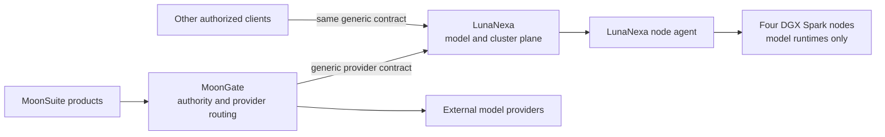

# LunaNexa

> **Implemented control-plane baseline.** LunaNexa now contains a native HTTP
> controller, durable registry/scheduler/enrollment/telemetry/workspace state, a native
> node reconciler and OCI supervisor, a provider-neutral client and CLI, a live
> Rabbita console, and release evidence tooling. Production acceptance still
> requires the private runtime, CA/identity, four-node cluster, measurements,
> and named human approvals in [the phased plan](docs/PLAN.md).

LunaNexa is a MoonBit-native model-as-a-service and hardware-cluster control
plane. It sits below provider routing and above the GPU machines so the hardware
cluster remains an independent execution environment rather than becoming
another MoonSuite deployment target. A node may alternatively enter a governed,
time-bounded exclusive-user mode; that mode is isolated from managed inference
and must complete access revocation and sanitization before the node returns.



## Product boundary

LunaNexa owns:

- node inventory, health and capacity;
- model artifact registration, licensing metadata and provenance;
- deployment, placement, rollout, rollback and reconciliation;
- bounded interactive inference admission, load balancing and failover;
- runtime adapters for approved model servers;
- evaluation, performance baselines, quotas, metering and audit events;
- deterministic prewarm, probe, cache, backpressure and transfer-grant policy
  decisions for an operator-sized fixed fleet;
- organizations, cost centers, projects, budgets, quotas, capacity commitments,
  rated usage, ledger evidence and versioned digital agreements;
- one Rabbita operator console for models, deployments, nodes, commercial
  governance, qualified-service evidence, jobs and alerts.

LunaNexa does **not** own:

- MoonSuite packs, application workflows or domain concepts;
- MoonClaw agent execution;
- MoonGate's provider selection, client compatibility or product authority;
- MoonDesk orchestration or MoonTown scheduling;
- a home-grown model server, object store, container engine or metrics database.

It is one product with multiple deployable components. The controller, API,
scheduler, registry, node agent, runtime adapters and console are components,
not a new Luna product series.

## Isolation promise

Managed GPU nodes contain only LunaNexa's node agent, approved model-runtime
containers, signed model artifacts and infrastructure telemetry. They do not
contain MoonSuite repositories, application binaries, pack manifests, domain
schemas, product credentials or user-facing application state.

An inference payload may necessarily contain user content that the selected
model must process. LunaNexa therefore distinguishes structural isolation from
payload handling: structural isolation is absolute, while payloads are
minimized, policy-labelled, encrypted in transit, excluded from logs by
default, and retained only when an explicit policy permits it.

## Intended implementation

- First-party control-plane and node code: MoonBit, native target.
- Concurrent I/O: `moonbitlang/async`.
- System integration: supported `moonbitlang/x` packages and narrow native
  adapters where required.
- Operator UI: Rabbita, generated from the same typed route and state contracts
  used by the API.
- Runtime boundary: pinned OCI images for vLLM, SGLang, TensorRT-LLM,
  llama.cpp or media runtimes as separately approved adapters.
- Persistent infrastructure: the management-node `/data/models` source disk,
  standard OCI registry, PostgreSQL and Prometheus-compatible telemetry rather
  than new Luna products.

The production profile deliberately has no batch-job subsystem and no
autoscaling. One exclusive lease names exactly one user and exactly one DGX;
the management plane copies only the assigned model to that node through a
short-lived, assignment-bound download and leaves the other DGX caches alone.

## Local validation

Run the consolidated repository gate:

```sh
sh scripts/release-gate.sh
```

It formats and checks native packages, runs the native suite, checks the
JavaScript console, and scans dependencies, deployment images, secrets,
contracts, and public responses. It deliberately does not claim the real
four-node or human release gate.

For local four-node behavior without DGX hardware, run
`sh scripts/four-node-simulation.sh`. It exercises isolated node identities,
signed reconciliation, strict runtime routing, queueing, failure, drain and
restart behavior, including the one-click single-node assignment path. See
[the simulation guide](docs/SIMULATION.md) for its deliberately narrow hardware
and performance claims.

Run `sh scripts/production-fault-simulation.sh EVIDENCE_DIRECTORY` for the
composed synthetic production-fault campaign. The resulting summary keeps real
mTLS, container-engine, DGX, thermal and human-approval claims explicitly false.

Native executables live in `cmd/control`, `cmd/node`, `cmd/lease-helper`,
`cmd/lease-helper-client`, `cmd/cli`, `cmd/benchmark`, `cmd/evidence`, and
`cmd/recovery`. The Rabbita operator site
lives in `cmd/console`; the enterprise portal lives in `cmd/enterprise`, with
the same-site WebIDE in `cmd/workbench`. Both sites consume one central API and
shared provider-neutral contracts. See the
[enterprise portal guide](docs/ENTERPRISE_PORTAL.md) and
[workspace guide](docs/WORKSPACES.md).
The initial scoped editor client lives in `extensions/vscode`.
The controller requires deployment-provided secret
values and immutable runtime/model digests.
Node inventory is read from a host-owned JSON file, and each enrolled node uses
its own hashed-at-rest node credential.

The repository also includes **LunaFide**, a deterministic, ephemeral
qualified-service test double under `testsupport/lunafide` with a native JSONL
scenario runner in `cmd/lunafide`. It is deliberately marked `TestOnly` and
`production_ready=false`; it is never a substitute for approved identity,
signature, payment or tax-invoice providers.

## Documents

- [Product contract](docs/PRODUCT_CONTRACT.md)
- [Enterprise portal and lease workflow](docs/ENTERPRISE_PORTAL.md)
- [PostgreSQL management database](docs/DATABASE.md)
- [Architecture](docs/ARCHITECTURE.md)
- [Phased implementation plan](docs/PLAN.md)
- [Architecture decisions](docs/DECISIONS.md)
- [Four-node functional simulation](docs/SIMULATION.md)
- [MiniCPM-o 4.5 Ascend 910C benchmark](docs/MINICPMO45_910C_BENCHMARK.md)
- [Developer workspaces and integrations](docs/WORKSPACES.md)
- [Management plane and one-click model services](docs/MANAGEMENT_PLANE.md)
- [Exclusive DGX node leases](docs/EXCLUSIVE_NODE_LEASES.md)
- [Exclusive lease production use-case matrix](docs/EXCLUSIVE_LEASE_USE_CASES.md)
- [Management node and four-DGX deployment guide](docs/DEPLOYMENT.md)
- [Production readiness and adversarial test record](docs/PRODUCTION_READINESS.md)
- [Administrator, enterprise, local and fixed settings authority](docs/SETTINGS_AUTHORITY.md)
- [Suanli documentation research and applicability review](docs/research/suanli/README.md)
- [Cost center, digital agreements, and commercial controls](docs/research/suanli/COMMERCIAL_CONTROL_PLANE.md)
- [Commercial, technical, and qualified-service expansion](docs/COMMERCIAL_AND_QUALIFIED_SERVICES.md)
- [Next-thread handoff](docs/IMPLEMENTATION_HANDOFF.md)
