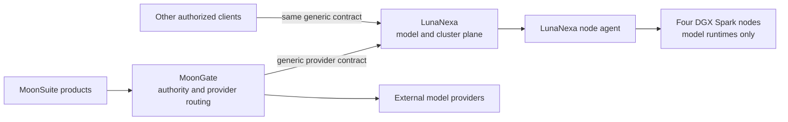

# LunaNexa

> **Inception · documentation-first repository.** LunaNexa is not ready to
> manage a production cluster. The next implementation thread should follow
> [the phased plan](docs/PLAN.md) and [implementation handoff](docs/IMPLEMENTATION_HANDOFF.md).

LunaNexa is a MoonBit-native model-as-a-service and hardware-cluster control
plane. It sits below provider routing and above the GPU machines so the hardware
cluster remains an independent execution environment rather than becoming
another MoonSuite deployment target.

## Product boundary

LunaNexa owns:

- node inventory, health and capacity;
- model artifact registration, licensing metadata and provenance;
- deployment, placement, rollout, rollback and reconciliation;
- inference queues, admission, batching, load balancing and failover;
- runtime adapters for approved model servers;
- evaluation, performance baselines, quotas, metering and audit events;
- one Rabbita operator console for models, deployments, nodes, jobs and alerts.

LunaNexa does **not** own:

- MoonSuite packs, application workflows or domain concepts;
- MoonClaw agent execution;
- MoonGate's provider selection, client compatibility or product authority;
- MoonDesk orchestration or MoonTown scheduling;
- a home-grown model server, object store, container engine or metrics database.

It is one product with multiple deployable components. The controller, API,
scheduler, registry, node agent, runtime adapters and console are components,
not a new Luna product series.

## Isolation promise

Managed GPU nodes contain only LunaNexa's node agent, approved model-runtime
containers, signed model artifacts and infrastructure telemetry. They do not
contain MoonSuite repositories, application binaries, pack manifests, domain
schemas, product credentials or user-facing application state.

An inference payload may necessarily contain user content that the selected
model must process. LunaNexa therefore distinguishes structural isolation from
payload handling: structural isolation is absolute, while payloads are
minimized, policy-labelled, encrypted in transit, excluded from logs by
default, and retained only when an explicit policy permits it.

## Intended implementation

- First-party control-plane and node code: MoonBit, native target.
- Concurrent I/O: `moonbitlang/async`.
- System integration: supported `moonbitlang/x` packages and narrow native
  adapters where required.
- Operator UI: Rabbita, generated from the same typed route and state contracts
  used by the API.
- Runtime boundary: pinned OCI images for vLLM, SGLang, TensorRT-LLM,
  llama.cpp or media runtimes as separately approved adapters.
- Persistent infrastructure: standard OCI registry, S3-compatible artifact
  storage and Prometheus-compatible telemetry rather than new Luna products.

## Documents

- [Product contract](docs/PRODUCT_CONTRACT.md)
- [Architecture](docs/ARCHITECTURE.md)
- [Phased implementation plan](docs/PLAN.md)
- [Architecture decisions](docs/DECISIONS.md)
- [Next-thread handoff](docs/IMPLEMENTATION_HANDOFF.md)

