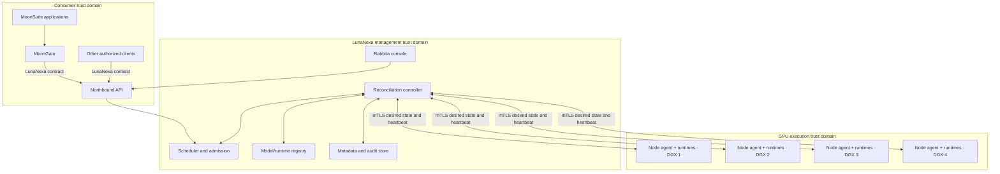

# LunaNexa architecture

## System context

LunaNexa is a boundary between model consumers and hardware. The boundary is
more important than the initial four-node topology: application decisions stop
above it, while placement and runtime decisions start below it.



## Plane separation

### Northbound provider plane

The API validates authentication, typed contracts, quotas, idempotency,
deadlines and data policy. It translates compatibility requests into the
canonical workload envelope and exposes streaming without revealing topology.

MoonGate remains responsible for deciding whether LunaNexa or an external
provider should satisfy a MoonSuite request. LunaNexa never calls back into a
MoonSuite product to make a scheduling decision.

### Control plane

The controller stores desired state and continuously reconciles observed state.
Operations such as deploy, scale, drain, promote, roll back and delete are
declarative state transitions rather than shell-command sequences.

The scheduler filters by hard requirements first—runtime, architecture,
memory, license, data locality and health—then scores remaining nodes by
available capacity, warm models, queue delay, reliability and operator policy.
Its decision is deterministic for the same state and policy version.

### Node plane

Each DGX runs one small LunaNexa node agent. It inventories devices, verifies
assignments, pulls pinned artifacts, supervises runtime containers, performs
health checks, enforces local limits and reports bounded telemetry.

The node agent does not implement application workflows or accept arbitrary
remote shell commands. Debug access is a separately authorized operator action,
not part of routine reconciliation.

### Data plane

Inference traffic is sent only to a ready runtime selected by the scheduler.
The platform supports streaming, bounded queues, cancellation, backpressure,
deadline propagation and idempotent retry where the model operation permits it.

Runtime implementations are adapters behind a common lifecycle interface:
inspect, prepare, start, ready, invoke, drain, stop and collect metrics. LunaNexa
does not reimplement CUDA kernels or model servers.

### State and artifact plane

Use durable standard infrastructure through narrow ports:

- transactional metadata store for desired state, generations, leases and
  audit events;
- OCI registry for runtime images;
- S3-compatible storage for model artifacts and large evaluation fixtures;
- Prometheus-compatible metrics and an established log backend;
- deployment-owned secret storage.

Development adapters may be local, but production state must survive controller
restart and must not live only on a DGX node.

## Initial four-node topology

Treat the four DGX Sparks as four schedulable nodes, not as one assumed shared-
memory machine. Phase one proves single-node serving. Multi-node sharding or
paired high-speed links are enabled only after the actual network, runtime and
model combination passes a topology-specific benchmark.

The initial controller should run outside the GPU execution nodes when a stable
management host is available. Losing one GPU node must not destroy desired
state or the registry. A later highly available controller can be added without
changing the node protocol.

## Model lifecycle

```text
candidate artifact
→ license and provenance recorded
→ digest verified
→ evaluation suite run
→ operator approval
→ canary deployment
→ readiness and benchmark gate
→ controlled promotion
→ observation
→ rollback or stable release
```

Promotion is never automatic merely because a newer artifact exists. A model
alias points to an approved version, and changes to that pointer create an
auditable policy decision.

## Data minimization

The request payload may contain domain content because inference cannot occur
without it. No other domain context crosses the boundary. The caller should
redact unnecessary identifiers before sending, and LunaNexa should enforce:

- data-class labels and allowed-runtime policy;
- encryption in transit and controlled temporary storage;
- no raw-payload logging by default;
- per-request retention and cache policy;
- explicit controls for evaluation capture or training reuse;
- deletion receipts when retained payloads expire.

Training reuse is opt-in and versioned. An inference request never silently
becomes training data.

## Repository shape to implement

```text
lunanexa/
  cmd/
    control/             # API/controller executable
    node/                # managed-node executable
    cli/                 # operator CLI
  contracts/             # public typed v1 envelopes and receipts
  api/                   # auth, validation, admission and streaming
  controller/            # desired-state reconciliation
  scheduler/             # filtering, scoring, queues and leases
  registry/              # models, artifacts, runtimes and licenses
  node/                   # node inventory and supervision
  runtimes/               # public adapter interface
  internal/               # private parsers and platform helpers only
  store/                  # durable state ports and adapters
  telemetry/              # metrics, events and bounded logs
  policy/                 # quotas, data classes and placement policy
  ui/                     # Rabbita console generated from typed contracts
  tests/fixtures/         # non-secret deterministic fixtures
  deploy/                 # manifests and documented deployment overlays
  docs/
```

Public concrete types live in their owning public packages. `internal/*` must
not own types exposed by `contracts`, `scheduler`, `registry` or `runtimes`.

## Observability and benchmarks

Per model/version/runtime/hardware profile, record:

- time to first token or first output;
- inter-token latency and generated tokens per second where applicable;
- end-to-end p50, p95 and p99 latency;
- queue time, batch efficiency and throughput;
- model load time, warm-up time and time to readiness;
- memory pressure, accelerator utilization and rejected admissions;
- cancellation, runtime failure and retry rates;
- drain, failover and controller-recovery time.

Benchmarks are versioned evidence, not marketing claims. A deployment is
promoted only against a named workload profile and declared service objective.

