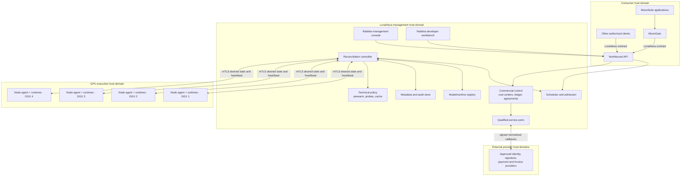

# LunaNexa architecture

## System context

LunaNexa is a boundary between model consumers and hardware. The boundary is
more important than the initial four-node topology: application decisions stop
above it, while placement and runtime decisions start below it.

Management, compute and operator-network ingress are independent concerns.
Management and compute are logical roles that may be separated for production
failure isolation or explicitly co-located for a constrained lab profile. A
bastion/access node is optional operator-network infrastructure, not a
LunaNexa component, scheduler role or daily-use requirement. Direct routing,
VPN, private ingress and OpenSSH `ProxyJump` are deployment choices outside the
node protocol.



## Plane separation

### Northbound provider plane

The API validates authentication, typed contracts, quotas, idempotency,
deadlines and data policy. It translates compatibility requests into the
canonical workload envelope and exposes streaming without revealing topology.

The native controller sits behind a trusted ingress or service mesh that
terminates TLS and validates client certificates. Southbound calls also carry
per-node hashed authority, HMAC-authenticated canonical heartbeats,
certificate-expiry checks and replay fences. These application checks do not
replace deployment mTLS; they limit damage if a trusted path is misrouted.

MoonGate remains responsible for deciding whether LunaNexa or an external
provider should satisfy a MoonSuite request. LunaNexa never calls back into a
MoonSuite product to make a scheduling decision.

### Control plane

The controller stores desired state and continuously reconciles observed state.
Operations such as deploy, drain, promote, roll back and delete are
declarative state transitions rather than shell-command sequences.

The scheduler filters by hard requirements first—runtime, architecture,
memory, license, data locality and health—then scores remaining nodes by
available capacity, warm models, queue delay, reliability and operator policy.
Its decision is deterministic for the same state and policy version.

### Management intent plane

The management intent plane owns controller-signed catalog templates,
deterministic deployment preflight, durable model-service operations, and
provider-neutral service endpoints. A one-click deployment submits one compact,
idempotent intent; the controller expands an executable plan into the same
signed desired assignments used by existing automation.

This layer cannot waive registry, license, verification, evaluation, alias,
data-class, secret-reference, or capacity requirements. Missing prerequisites
produce a durable blocked operation with typed findings. See
`docs/MANAGEMENT_PLANE.md`.

### Commercial and agreement plane

The commercial core owns an opaque organization → cost center → project
hierarchy, exactly-once usage rating, immutable finalized periods, linked
adjustments, budgets, quotas, capacity commitments, RBAC and versioned agreement
evidence. Provider-specific identity, payment, invoice and signature records
are normalized at the boundary; raw provider references are hashed in public
snapshots.

Commercial mutations are subject to the same authenticated operator boundary
as deployment control. Production state is restored from PostgreSQL snapshots,
and commercial plus integration callback state is committed together. Lease
approval calls commercial admission directly, so organization verification,
project ownership, quotas and hard budgets are not merely advisory UI checks.

`LunaFide` is an isolated deterministic test double for this external boundary.
Its callbacks are replay-, sequence-, tenant- and aggregate-checked, but its
test MAC is explicitly not a qualified signature. It cannot satisfy a
production trust, payment or tax requirement.

### Technical decision plane

Prewarm transitions, health-probe evaluation, safe cache telemetry, bounded
admission, short-lived transfer grants and reviewed sidecar profiles are
deterministic decisions. Prewarm state and transfer nonces are durable, while
artifact bytes are served only after a live assignment and one-time grant pass.
The production profile intentionally excludes autoscaling and batch jobs.

### Browser experience plane

LunaNexa ships two Rabbita browser sites from shared public contracts:

- the management console presents cluster health, users, access grants,
  capacity leases, models, deployments, policy and audit evidence;
- the enterprise site presents onboarding, agreement signing requests, lease
  requests/status, tenant cost/model views and a local-browser WebIDE with
  generic model invocation and approved editor handoffs.

An approved desktop handoff crosses the browser boundary with only a
short-lived, single-use code in a URL fragment. The local client removes that
fragment, redeems through an administrator-pinned issuer and keeps the resulting
lease-scoped API credential in its local provider gateway. LunaNexa stores only
digests and rechecks lease plus contract authority on every credential use.
Product-specific translation stays outside LunaNexa's source boundary.

The enterprise portal writes only tenant-scoped intent. It does not accept a
node ID or raw access secret. The operator console selects one eligible node;
the controller then creates a credential reference and reserves the existing
exclusive-node lease authority idempotently. See `docs/ENTERPRISE_PORTAL.md`.

The workbench is not implicitly a remote administration channel. A
`WorkspaceLease` remains a time-bounded entitlement to control-plane admission
and model capacity, not a DGX login. A separate `ExclusiveNodeLease` may name
one DGX and one user. The two contracts cannot be substituted for one another.
VS Code, CodeBuddy, WorkBuddy, Trae, Qoder and future integrations use scoped
northbound contracts in managed-service mode; any user runtime on a DGX exists
only inside an explicit exclusive lease.

### Exclusive access plane

Each node has one effective operating mode: `ManagedService` or
`ExclusiveLease`. Reserving an exclusive lease immediately removes the node
from scheduler eligibility and issues a cordon directive. The lease authority
then reconciles provisioning, activation, expiry, drain, access revocation and
sanitization. Completion is the only normal path back to managed service;
unproven cleanup quarantines the node.

The contract carries a username and credential reference, never a password or
private key. A narrow host provisioner resolves that reference and performs
allowlisted account and access operations. See `docs/EXCLUSIVE_NODE_LEASES.md`.

### Node plane

Each DGX runs one small LunaNexa node agent. It inventories devices, verifies
assignments, materializes pinned artifacts only for assignments naming that
node, supervises runtime containers, performs health checks, enforces local
limits and reports bounded telemetry. In exclusive mode the same protected
daemon also observes the lease generation and local expiry; the leased account
cannot modify or stop it.

Materialization is a node-owned state transition before runtime preparation:

```text
assigned → downloading → digest verified → signature verified
         → atomically cached → read-only mounted → runtime ready
```

Downloads use an assignment-sized, content-addressed cache under the
deployment-owned node state directory. Partial transfers are resumable and
never become visible as complete artifacts. Cache hits are reverified after an
agent restart. A digest or signature mismatch quarantines the local candidate
and prevents runtime launch. When no desired assignment on that node references
a digest, reconciliation removes the local cache entry. The runtime container
sees a fixed local model path and no artifact URI or storage credential.

The node agent does not implement application workflows or accept arbitrary
remote shell commands. Debug access is a separately authorized operator action,
not part of routine reconciliation.

### Data plane

Inference traffic is sent only to a ready runtime selected by the scheduler.
The platform supports streaming, bounded queues, cancellation, backpressure,
deadline propagation and idempotent retry where the model operation permits it.
Admission capacity bounds queued plus running work. A separately configured
runtime-concurrency limit controls active adapter calls; accepted overflow waits
under its request deadline, remains cancellable, and reports queue time apart
from accelerator time. Durable active workload IDs reject reconstruction-time
relaunch, while the scoped idempotency key is also propagated to the serving
adapter as defense in depth.
The serving adapter resolves that selected node either through a strict
deployment-owned node-to-HTTPS-endpoint map or through one trusted gateway that
enforces the authenticated node routing hint. In strict mode an absent mapping
fails closed; the generic endpoint is never used as an implicit substitute for
a selected node. Strict-mode placement also requires a non-expired signed
assignment whose deployment ID appears in the node agent's ready-runtime
heartbeat; static inventory or license labels alone cannot make a runtime
schedulable.

Runtime implementations are adapters behind a common lifecycle interface:
inspect, prepare, start, ready, invoke, drain, stop and collect metrics. LunaNexa
does not reimplement CUDA kernels or model servers.

### State and artifact plane

Use durable standard infrastructure through narrow ports:

- transactional metadata store for desired state, generations, leases and
  audit events;
- OCI registry for runtime images;
- the management-node `/data/models` disk and assignment-scoped artifact
  gateway for model artifacts, with optional external storage only behind a
  reviewed source adapter;
- Prometheus-compatible metrics and an established log backend;
- deployment-owned secret storage.

Development adapters may be local, but production state must survive controller
restart and must not live only on a DGX node.

Model catalog discovery and artifact ingestion are handled by a separately
deployable, least-privilege model-source adapter. The controller proxies only a
bounded authenticated contract and remains the registry/approval authority; it
does not gain general Internet egress or write access to the model store. The
first source profile is ModelScope and is specified in
[`MODELSCOPE_MODEL_ONBOARDING.md`](MODELSCOPE_MODEL_ONBOARDING.md).

PostgreSQL schema v1 is implemented for enterprise memberships, agreements,
tenant lease requests, workspace users, grants, leases and admission
reservations. Each mutation commits a canonical typed snapshot and normalized
indexed projections together. File persistence for these domains is now an
explicit development fallback. Remaining controller, registry, commercial and
technical-policy stores retain their existing adapters and must be migrated
before claiming a fully database-backed control plane.

The artifact store is authoritative; node-local materializations are disposable
assignment-scoped cache entries. This keeps model transfer out of the management API
process while allowing a selected DGX to start without the serving container
holding object-store credentials.

## Initial four-node acceptance profile

The first acceptance campaign names four DGX Sparks; that is an explicit test
inventory, not a platform-wide node-count invariant. Treat those machines as
independent schedulable nodes, not as one assumed shared-memory machine. Phase
one proves single-node serving. Multi-node sharding or
paired high-speed links are enabled only after the actual network, runtime and
model combination passes a topology-specific benchmark.

The local four-node functional simulator mirrors the four independent node
identities and runtime endpoints with native processes. It validates protocol,
placement and recovery behavior but is not an accelerator or performance
emulator; see `docs/SIMULATION.md`.

Controller placement is a deployment-profile decision. Separation is preferred
when the profile needs compute-failure isolation; constrained labs may
explicitly co-locate management and compute. In either case, loss of any node
covered by the profile's failure claim must not destroy desired state or the
registry. A later highly available controller can be added without changing
the node protocol.

## Model lifecycle

```text
candidate artifact
→ license and provenance recorded
→ digest verified
→ evaluation suite run
→ operator approval
→ canary deployment
→ readiness and benchmark gate
→ controlled promotion
→ observation
→ rollback or stable release
```

Promotion is never automatic merely because a newer artifact exists. A model
alias points to an approved version, and changes to that pointer create an
auditable policy decision.

## Data minimization

The request payload may contain domain content because inference cannot occur
without it. No other domain context crosses the boundary. The caller should
redact unnecessary identifiers before sending, and LunaNexa should enforce:

- data-class labels and allowed-runtime policy;
- encryption in transit and controlled temporary storage;
- no raw-payload logging by default;
- per-request retention and cache policy;
- explicit controls for evaluation capture or training reuse;
- deletion receipts when retained payloads expire.

Training reuse is opt-in and versioned. An inference request never silently
becomes training data.

## Repository shape to implement

```text
lunanexa/
  cmd/
    control/             # API/controller executable
    node/                # managed-node executable
    cli/                 # operator CLI
  contracts/             # public typed v1 envelopes and receipts
  api/                   # auth, validation, admission and streaming
  controller/            # desired-state reconciliation
  deployment/            # public catalog, intent, plan and operation types
  deployment/store/      # native durable management-plane state and signing
  scheduler/             # filtering, scoring, queues and leases
  registry/              # models, artifacts, runtimes and licenses
  node/                   # node inventory and supervision
  runtimes/               # public adapter interface
  internal/               # private parsers and platform helpers only
  store/                  # durable state ports and adapters
  telemetry/              # metrics, events and bounded logs
  policy/                 # quotas, data classes and placement policy
  workspace/              # provider-neutral workspace, lease and integration contracts
  portal/                 # enterprise membership, agreement and lease-request contracts
  portal/store/           # durable centralized enterprise workflow state
  ui/                     # Rabbita management console generated from typed contracts
  ui/enterprise/          # Rabbita enterprise portal
  ui/workbench/           # Rabbita individual developer workbench
  tests/fixtures/         # non-secret deterministic fixtures
  deploy/                 # manifests and documented deployment overlays
  docs/
```

Public concrete types live in their owning public packages. `internal/*` must
not own types exposed by `contracts`, `scheduler`, `registry` or `runtimes`.

## Observability and benchmarks

Per model/version/runtime/hardware profile, record:

- time to first token or first output;
- inter-token latency and generated tokens per second where applicable;
- end-to-end p50, p95 and p99 latency;
- queue time, admission backpressure and throughput;
- model load time, warm-up time and time to readiness;
- memory pressure, accelerator utilization and rejected admissions;
- cancellation, runtime failure and retry rates;
- drain, failover and controller-recovery time.

Benchmarks are versioned evidence, not marketing claims. A deployment is
promoted only against a named workload profile and declared service objective.
