# Contract document system

LunaNexa contract documents are a dedicated long-horizon subsystem within the
hybrid digital-to-offline commercial workflow. It collects supplied data,
retains immutable template versions, generates fidelity-checked DOCX/PDF pairs,
and preserves every later execution form as a separate revision and artifact.

## Authority boundary

The retained DOCX is the legal wording and formatting authority. LunaNexa owns
only typed collection, validation, lifecycle state, digest confirmation,
generation requests, evidence, and audit. It does not author clauses, provide
legal advice, infer a missing value, or calculate language that the source
expects a person to supply.

```mermaid
flowchart LR
  T["Immutable source DOCX + slot manifest"] --> C["Authenticated data collection"]
  C --> V["Required-field and source-choice validation"]
  V --> H["Human digest confirmation"]
  H --> J["Durable generation request"]
  J --> D["DOCX in-place OOXML patch"]
  D --> R["MoonLeaf approved-font PDF renderer"]
  R --> Q["18-page visual + structural fidelity gate"]
  Q --> A["Immutable DOCX/PDF artifacts and evidence"]
```



## Durable lifecycle

`contractdoc.ContractPacket` is revision- and digest-fenced. The full state
machine has nine states:

`InformationDraft -> ReadyForConfirmation -> InformationConfirmed -> GenerationRequested -> Generated -> Effective -> Closed`

`GenerationFailed` is a retryable branch off `GenerationRequested`, and
`Superseded` is a terminal branch reachable from every pre-`Effective` state.

| From | Action | To | Actor | Preconditions |
| --- | --- | --- | --- | --- |
| — | create packet | `InformationDraft` | CustomerMessenger | initial-stage forms start freely; effective-stage forms require a `preceding_packet_ref` naming a same-tenant packet in `Effective` state |
| `InformationDraft`, `ReadyForConfirmation`, or `InformationConfirmed` | save information | `InformationDraft`, or `ReadyForConfirmation` once all required fields are complete | CustomerMessenger or ManagerOperator, own fields only | editable states only; any change clears the prior confirmation and values digest |
| `ReadyForConfirmation` | confirm information | `InformationConfirmed` | CustomerMessenger | no missing required fields; records the confirmed values digest |
| `InformationConfirmed` | request generation | `GenerationRequested` | CustomerMessenger | the expected values digest must equal the confirmed digest |
| `GenerationFailed` | retry generation | `GenerationRequested` | CustomerMessenger | same digest fencing; the confirmed values are unchanged |
| `GenerationRequested` | complete generation | `Generated` | renderer worker | a DOCX/PDF pair with valid digests, one shared render-evidence digest, matching page counts, and the declared source page count for known templates |
| `GenerationRequested` | fail generation | `GenerationFailed` | renderer worker | a non-empty failure reason |
| `Generated` | register execution | `Effective` | ManagerOperator | a valid evidence digest and a `YYYY-MM-DD` signing date; `registered_by` is fixed server-side to the operator authority |
| `Effective` | close packet | `Closed` | ManagerOperator | closure kind `Expired`, `EarlyTermination`, or `Settled`; early termination additionally requires a settlement (see cross-packet rules below) |
| any pre-`Effective` state | supersede packet | `Superseded` | ManagerOperator | a successor reference and reason; `Effective`, `Closed`, and `Superseded` packets are contractual facts and can never be superseded |

Generated artifacts are never mutated. A later reservation, access, incident,
settlement, or early termination task creates a new packet bound to the same
source template digest, the appropriate form subset, and the effective
predecessor packet.

## Lifecycle management rules (合同全生命周期管理)

Each state represents one period of the underlying paper contract:

| State | Contract period | What it means |
| --- | --- | --- |
| `InformationDraft` | drafting | either side is filling its owned fields; nothing is generated from blank or invented values |
| `ReadyForConfirmation` | review/confirmation | all required online fields are complete; the customer reviews the preview against the source wording |
| `InformationConfirmed` | attested | the customer has attested the values; the confirmed digest is pinned and the packet awaits a generation request |
| `GenerationRequested` | rendering | the packet is frozen while the renderer worker produces the DOCX/PDF pair under the fidelity gate |
| `Generated` | awaiting offline signature | the DOCX/PDF pair is retained and read-only; signing and stamping happen offline |
| `GenerationFailed` | rendering failed | the confirmed values are unchanged; the customer may retry generation |
| `Effective` | in force | the operator registered the offline signed-and-stamped evidence; the packet is read-only and may anchor follow-up forms |
| `Closed` | closed | terminal; the closure records its kind (`Expired`, `EarlyTermination`, or `Settled`), reason, and operator |
| `Superseded` | replaced before effect | terminal; the supersession records the successor packet, reason, and operator |

The action bar in both browser surfaces renders exactly the capability list
the lifecycle allows, so the role-by-state matrix is enforced by construction:

| Capability | CustomerMessenger | ManagerOperator | State precondition |
| --- | --- | --- | --- |
| `SaveInformation` | yes | yes | `InformationDraft`, `ReadyForConfirmation`, or `InformationConfirmed` |
| `ConfirmInformation` | yes | no | `ReadyForConfirmation` |
| `RequestGeneration` | yes | no | `InformationConfirmed` with a confirmed values digest |
| `RetryGeneration` | yes | no | `GenerationFailed` with a confirmed values digest |
| `RegisterExecution` | no | yes | `Generated` |
| `ClosePacket` | no | yes | `Effective` |
| `SupersedePacket` | no | yes | any state except `Effective`, `Closed`, or `Superseded` |

The responsibility split mirrors the offline contract process. The customer
owns information confirmation and generation requests — their attestation of
the supplied values. The operator owns execution registration, closure, and
supersession — the facts of the signed paper contract. The renderer worker
owns generation results and failures. The step bar condenses the machine into
five customer-visible steps (fill information, review and confirm, generate
documents, signed and effective, closed and archived) and shows a terminal
badge for superseded packets; per-state guidance text explains what each state
means and what happens next.

Two cross-packet rules bind packets together:

- Effective-stage forms (`AccessConfirmation`, `ViolationNotice`,
  `DamageAssessment`, `SettlementConfirmation`, `EarlyTerminationApplication`)
  may only be created with a `preceding_packet_ref` naming a same-tenant
  packet already in `Effective` state. Initial-stage forms (`MasterLease`,
  `ReservationApplication`) open the relationship and need no predecessor.
- An `EarlyTermination` closure requires a same-tenant
  `SettlementConfirmation` packet in `Effective` or `Closed` state; a merely
  generated settlement is unsigned and the store rejects the close. `Expired`
  and `Settled` closures have no settlement precondition.

Every mutation carries an `expected_revision` fence; a stale revision is
rejected with a conflict. Generation requests additionally carry the expected
values digest, so a packet can only be rendered from exactly the values the
customer confirmed. Any information change clears the confirmation and its
digest, forcing a fresh review before generation. Preview is available in any
state: it applies only the requesting role's draft to a verified copy of the
fillable DOCX and is revision-fenced like every other operation.

## Privacy

Business data is tenant scoped. Audit events exclude raw values. Signing and
sealing remain offline. Passwords and other access credentials never enter the
contract packet, artifact substitutions, logs, or audit. PostgreSQL stores the
typed packet snapshot in production; artifacts use the existing opaque
transfer/object-storage boundary.

## Current source collection

The first manifest is the exact 18-page youthpolicy DGX Spark remote-lease
packet described in
[`contracts/youthpolicy-dgx-spark-remote-lease-v1.md`](contracts/youthpolicy-dgx-spark-remote-lease-v1.md).
The collection currently contains one DOCX file and seven distinct forms.

Every declared source slot has one authoritative owner:

- `CustomerMessenger` — the authenticated customer or designated messenger;
- `ManagerOperator` — the authenticated manager/operator console;
- `PlatformDerived` — a value synchronized from durable LunaNexa order or
  lifecycle authority and read-only in both browsers;
- `OfflineParticipant` — signatures, seals, passwords, and other values that
  never enter online packet state.

Both browser surfaces edit the same generation-fenced packet revision. Every
persisted value carries its owner, source reference, updating actor, and update
time. A customer cannot submit a manager field, an operator cannot overwrite a
customer field, and neither can author a platform-derived or offline-only
field. Packet confirmation remains blocked until all required online owners
have completed their fields.

The enterprise portal and operator console show the same authoritative DOCX
preview beside their respective input form. The customer sees only
customer/messenger-owned inputs; the operator sees only manager/operator-owned
inputs. Neither browser renders the other party's controls, even as disabled
fields. Preview requests apply only the current role's draft to a verified copy
of the fillable DOCX, reopen it with MoonLeaf, and return MoonLeaf's bounded
neutral text/table scene for Rabbita rendering. No raster screenshot or
alternate HTML contract is used. Demo mode serves a field-free
MoonLeaf scene generated from that same DOCX at build time. The release gate
regenerates it and requires byte-for-byte equality, so it cannot become a
second editable contract template.

The customer portal exposes the collection as **Contract forms / 合同表单**.
Its subject-scoped native API is:

- `GET /v1/contract-documents/manifest` — the template manifest and slot
  definitions;
- `GET /v1/contract-documents/self` — the subject's packets;
- `POST /v1/contract-documents/self` — create a packet; effective-stage forms
  require a `preceding_packet_ref` naming a same-tenant `Effective` packet;
- `PUT /v1/contract-documents/self/{packet_id}:information` — save owned
  fields; only in `InformationDraft`, `ReadyForConfirmation`, or
  `InformationConfirmed`;
- `POST /v1/contract-documents/self/{packet_id}:preview` — role-scoped
  MoonLeaf preview; any state, revision-fenced;
- `POST /v1/contract-documents/self/{packet_id}:confirm` — confirm
  information; only from `ReadyForConfirmation`;
- `POST /v1/contract-documents/self/{packet_id}:generate` — request or retry
  generation (202); only from `InformationConfirmed` or `GenerationFailed`,
  digest-fenced.

The operator side uses the same packets through an operator-token API:

- `GET /v1/contract-documents/operator/packets` — all packets;
- `PUT /v1/contract-documents/operator/packets/{packet_id}:information` —
  save operator-owned fields; editable states only;
- `POST /v1/contract-documents/operator/packets/{packet_id}:preview` —
  operator-scoped preview; any state, revision-fenced;
- `POST /v1/contract-documents/operator/packets/{packet_id}:execute` —
  register the offline signed evidence; only from `Generated`;
- `POST /v1/contract-documents/operator/packets/{packet_id}:close` — close
  with kind `Expired`, `EarlyTermination`, or `Settled`; only from
  `Effective`, with the settlement rule for early termination;
- `POST /v1/contract-documents/operator/packets/{packet_id}:supersede` —
  supersede by a successor packet; any state except `Effective`, `Closed`,
  or `Superseded`.

The renderer worker authenticates with its own token and drives the
asynchronous generation leg:

- `GET /v1/contract-documents/worker/pending` — packets in
  `GenerationRequested`;
- `POST /v1/contract-documents/worker/results` — complete generation with the
  DOCX/PDF artifact pair and a worker receipt; only from
  `GenerationRequested`;
- `POST /v1/contract-documents/worker/failures` — record a generation failure
  with a reason and worker receipt; only from `GenerationRequested`.

The store uses PostgreSQL when management PostgreSQL is configured. Otherwise
it uses `LUNANEXA_CONTRACT_DOCUMENT_PATH` (default
`lunanexa-contract-documents.json`) with atomic mode-0600 snapshots.

Generation is asynchronous. A request advances only after the controller
derives a digest from the exact confirmed values. Completion requires a DOCX
and PDF pair with one shared render-evidence digest and the source page count.
MoonLeaf's semantic browser preview does not claim Word-compatible pagination.
A released PDF still requires the approved exact production font set and
retained page-level evidence.

The preview UI places the current role's form and the MoonLeaf scene side by
side on wide screens and stacks them on narrow screens. Source-authored manual
page breaks are preserved. Automatic Word pagination remains part of the final
DOCX/PDF render gate, not a browser approximation.

This retained DOCX declares A4 dimensions but omits `w:pgMar`. Its verified WPS
layout uses the Chinese document default: 1440 twips at the top and bottom and
1800 twips at the left and right. LunaNexa passes that explicit profile to
MoonLeaf and records the resulting effective margins in the browser scene. The
Rabbita renderer scales every font, line, indent, cell inset, and paragraph gap
against the resulting 8305-twip content box. It preserves source-authored ASCII
spaces with `white-space: pre-wrap`, uses inter-character justification for
Chinese justified lines, and leaves kerning enabled. The current source has
`w:kern="2"` throughout but has no explicit run-level `w:spacing` or `w:w`;
LunaNexa therefore does not invent global tracking or character scaling.

### Licensed font installation

The browser and MoonLeaf renderer consume the same organization-approved font
files. They are deployment inputs and must not be committed to this repository.
On a management Mac, install verified files with:

```sh
scripts/install-contract-fonts.sh \
  /licensed-fonts/FangSong_GB2312.ttf \
  /licensed-fonts/FZXiaoBiaoSong-B05S.ttf \
  /licensed-fonts/SimHei.ttf
sh scripts/build-browser-bundles.sh
```

The installer verifies each font's internal family and rejects a restricted
OS/2 embedding flag. It copies accepted files into the Git-ignored
`assets/fonts/private/` build input and the current macOS user's
`~/Library/Fonts/LunaNexa/` directory. The static browser bundle then serves
them from its own origin through `assets/fonts/contract-fonts.css`; no third
party font CDN receives contract text. Supplying a renamed substitute is an
error, not a fallback. Production renderer images mount the same approved
files from a deployment secret or read-only volume rather than baking them
into a public image layer.

## Known gaps

The lifecycle model deliberately does not yet do the following:

- no automatic expiry scheduling: a lease that runs to its end date stays
  `Effective` until an operator closes it — `ClosureKind::Expired` is a manual
  operator close, not a timer;
- no renewal or amendment flow for `Effective` packets: closing the packet
  and creating a new one (supersession is reserved for pre-effect packets) is
  the current path;
- no cross-check of settlement packets against commercial ledger balances —
  the early-termination gate checks that a settlement packet exists in a
  qualifying state, not that its amounts match the ledger;
- `access/` API keys are not gated on packet state: closing or superseding a
  packet does not revoke or suspend issued access credentials.

## Production blockers

- approved Chinese fonts matching `仿宋_GB2312`, `黑体`, and
  `方正小标宋简体` must be licensed and installed in the renderer image;
- an approved DOCX/PDF rendering image must produce and retain page-level
  fidelity evidence;
- the rendering image must be MoonLeaf and emit a typed
  `moonleaf.render-evidence.v1` receipt; LibreOffice, Word, and other office
  engines are not substitutes;
- legal/finance owners must approve the exact source digest and slot manifest;
- real contract values must be supplied and confirmed. Test/demo values are
  prohibited for released contracts.
