# Contract document system

LunaNexa contract documents are a dedicated long-horizon subsystem within the
hybrid digital-to-offline commercial workflow. It collects supplied data,
retains immutable template versions, generates fidelity-checked DOCX/PDF pairs,
and preserves every later execution form as a separate revision and artifact.

## Authority boundary

The retained DOCX is the legal wording and formatting authority. LunaNexa owns
only typed collection, validation, lifecycle state, digest confirmation,
generation requests, evidence, and audit. It does not author clauses, provide
legal advice, infer a missing value, or calculate language that the source
expects a person to supply.

```mermaid
flowchart LR
  T["Immutable source DOCX + slot manifest"] --> C["Authenticated data collection"]
  C --> V["Required-field and source-choice validation"]
  V --> H["Human digest confirmation"]
  H --> J["Durable generation request"]
  J --> D["DOCX in-place OOXML patch"]
  D --> R["Approved-font PDF renderer"]
  R --> Q["14-page visual + structural fidelity gate"]
  Q --> A["Immutable DOCX/PDF artifacts and evidence"]
```

## Durable lifecycle

`contractdoc.ContractPacket` is revision- and digest-fenced:

`InformationDraft -> ReadyForConfirmation -> InformationConfirmed -> GenerationRequested -> Generated`

Any information change clears the prior confirmation. Generated artifacts are
never mutated. A later reservation, access, incident, settlement, or early
termination task creates a new packet revision bound to the same source
template digest and the appropriate form subset.

## Privacy

Business data is tenant scoped. Audit events exclude raw values. Signing and
sealing remain offline. Passwords and other access credentials never enter the
contract packet, artifact substitutions, logs, or audit. PostgreSQL stores the
typed packet snapshot in production; artifacts use the existing opaque
transfer/object-storage boundary.

## Current source collection

The first manifest is the exact 14-page youthpolicy DGX Spark remote-lease
packet described in
[`contracts/youthpolicy-dgx-spark-remote-lease-v1.md`](contracts/youthpolicy-dgx-spark-remote-lease-v1.md).
The collection currently contains one DOCX file and seven distinct forms.

The customer portal exposes the collection as **Contract forms / 合同表单**.
Its subject-scoped native API is:

- `GET /v1/contract-documents/manifest`
- `GET|POST /v1/contract-documents/self`
- `PUT /v1/contract-documents/self/{packet_id}:information`
- `POST /v1/contract-documents/self/{packet_id}:confirm`
- `POST /v1/contract-documents/self/{packet_id}:generate`

The store uses PostgreSQL when management PostgreSQL is configured. Otherwise
it uses `LUNANEXA_CONTRACT_DOCUMENT_PATH` (default
`lunanexa-contract-documents.json`) with atomic mode-0600 snapshots.

Generation is asynchronous. A request advances only after the controller
derives a digest from the exact confirmed values. Completion requires a DOCX
and PDF pair with one shared render-evidence digest and the source page count.
On this Mac the renderer does not have the three exact source CJK fonts, so the
job must remain pending rather than publish a visually altered PDF.

## Production blockers

- approved Chinese fonts matching `仿宋_GB2312`, `黑体`, and
  `方正小标宋简体` must be licensed and installed in the renderer image;
- an approved DOCX/PDF rendering image must produce and retain page-level
  fidelity evidence;
- legal/finance owners must approve the exact source digest and slot manifest;
- real contract values must be supplied and confirmed. Test/demo values are
  prohibited for released contracts.
