# Contract document system

LunaNexa contract documents are a dedicated long-horizon subsystem within the
hybrid digital-to-offline commercial workflow. It collects supplied data,
retains immutable template versions, generates fidelity-checked DOCX/PDF pairs,
and preserves every later execution form as a separate revision and artifact.

## Authority boundary

The retained DOCX is the legal wording and formatting authority. LunaNexa owns
only typed collection, validation, lifecycle state, digest confirmation,
generation requests, evidence, and audit. It does not author clauses, provide
legal advice, infer a missing value, or calculate language that the source
expects a person to supply.

```mermaid
flowchart LR
  T["Immutable source DOCX + slot manifest"] --> C["Authenticated data collection"]
  C --> V["Required-field and source-choice validation"]
  V --> H["Human digest confirmation"]
  H --> J["Durable generation request"]
  J --> D["DOCX in-place OOXML patch"]
  D --> R["MoonLeaf approved-font PDF renderer"]
  R --> Q["18-page visual + structural fidelity gate"]
  Q --> A["Immutable DOCX/PDF artifacts and evidence"]
```

## Durable lifecycle

`contractdoc.ContractPacket` is revision- and digest-fenced:

`InformationDraft -> ReadyForConfirmation -> InformationConfirmed -> GenerationRequested -> Generated`

Any information change clears the prior confirmation. Generated artifacts are
never mutated. A later reservation, access, incident, settlement, or early
termination task creates a new packet revision bound to the same source
template digest and the appropriate form subset.

## Privacy

Business data is tenant scoped. Audit events exclude raw values. Signing and
sealing remain offline. Passwords and other access credentials never enter the
contract packet, artifact substitutions, logs, or audit. PostgreSQL stores the
typed packet snapshot in production; artifacts use the existing opaque
transfer/object-storage boundary.

## Current source collection

The first manifest is the exact 18-page youthpolicy DGX Spark remote-lease
packet described in
[`contracts/youthpolicy-dgx-spark-remote-lease-v1.md`](contracts/youthpolicy-dgx-spark-remote-lease-v1.md).
The collection currently contains one DOCX file and seven distinct forms.

Every declared source slot has one authoritative owner:

- `CustomerMessenger` — the authenticated customer or designated messenger;
- `ManagerOperator` — the authenticated manager/operator console;
- `PlatformDerived` — a value synchronized from durable LunaNexa order or
  lifecycle authority and read-only in both browsers;
- `OfflineParticipant` — signatures, seals, passwords, and other values that
  never enter online packet state.

Both browser surfaces edit the same generation-fenced packet revision. Every
persisted value carries its owner, source reference, updating actor, and update
time. A customer cannot submit a manager field, an operator cannot overwrite a
customer field, and neither can author a platform-derived or offline-only
field. Packet confirmation remains blocked until all required online owners
have completed their fields.

The enterprise portal and operator console show the same authoritative DOCX
preview beside their respective input form. The customer sees only
customer/messenger-owned inputs; the operator sees only manager/operator-owned
inputs. Neither browser renders the other party's controls, even as disabled
fields. Preview requests apply only the current role's draft to a verified copy
of the fillable DOCX, reopen it with MoonLeaf, and return MoonLeaf's bounded
neutral text/table scene for Rabbita rendering. No raster screenshot or
alternate HTML contract is used. Demo mode serves a field-free
MoonLeaf scene generated from that same DOCX at build time. The release gate
regenerates it and requires byte-for-byte equality, so it cannot become a
second editable contract template.

The customer portal exposes the collection as **Contract forms / 合同表单**.
Its subject-scoped native API is:

- `GET /v1/contract-documents/manifest`
- `GET|POST /v1/contract-documents/self`
- `PUT /v1/contract-documents/self/{packet_id}:information`
- `POST /v1/contract-documents/self/{packet_id}:preview`
- `POST /v1/contract-documents/self/{packet_id}:confirm`
- `POST /v1/contract-documents/self/{packet_id}:generate`

The operator side uses the same packets through:

- `GET /v1/contract-documents/operator/packets`
- `PUT /v1/contract-documents/operator/packets/{packet_id}:information`
- `POST /v1/contract-documents/operator/packets/{packet_id}:preview`

The store uses PostgreSQL when management PostgreSQL is configured. Otherwise
it uses `LUNANEXA_CONTRACT_DOCUMENT_PATH` (default
`lunanexa-contract-documents.json`) with atomic mode-0600 snapshots.

Generation is asynchronous. A request advances only after the controller
derives a digest from the exact confirmed values. Completion requires a DOCX
and PDF pair with one shared render-evidence digest and the source page count.
MoonLeaf's semantic browser preview does not claim Word-compatible pagination.
A released PDF still requires the approved exact production font set and
retained page-level evidence.

The preview UI places the current role's form and the MoonLeaf scene side by
side on wide screens and stacks them on narrow screens. Source-authored manual
page breaks are preserved. Automatic Word pagination remains part of the final
DOCX/PDF render gate, not a browser approximation.

## Production blockers

- approved Chinese fonts matching `仿宋_GB2312`, `黑体`, and
  `方正小标宋简体` must be licensed and installed in the renderer image;
- an approved DOCX/PDF rendering image must produce and retain page-level
  fidelity evidence;
- the rendering image must be MoonLeaf and emit a typed
  `moonleaf.render-evidence.v1` receipt; LibreOffice, Word, and other office
  engines are not substitutes;
- legal/finance owners must approve the exact source digest and slot manifest;
- real contract values must be supplied and confirmed. Test/demo values are
  prohibited for released contracts.
