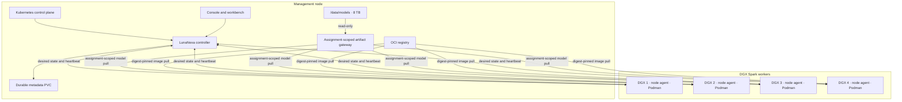

# LunaNexa deployment guide

This guide deploys LunaNexa on one management node with an 8 TB model disk at
`/data/models` and four DGX Spark compute nodes. It covers the currently
implemented managed model-service path and the management-plane portion of
exclusive node leasing.

## 1. Supported deployment shape

The repository templates assume one Kubernetes cluster containing the
management node and the four DGX workers:



The management node does not copy every model to every DGX. A selected node
pulls the exact artifact referenced by its signed assignment. The artifact is
verified and cached locally before its runtime container starts.

### Deployment readiness

| Capability | Status | Deployment implication |
| --- | --- | --- |
| Controller, scheduler, registry, API and audit | Implemented | Deploy on the management node |
| Rabbita operator console and enterprise portal/WebIDE | Implemented | Serve as two sites behind the trusted TLS ingress |
| Durable enterprise signing and lease-request workflow | Implemented | Configure an approved provider and signed callback secret; LunaFide remains test-only |
| DGX heartbeat, sensor telemetry and assignment reconciliation | Implemented | Deploy one protected agent per DGX with allowlisted `nvidia-smi` |
| Selected-node model pull and local verification | Implemented | Controller serves only the object bound to the live node assignment from `/data/models` |
| Batch jobs and autoscaling | Intentionally absent | Capacity is a fixed four-node fleet; operator placement and backpressure are explicit |
| Digest-pinned runtime supervision | Implemented | Requires Podman/Docker, an OCI registry and an approved runtime image |
| Controller/node transport mTLS termination | External | Provide a trusted service-mesh or loopback proxy; do not expose controller HTTP directly |
| Exclusive lease reservation and managed-placement fence | Implemented | Safe for control-plane testing |
| Exclusive lease watchdog and helper protocol | Implemented | Persists signed generation, expires offline, reports provision/revoke/sanitize/quarantine evidence |
| Privileged account/SSH/sanitization helper | Reference implementation included | Install the root-owned helper and fixed client for host-systemd mode; physically validate the host policy before production leases |
| OCI registry, CA, secret manager and metrics backend | External | Provision independently; they are not LunaNexa services |

## 2. Non-negotiable boundaries

- `/data/models` remains on the management node. Do not NFS-mount it into DGX
  runtime containers or expose its host path through the public API.
- Keep logical `s3://bucket/object` references in catalog records, but point the
  node agent at the controller's protected `/v1/artifacts` gateway. The gateway
  resolves the key below `/data/models` only after node, assignment, deployment,
  digest, expiry, controller epoch, signature and one-time transfer checks pass.
- Runtime images are immutable OCI images pinned by full SHA-256 digest.
- Every DGX has a unique node credential. Bootstrap tokens are one-use and
  expire within 15 minutes.
- Controller signing keys, node tokens, artifact credentials, operator tokens
  and TLS private keys must come from a secret manager or protected host files.
  Do not store them in Git, ConfigMaps, command history or lease JSON.
- A node is either available for managed services or fenced for an exclusive
  lease. These modes must never overlap.

## 3. Prerequisites

### Management node

- Linux host with the 8 TB filesystem already formatted and mounted at
  `/data/models`;
- a supported Kubernetes control plane and persistent storage provisioner;
- ingress-nginx or an equivalent identity-aware TLS ingress;
- OCI build/publish tooling and Cosign;
- an OCI registry reachable by every DGX;
- a certificate authority, secret manager and backup target;
- a service-mesh or node-local proxy able to establish mTLS from every DGX to
  the management plane;
- DNS records for the LunaNexa API/UI, registry and runtime
  endpoints.

Creating or formatting the 8 TB filesystem is outside this repository. Verify
the intended device and mount before installing LunaNexa:

```sh
findmnt /data/models
df -h /data/models
sudo install -d -m 0750 -o ARTIFACT_USER -g ARTIFACT_GROUP /data/models
```

Replace `ARTIFACT_USER` and `ARTIFACT_GROUP` with the controller's read-only
runtime identity. Do not run a filesystem formatter as part of an automated
LunaNexa install.

### DGX Spark nodes

Each DGX needs:

- a unique, stable Kubernetes node name such as `dgx-spark-01`;
- the NVIDIA driver/toolkit required by the approved runtime image;
- Podman or Docker at an allowlisted path;
- a protected engine socket at `unix:///run/podman/podman.sock` or an approved
  equivalent below `/run`;
- the root-owned `/usr/libexec/lunanexa-lease-helper` and unprivileged fixed
  client `/usr/libexec/lunanexa-lease-helper-client` for the recommended host
  systemd deployment, or a separately reviewed socket adapter when the node
  agent runs in Kubernetes;
- a pre-created OCI network named `lunanexa-runtime`;
- host directories `/etc/lunanexa` and `/var/lib/lunanexa`;
- network access to the controller, artifact HTTPS endpoint, OCI registry and
  approved runtime route only;
- synchronized time. Heartbeats outside the controller replay window are
  rejected.

The supplied DaemonSet uses host paths for configuration, state and the Podman
socket. Confirm that its non-root process identity can read the configuration
files, write `/var/lib/lunanexa`, and access only the intended engine socket.
It also requires a deployment-owned lease-helper socket adapter; the bundled
sudo client is for the host systemd layout and is not mounted into the
DaemonSet. The node agent never invokes a shell
or accepts controller-supplied commands: it calls only the fixed
`provision|revoke|sanitize|quarantine` client actions with validated lease IDs,
usernames, credential references and expiry. The privileged service must resolve
credential references locally, lock access at expiry, remove lease-labelled
containers and user state, and return a bounded receipt. Its absence or nonzero
result quarantines the node.

For the recommended exclusive-lease host layout, build the three native
executables, install the deployment files with root ownership, validate the
sudoers policy, and enable the explicit helper marker:

```sh
moon build cmd/node cmd/lease-helper cmd/lease-helper-client --target native
sudo install -o root -g root -m 0755 _build/native/debug/build/cmd/node/node.exe /usr/libexec/lunanexa-node
sudo install -o root -g root -m 0755 _build/native/debug/build/cmd/lease-helper/lease-helper.exe /usr/libexec/lunanexa-lease-helper
sudo install -o root -g root -m 0755 _build/native/debug/build/cmd/lease-helper-client/lease-helper-client.exe /usr/libexec/lunanexa-lease-helper-client
sudo install -o root -g root -m 0440 deploy/sudoers/lunanexa-lease-helper /etc/sudoers.d/lunanexa-lease-helper
sudo visudo -cf /etc/sudoers.d/lunanexa-lease-helper
sudo install -o root -g root -m 0644 deploy/tmpfiles.d/lunanexa-lease.conf /etc/tmpfiles.d/lunanexa-lease.conf
sudo systemd-tmpfiles --create /etc/tmpfiles.d/lunanexa-lease.conf
sudo install -o root -g root -m 0644 deploy/systemd/lunanexa-node.service /etc/systemd/system/lunanexa-node.service
sudo install -o root -g root -m 0600 /dev/null /etc/lunanexa/lease-helper.enabled
```

Copy `deploy/lunanexa-node.env.example` to `/etc/lunanexa/node.env`, replace
every example endpoint/identifier, and install the referenced host credentials
separately. The credential issuer stages exactly one public SSH certificate/key
line at `/run/lunanexa/lease-credentials/LEASE_ID.authorized_keys`; the helper
consumes it without accepting a controller-provided path and removes it during
sanitization. The dedicated lease user must have no writable path outside its
home and rootless runtime storage. Configure and test per-user temporary/mount
namespaces before enabling SSH.

### Node transport boundary

The controller process listens on HTTP inside its trusted deployment boundary.
The node executable accepts an HTTPS controller URL, or loopback HTTP for a
local proxy, but it does not currently load an X.509 client key into its native
HTTP transport. Deploy one of these patterns:

1. a node-local sidecar listening on `127.0.0.1` that establishes mTLS to the
   management service; or
2. an equivalent service-mesh path that transparently authenticates and
   encrypts node traffic.

Set the node's `controller-endpoint` to the protected endpoint for that pattern.
The per-node `Node` credential, heartbeat HMAC and replay fence remain required
inside the mTLS channel. The enrollment certificate record does not replace
transport TLS configuration. The base DaemonSet does not include this proxy;
add it in the reviewed production overlay. Do not make the public ingress
accept unauthenticated node traffic as a workaround.

## 4. Build and publish immutable images

From the repository root:

```sh
sh scripts/release-gate.sh
moon build cmd/control cmd/node cmd/cli --target native --release
sh scripts/build-browser-bundles.sh
```

Build controller, node, console and workbench images in the deployment-owned
image pipeline. Bundle the allowlisted Cosign binary in the controller and node
images. Sign each image, publish it to the private registry, and record its full
digest.

The files in `deploy/` intentionally contain values such as
`${CONTROLLER_IMAGE_DIGEST}` and `registry.invalid`. They are templates and
must not be applied until a reviewed overlay has replaced every placeholder
with a production value.

## 5. Prepare model and runtime distribution

### Model storage and scoped gateway

Use a deterministic layout under `/data/models`; for example:

```text
/data/models/
  models/
    model.text/
      v1/
        model.blob
        model.blob.sig
  manifests/
  quarantine/
```

Register the model above using the logical object
`s3://models/model.text/v1/model.blob`. With
`LUNANEXA_MODEL_STORE_ROOT=/data/models`, the controller resolves it as
`/data/models/models/model.text/v1/model.blob`. The gateway has no list or write
route. A DGX authenticates with its own Node credential and must send the
assignment ID, deployment ID and model digest headers added by the node daemon.

Before registration:

1. calculate and record the complete SHA-256 digest and byte size;
2. sign the blob with the deployment artifact-signing authority;
3. store the detached signature beside the blob;
4. verify the signature from a clean host;
5. retain license, provenance and evaluation evidence outside the model blob.

Set the node ConfigMap `artifact-endpoint` to the protected controller artifact
base, for example `https://control.cluster.example/v1/artifacts`. The node agent
constructs `<artifact-endpoint>/<bucket>/<object>`. The built-in gateway supports
ordinary GET and strict `Range: bytes=N-` resume. It consumes a durable,
short-lived transfer nonce before opening the file and returns no filesystem
path or model-store credential.

### Runtime images and routes

Publish each approved model server as a digest-pinned OCI image with an
image-defined health check. The current node supervisor does not publish a host
port. Production routing therefore requires an approved node-local HTTPS
gateway or equivalent endpoint attached to the `lunanexa-runtime` network.
That gateway must route only to the assigned, healthy container and must be
measured as part of cluster acceptance.

Create the strict route document used by the controller:

```json
[
  {
    "node_id": "dgx-spark-01",
    "endpoint": "https://runtime-01.cluster.example/v1/responses"
  },
  {
    "node_id": "dgx-spark-02",
    "endpoint": "https://runtime-02.cluster.example/v1/responses"
  },
  {
    "node_id": "dgx-spark-03",
    "endpoint": "https://runtime-03.cluster.example/v1/responses"
  },
  {
    "node_id": "dgx-spark-04",
    "endpoint": "https://runtime-04.cluster.example/v1/responses"
  }
]
```

Every schedulable node must have exactly one HTTPS mapping. There is no fallback
from an unmapped node to the generic runtime URL in strict mode.

## 6. Prepare Kubernetes placement and identity

Label nodes explicitly:

```sh
kubectl label node MANAGEMENT_NODE lunanexa.io/role=management
kubectl label node dgx-spark-01 lunanexa.io/role=gpu
kubectl label node dgx-spark-02 lunanexa.io/role=gpu
kubectl label node dgx-spark-03 lunanexa.io/role=gpu
kubectl label node dgx-spark-04 lunanexa.io/role=gpu
```

Replace `MANAGEMENT_NODE` with the real Kubernetes node name. Add a reviewed
deployment overlay with:

- `nodeSelector: {lunanexa.io/role: management}` for the controller, console,
  workbench and controller artifact gateway;
- `nodeSelector: {lunanexa.io/role: gpu}` for the node-agent DaemonSet;
- tolerations only for the taints deliberately assigned to those nodes.

This overlay is required: the base manifests do not currently enforce these
selectors, so applying them unchanged could run an agent on the management node
or a management component on a DGX.

Create a dedicated namespace and label only the trusted ingress namespace:

```sh
kubectl create namespace lunanexa
kubectl label namespace INGRESS_NAMESPACE lunanexa.io/ingress=trusted
```

Label the namespace containing external runtime routes as required by the
reviewed `deploy/network-policy.yaml` overlay:

```sh
kubectl label namespace RUNTIME_NAMESPACE lunanexa.io/service=runtime
```

If services use host addresses rather than namespaces, replace the namespace
selectors with narrowly scoped `ipBlock` rules. Never add unrestricted egress.

## 7. Provision secrets and trust

Use the deployment secret provider to create these Kubernetes Secrets. Secret
manifests and literal values are intentionally absent from the repository.

### Controller credential keys

The `lunanexa-control-credentials` Secret must provide:

- `runtime-token`;
- `operator-token`;
- `inference-token`;
- `audit-token`;
- `monitoring-token`;
- `assignment-signing-secret`;
- `catalog-signing-secret`;
- `exclusive-lease-signing-secret`;
- `provider-callback-secret` (at least 32 random bytes, independent of every
  other signing authority);
- `api-key-issuer-secret` (at least 32 random bytes, independent of every other
  signing authority).

The separate `lunanexa-database` Secret must provide `database`, `username`,
`password`, and `url`. The URL is consumed only by the management controller
and must enable verified TLS when the database is external. Never expose
PostgreSQL to a GPU node or public ingress.

Use independent random values. `assignment-signing-secret` is also provisioned
to each node as the protected assignment verification key. Treat disclosure of
that shared verifier as cluster-wide signing-authority compromise.

Set `LUNANEXA_PROVIDER_CALLBACK_NAME` and
`LUNANEXA_PROVIDER_CALLBACK_ENVIRONMENT` to the exact adapter identity used by
the approved provider. The adapter signs the raw callback body and the provider,
environment, event ID and millisecond timestamp headers with
`provider-callback-secret`. Rotate this key through a reviewed dual-delivery
window at the ingress; never reuse the test-only LunaFide MAC. Configure
`LUNANEXA_EXCLUSIVE_LEASE_PRICE_PER_SECOND_MINOR`,
`LUNANEXA_BILLING_CURRENCY`, and `LUNANEXA_BILLING_SCALE` before enabling hard
budgets. A zero unit price is suitable only for an explicitly free/internal
service profile.

The provider callback request is:

```text
POST /v1/provider-callbacks/commercial
X-LunaNexa-Provider: <configured provider>
X-LunaNexa-Environment: <configured environment>
X-LunaNexa-Event-Id: <stable provider event id>
X-LunaNexa-Event-Timestamp: <Unix milliseconds>
X-LunaNexa-Signature: <lowercase hex HMAC-SHA256>
```

The MAC input is the UTF-8 string
`lunanexa.provider-callback.v1|provider|environment|event-id|timestamp|raw-body`.
The listener allows at most five minutes of clock skew, binds the body fields
back to the authenticated headers, and stores the callback ID for replay.
Payment, tax-invoice, identity and qualified-signature adapters use the same
transport. Do not send `signature_verified` to an operator endpoint; those
routes fail with `VerifiedTransportRequired`.

### TLS and Cosign trust

Provision:

- `lunanexa-ingress-tls` for the public TLS endpoint;
- `lunanexa-client-ca` for ingress client-certificate validation;
- `lunanexa-cosign-trust` containing `cosign.pub`;
- the same read-only artifact verification public key on each DGX.

The native controller is designed to sit behind this trusted ingress. Do not
publish its port directly to an untrusted network.

## 8. Prepare each DGX host

Create the protected directories and rootless runtime network according to the
local OS and container-engine policy. Each host must contain:

```text
/etc/lunanexa/
  inventory.json
  node-token
  node-public-key
  assignment-verification-key
  cosign.pub
  bootstrap-token-id       # temporary, one use
  bootstrap-token          # temporary, one use
/var/lib/lunanexa/
  node-state.json           # created by the agent
  node-certificate.json     # created by enrollment
  models/                   # disposable verified local cache
```

Set credential files to mode `0600` and the directory to a protected owner/group
readable by the node agent. Do not use the same `node-token` on two DGX hosts.

Example inventory for `dgx-spark-01`:

```json
{
  "node_id": "dgx-spark-01",
  "agent_version": "0.1.0",
  "os_release": "ubuntu",
  "runtime_names": ["registry.example/model-runtime"],
  "accelerators": [
    {
      "device_id": "gpu-0",
      "architecture": "nvidia-gb10",
      "memory_total_mib": 128000,
      "memory_free_mib": 128000,
      "healthy": true
    }
  ],
  "labels": {
    "lunanexa.models": "model.text@v1",
    "lunanexa.warm-models": "",
    "lunanexa.data-classes": "Public,Internal,Confidential",
    "lunanexa.queue-depth": "0",
    "lunanexa.reliability-per-mille": "1000"
  },
  "taints": []
}
```

Inventory must be generated from the real host. Do not copy memory or device
values from this example without verifying them. Live utilization, used/total
GPU memory, maximum temperature and aggregate power come from the fixed
`nvidia-smi` sensor query; labels cannot override those measurements.

## 9. Render and apply the management plane

Render a private overlay that replaces:

- all image digests and registry names;
- controller epoch and runtime/model digests;
- controller artifact base and strict runtime endpoints;
- TLS hostname and namespace placeholders;
- storage class and PVC requirements;
- the management/GPU node selectors;
- any deployment-specific network-policy addresses.

Review `deploy/admin-settings.example.json` as an operator-owned artifact,
increment its `generation` for every approved policy change, and place it in
the `lunanexa-admin-settings` ConfigMap. The same read-only document is mounted
by the controller and all node agents. Enterprise users cannot mutate it; their
request choices are bounded by it, while locale and editor presentation remain
browser-local. See [settings authority](SETTINGS_AUTHORITY.md) for the complete
ownership table and validation limits.

Keep rendered manifests outside Git if they contain private inventory. Review
them for unresolved placeholders before applying:

```sh
rg '\$\{[A-Z0-9_]+\}|registry\.invalid|lunanexa\.invalid' RENDERED_DIRECTORY
```

The command must return no unresolved production placeholder. Apply in this
order:

1. namespace labels, service accounts, PVC, ConfigMaps and secret-provider
   resources derived from `deploy/prerequisites.yaml`;
2. PostgreSQL from `deploy/postgres.yaml`, or the approved external PostgreSQL
   service, then run the `cmd/database` migration check;
3. controller from `deploy/controller.yaml`;
4. console and enterprise/workbench sites;
5. network policies;
6. ingress;
7. the node-agent DaemonSet after the first DGX has been prepared.

Check the management plane before enrollment:

```sh
kubectl -n lunanexa rollout status deployment/lunanexa-control
kubectl -n lunanexa get pods,svc,ingress,pvc
curl --fail --cacert SERVER_CA_FILE \
  --cert OPERATOR_CLIENT_CERT --key OPERATOR_CLIENT_KEY \
  https://LUNANEXA_HOST/health
```

Client-certificate options depend on the chosen identity system; supply them
without putting private-key material in shell history.

## 10. Enroll the DGX nodes

Configure the CLI on a trusted operator host:

```sh
export LUNANEXA_ENDPOINT=https://LUNANEXA_HOST
export LUNANEXA_OPERATOR_TOKEN=FROM_SECRET_PROVIDER
```

For each DGX, generate a distinct bootstrap secret of at least 20 characters
and an expiry no more than 15 minutes in the future. Create a private JSON file:

```json
{
  "token_id": "bootstrap-dgx-spark-01",
  "secret": "REFERENCE_TO_A_FRESH_ONE_USE_VALUE",
  "expires_unix_ms": "REPLACE_WITH_UNIX_MILLISECONDS"
}
```

The JSON file passed to the CLI must contain the actual one-use value, but it
must be created with mode `0600`, excluded from Git, transferred through the
private operations channel and destroyed after enrollment.

Issue it:

```sh
lunanexa issue-enrollment-token bootstrap-dgx-spark-01.json
```

Place the matching ID and secret in the selected node's temporary
`/etc/lunanexa/bootstrap-token-id` and `/etc/lunanexa/bootstrap-token` files,
then enable the node-agent pod on that node. The agent enrolls, stores its
certificate under `/var/lib/lunanexa`, starts heartbeats and rotates the
certificate before expiry. Remove both bootstrap files after successful
enrollment.

Enroll and validate one DGX before enabling the other three:

```sh
lunanexa nodes
kubectl -n lunanexa logs daemonset/lunanexa-node --tail=100
```

Repeat with new bootstrap and node credentials for each remaining DGX.

## 11. Register and deploy the first model service

Use the operator sequence in `docs/OPERATIONS.md` to register the runtime,
model, license, verification and evaluation evidence, then approve and promote
an alias.

Update the example catalog template and intent with real digests, logical object
references, resources and policies. Then run:

```sh
lunanexa register-template deploy/model-service-template.example.json
lunanexa plan-deployment deploy/model-service-intent.example.json
lunanexa deploy deploy/model-service-intent.example.json
lunanexa deployments
```

The same governed deployment is available from the Rabbita console after the
management plane is reachable:

1. open the console through the trusted TLS ingress and expand **Controller
   connection**;
2. enter the operator and audit credentials from the deployment secret
   provider, then select **Connect and refresh**;
3. on **Overview**, require all four **Deployment launchpad** checks to be
   green;
4. select **Open one-click deployment**;
5. choose the approved immutable template and enter a unique service name. The
   console displays fixed one-machine capacity and provides no replica control;
6. select **Deploy model service** once. The controller performs the
   authoritative preflight and creates one durable, idempotent operation;
7. follow the operation in **Service operations** until it is ready, then
   promote it if the template requires explicit promotion.

The browser keeps credentials in memory and does not persist them in cluster
metadata. Retrying the same service name uses the same console idempotency key.
A different desired deployment must use a different service name.

“One click” begins after the deployment prerequisites are satisfied. It does
not silently install Kubernetes, configure TLS, create secret-provider
material, expose `/data/models`, enroll DGX hosts or approve a model license.
Those high-authority steps remain explicit because they require
deployment-specific trust and human approval.

The dry-run plan must be executable and name only eligible capacity. After the
deployment is accepted, verify:

- only the selected DGX downloads the model;
- the cache entry matches the declared size, digest and signature;
- the runtime receives a read-only mount at
  `/var/lib/lunanexa/model/model`;
- no node credential or logical object reference appears in the runtime
  environment;
- the node heartbeat reports the deployment only after runtime health succeeds;
- inference routing reaches the endpoint mapped to that DGX.

Do not pre-copy the model to the other three nodes. Their caches should remain
unchanged until an assignment explicitly selects them.

## 12. Exclusive node leases

The implemented management-plane lease API reserves exactly one DGX, generation-
fence its lifecycle and remove it immediately from managed placement:

```sh
lunanexa lease-node deploy/exclusive-node-lease.example.json
lunanexa exclusive-leases
lunanexa terminate-node-lease LEASE_ID GENERATION operator-request
```

Before submitting the example, replace its unique identifiers and both lease
timestamps. The repository deliberately does not ship a moving or silently
valid login window; `starts_unix_ms` must be current/future and
`expires_unix_ms` must be later.

Each non-terminal lease owns one machine and one subject; the lease authority
rejects a second lease on that node. The lease body contains a validated
username and an `ssh-cert:` or `secret:`
reference. It never contains a password, private key or certificate value.

Reservation fences and cordons the selected node but does not immediately
create login access. The authenticated node poll advances to `Provisioning`
only after desired assignments and heartbeat-observed runtimes are empty. The
generic operator transition endpoint is fail-closed; `Active` and `Completed`
require fresh node-helper evidence.

Natural expiry is reconciled when the node polls. The termination command and
the operator console's **Terminate & clean** action use the same generation
fence. Both paths revoke access before sanitization. A node returns to managed
service only after the controller validates a fresh, action/lease/generation-
bound helper receipt. Any failure leaves it quarantined and unavailable.

The bundled helper implements the reference Linux account, staged SSH access,
rootless Podman and dedicated-home policy. Production interactive access is
still blocked until that policy, writable-path isolation and the destructive
expiry/early-termination cases pass on every physical DGX host image.

## 13. Acceptance checklist

Before production use, record evidence that:

- all four nodes have distinct credentials and truthful inventory;
- TLS client identity, controller-to-node authority and heartbeat replay fences
  reject invalid callers;
- controller state survives restart under a higher fencing epoch;
- an approved model deploys to exactly one selected DGX;
- digest/signature failure prevents runtime launch;
- an unlicensed or failed-evaluation model is blocked before assignment;
- draining one node prevents new placement there;
- natural expiry and early termination kill tenant work, remove the dedicated
  account/home/access material/runtime objects, reject forged evidence, and
  keep an unclean node quarantined;
- strict runtime routing cannot reach an unmapped node;
- prompts, outputs, secrets, internal paths and node addresses do not appear in
  public responses or ordinary logs;
- backup and clean-host restore meet the declared RPO/RTO;
- measured DGX performance and model-license acceptance have named human
  approval.

Run the repository-owned validation before every image promotion:

```sh
sh scripts/release-gate.sh
```

The adversarial corpus, exact commands, evidence interpretation and remaining
blockers are recorded in `docs/PRODUCTION_READINESS.md`. This gate does not
replace the physical four-node acceptance campaign.

## 14. Backup, upgrade and rollback

Back up all controller snapshots together:

- controller/audit;
- registry;
- enrollment/certificate authority state;
- scheduler/quota state;
- telemetry evidence;
- workspace authority and admission state;
- model-service deployment operations;
- exclusive-node lease authority.

Back up `/data/models` separately by immutable digest, including detached
signatures and license/provenance manifests. Test restoration on a clean
management node.

The current native `lunanexa.backup.v2` recovery bundle covers the five core
controller, registry, enrollment, scheduler and telemetry snapshots. Until that
format is extended, the deployment backup system must separately capture the
workspace/admission files, model-service operations and exclusive-lease state
while the controller is fenced. A five-file bundle alone is not a complete
backup of this deployment.

For an upgrade:

1. fence the previous controller;
2. back up and verify state;
3. deploy the new controller in reconciliation-only mode with a higher epoch;
4. inspect `lunanexa recovery-plan`;
5. enable mutations after node reconciliation;
6. cordon and upgrade one DGX agent at a time.

Rollback is permitted only when on-disk schemas remain compatible. A rolled-
back controller still needs a newer epoch; never reuse an older fencing epoch.

## 15. Common deployment failures

| Symptom | Likely cause | Check |
| --- | --- | --- |
| Controller does not start | Missing required secret/config reference | Pod events and controller environment references |
| Node enrollment rejected | Expired/reused bootstrap or weak node token | Token expiry, one-use status and unique host files |
| Heartbeat rejected | Clock skew, wrong node ID/token or stale generation | NTP, inventory ID and node credentials |
| No placement | Node cordoned, leased, unhealthy or incompatible | `lunanexa nodes`, lease list and dry-run findings |
| Model download fails | Assignment binding, node credential, source path, size or range handling | Controller `artifact.transfer` audit plus node evidence without exposing credentials |
| Model never reaches runtime | Digest or detached signature verification failed | Node agent evidence and quarantine path |
| Runtime never becomes ready | Image digest, health check, engine socket or gateway mismatch | Podman inspection and strict route mapping |
| Controller cannot invoke runtime | Missing/incorrect node endpoint or network policy | Runtime endpoint document, DNS and allowed egress |
| DGX remains unavailable after lease | Lease is non-terminal or quarantined | Lease generation and revocation/sanitization evidence |

For security rotation and recovery details, also read
`docs/SECURITY_OPERATIONS.md`, `docs/RECOVERY_RUNBOOK.md` and
`docs/EXCLUSIVE_NODE_LEASES.md`.
