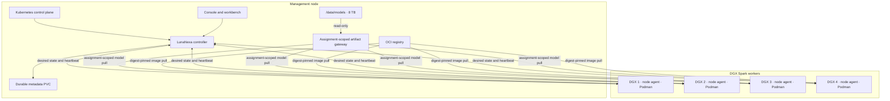

# LunaNexa deployment guide

This guide covers the topology-neutral installation workflow and then uses the
first named acceptance profile—one management placement with an 8 TB model
disk at `/data/models` and four DGX Spark compute placements—as a concrete
example. That example is not a node-count, co-location, storage-placement or
network-ingress requirement. The guide covers the currently implemented
managed model-service path and the management-plane portion of exclusive node
leasing.

If this is your first installation, follow **First installation: exact order**
below before using the detailed reference sections. The most important
distinction is that management placement and LunaNexa compute enrollment are
separate decisions. A host performs compute enrollment only when it is
explicitly selected and qualified, even if that host also carries management.

Contract-document packet state is stored in management PostgreSQL. File-mode
development uses `LUNANEXA_CONTRACT_DOCUMENT_PATH`; the supplied manifest sets
`/var/lib/lunanexa/contract-documents.json`. Exact DOCX/PDF publication remains
blocked until the renderer image contains licensed `仿宋_GB2312`, `黑体`, and
`方正小标宋简体` fonts and passes the 18-page fidelity gate described in
[`CONTRACT_DOCUMENTS.md`](CONTRACT_DOCUMENTS.md).

## 1. Named four-DGX acceptance example

The diagram is the first physical acceptance campaign. The installer and node
protocol accept a different explicitly selected inventory:



The management node does not copy every model to every DGX. A selected node
pulls the exact artifact referenced by its signed assignment. The artifact is
verified and cached locally before its runtime container starts.

### Deployment readiness

| Capability | Status | Deployment implication |
| --- | --- | --- |
| Controller, scheduler, registry, API and audit | Implemented | Deploy on the management node |
| Rabbita operator console and enterprise portal/WebIDE | Implemented | Serve as two sites behind the trusted TLS ingress |
| Durable enterprise signing and lease-request workflow | Implemented | Configure an approved provider and signed callback secret; LunaFide remains test-only |
| DGX heartbeat, sensor telemetry and assignment reconciliation | Implemented | Deploy one protected agent per DGX with allowlisted `nvidia-smi` |
| Selected-node model pull and local verification | Implemented | Controller serves only the object bound to the live node assignment from `/data/models` |
| Batch jobs and autoscaling | Intentionally absent | Capacity is an explicitly inventoried fleet; operator placement and backpressure are explicit |
| Digest-pinned runtime supervision | Implemented | Requires Podman/Docker, an OCI registry and an approved runtime image |
| Controller/node transport mTLS termination | External | Provide a trusted service-mesh or loopback proxy; do not expose controller HTTP directly |
| Exclusive lease reservation and managed-placement fence | Implemented | Safe for control-plane testing |
| Exclusive lease watchdog and helper protocol | Implemented | Persists signed generation, expires offline, reports provision/revoke/sanitize/quarantine evidence |
| Privileged account/SSH/sanitization helper | Reference implementation included | Install the root-owned helper and fixed client for host-systemd mode; physically validate the host policy before production leases |
| Contract governance A–G | Implemented locally | Configure operator identity mappings and expiry/approval settings; validate external legal, finance, ledger and notification gates before production use |
| OCI registry, CA, secret manager and metrics backend | External | Provision independently; they are not LunaNexa services |

The Kubernetes readiness probe calls the disclosure-safe `/ready` local
component gate while its liveness probe calls `/health`. Before admitting
production users, call the operator-protected
`GET /v1/readiness`. Unlike `/health`, it is a fail-closed aggregate deployment
gate and returns stable blocker codes for notification delivery, observability,
offline-commerce evidence, exclusive-machine credentials/helper verification,
artifact verification and guide diagnostics. Do not make the Kubernetes
liveness probe depend on external providers; use this endpoint from the release
check after all provider credentials and signed evidence are installed.

### Contract-governance deployment inputs

The contract governance routes use the same durable contract-document store as
the packet workflow. Configure the operator mapping as a comma-separated set of
`operator-ref=token` entries; tokens are host/deployment references and must not
be committed:

```text
LUNANEXA_OPERATOR_TOKENS=operator:alice=FROM_SECRET_PROVIDER_ALICE,operator:bob=FROM_SECRET_PROVIDER_BOB
LUNANEXA_CONTRACT_APPROVAL_THRESHOLD_CNY=50000.00
LUNANEXA_CONTRACT_EXPIRY_RECONCILE_INTERVAL_MS=3600000
LUNANEXA_CONTRACT_EXPIRY_GRACE_DAYS=7
```

The threshold is optional; when configured, high-value execute/close actions
require a different mapped operator to approve them. The interval and grace
period are bounded by the controller and apply to automatic expiry closure.
Operator-token mapping provides audit attribution only. It is not an IdP,
tenant-level RBAC system, or a replacement for ingress identity; production
deployments must still bind the operator reference to the approved identity
provider and tenant policy. Settlement drafts, invoices, legal approval,
signatures, notification delivery and ledger reconciliation remain external
gates and must be evidenced before `/v1/readiness` is accepted.

## First installation: exact order

There are two different meanings of “register a node” in this deployment:

| Host | Kubernetes registration | LunaNexa enrollment |
| --- | --- | --- |
| Management placement | Join the selected host to Kubernetes and label the selected node `lunanexa.io/role=management` | It is not compute capacity unless the operator separately qualifies and enrolls that same physical host for an explicit test or co-located profile |
| DGX compute node | Join it as a Kubernetes worker and label it `lunanexa.io/role=gpu` | Enroll it with a one-use bootstrap token and a unique persistent node secret |

These are logical roles, not an assumed count of physical machines. A lab may
explicitly co-locate management and temporary compute on one host; the
production profile may separate them for failure isolation. An access node,
bastion or jump host is **not** a LunaNexa component and is not required by the
product. If the operator network requires one, keep it in the operator-owned
OpenSSH/VPN configuration rather than registering it as management or compute.

For the planned four-DGX acceptance inventory, the safe first-install sequence
is below. A different explicitly selected inventory ends after its final
selected compute node; “remaining three” is not a scheduler invariant.

```text
management host ready
→ management node labelled
→ management plane rendered and started
→ health and ingress verified
→ first DGX joined and prepared
→ first DGX enrolled and heartbeating
→ remaining three DGX nodes enrolled one at a time
→ runtime/model evidence registered
→ first model service planned and deployed
```

### Assisted deployment UI

The repository includes a guarded installer page and a loopback-only native
companion. The page does not infer a topology. Select one explicit scope:

- **Management foundation** installs only the management, database, model-data
  and storage-facing services. Compute inventory must be empty.
- **Add compute nodes** enrolls only the selected compute hosts into an
  existing management plane.
- **Management + selected compute** installs both logical roles in one reviewed
  operation using only the hosts explicitly listed by the operator.
- **Local Colima simulation** reconciles the isolated development topology and
  makes no production-hardware claim.

Remote modes start at pinned SSH verification. The selected hosts must already
have joined the Kubernetes cluster through the procedure owned by the chosen
distribution. The current companion deliberately does not choose or install a
Kubernetes distribution, accept a `kubeadm join` token, or expose an arbitrary
shell command. SSH port 22 is only the default and is editable in the form.

Build the browser bundles, serve `_build/browser-dist` on loopback, and start
the companion from the same trusted operator machine:

```sh
sh scripts/build-browser-bundles.sh
python3 -m http.server 4173 --bind 127.0.0.1 --directory _build/browser-dist
sh scripts/start-deployment-ui.sh
```

To keep the ephemeral companion bearer out of terminal scrollback, provide a
new absolute protected path. The start script refuses to overwrite or follow an
existing file:

```sh
LUNANEXA_INSTALLER_TOKEN_FILE=/ABSOLUTE/PROTECTED/session-token \
  sh scripts/start-deployment-ui.sh
```

Open `http://127.0.0.1:4173/installer/`. Paste only the session token printed by
the start script, then enter local paths and host inventory. Never paste an SSH
private key, Kubernetes credential, node token or bootstrap secret into the
page. The page stores none of these form fields in browser storage.

For a management install, render the non-secret combined manifest and generate
the protected secret manifest before opening the page:

```sh
scripts/deploy/render-management-foundation.sh \
  --output /ABSOLUTE/RENDERED_DIRECTORY \
  --management-node MANAGEMENT_NODE \
  --control-image IMMUTABLE_CONTROL_IMAGE \
  --web-image IMMUTABLE_WEB_IMAGE \
  --postgres-image IMMUTABLE_POSTGRES_IMAGE \
  --model-store-root /data/models \
  --control-uid MODEL_STORE_UID \
  --control-gid MODEL_STORE_GID \
  --runtime-endpoint http://127.0.0.1:19090/v1/responses \
  --public-api-base-url https://gpu.example.com \
  --controller-epoch 1
scripts/deploy/generate-management-secrets.sh \
  /ABSOLUTE/PROTECTED_DIRECTORY/management-secrets.yaml
```

The management form accepts the **paths** to those two artifacts. Secret values
never enter the page. The companion requires the secret manifest to be a regular
non-symlink file with mode `0400` or `0600` and applies it before workloads.

The UI always offers **Preview and verify** first. Preview performs only the
checks required by the selected scope: pinned-host SSH checks, management-disk
inspection, accelerator/runtime inspection for selected compute hosts,
Kubernetes node lookup, local secret-file presence checks and rendered-
placeholder scans. For management scopes it also runs Kubernetes diff against
the non-secret rendered manifest and prints only the identities of resources
that differ. The protected Secret manifest is deliberately excluded from that
diff, and an unsummarizable or failed diff blocks Preview. Preview does not
mutate hosts or Kubernetes. Apply remains
disabled until the scope-specific phrase (`DEPLOY MANAGEMENT`, `ADD COMPUTE`,
`DEPLOY MANAGEMENT AND COMPUTE`, or `RECONCILE SIMULATION`) is entered. Apply runs only
the versioned stages in `scripts/deploy/`; there is no interactive terminal
input or free-form command endpoint.

Prepare the protected local node-material directory in this shape before
previewing:

```text
SECRETS/
  dgx-spark-01/
    node-token
    assignment-verification-key
    cosign.pub
    inventory.json
    bootstrap-token-id
    bootstrap-token
    bootstrap.json
  dgx-spark-02/ ...
  dgx-spark-03/ ...
  dgx-spark-04/ ...
```

Each `bootstrap.json` is the private operator input for
`lunanexa issue-enrollment-token`; its ID and secret must match that node's two
temporary bootstrap files. The companion inherits `LUNANEXA_ENDPOINT` and
`LUNANEXA_OPERATOR_TOKEN` from its own protected environment for an apply run.
The start script never prints either value.

The companion binds only to `127.0.0.1` by default, requires a fresh 256-bit
session token, permits only the configured loopback browser origin, validates
all identifiers/hosts/absolute paths, runs one installation at a time, merges
and bounds subprocess output, and streams read-only terminal events. SSH always
uses `BatchMode=yes`, `IdentitiesOnly=yes` and `StrictHostKeyChecking=yes` with
the selected pinned `known_hosts` file.

The recommended management renderer emits one reviewed file:

```text
management.yaml
```

The split-manifest compatibility path requires these reviewed filenames:

```text
prerequisites.yaml
postgres.yaml
controller.yaml
console.yaml
enterprise.yaml
workbench.yaml
network-policy.yaml
```

`ingress.yaml` is optional. When it is absent the installer explicitly retains
protected port-forward access until a reviewed TLS edge exists. Compute scopes
default to `node-daemonset.yaml`. A host-agent installation declares the
alternative explicitly by writing exactly `host-systemd` to
`node-agent-layout`; it then provides these non-secret rendered artifacts:

```text
node-agent-layout
lunanexa-node
lunanexa-node.service
admin-settings.json
```

Each protected per-node directory for that layout additionally contains
`node.env`, `lunanexa-controller-tunnel.service`, `tunnel-identity`, and
`tunnel-known-hosts`. The tunnel is a lab-only loopback transport over the
operator-owned LAN; production still requires the reviewed TLS/mTLS edge.
The installer does not accept a mutable privileged script from the staging
directory. `/usr/libexec/lunanexa-install-node-material` must be installed
root-owned in advance, and the SSH account may receive non-interactive sudo
only for that fixed helper's exact `--check`, `--start`,
`--cleanup-bootstrap`, and selected node staging-path invocations.

The private overlay must include management placement selectors and a GPU
selector in `node-daemonset.yaml`. The installer refuses unresolved template
variables, `.invalid` endpoints, missing protected inputs, unknown SSH host
keys, missing accelerators on selected compute hosts, interactive sudo, or an
empty/invalid selected compute inventory.
The complete management-only UI procedure, incident record and promotion gaps
are maintained in
[MANAGEMENT_FOUNDATION_UI_RUNBOOK.md](MANAGEMENT_FOUNDATION_UI_RUNBOOK.md).

### Minimal local Kubernetes simulation on macOS

The local topology simulation uses a dedicated Colima profile and a `kind`
cluster with one control-plane node plus four workers. It validates Kubernetes
node labels, management placement and one compute pod per worker without
pretending that the Mac provides NVIDIA devices or production host identity.

With the `lunanexa` Colima profile running, start or reconcile the topology:

```sh
sh scripts/start-local-kubernetes-simulation.sh
```

The script uses only the dedicated `kind-lunanexa-sim` context in
`~/.kube/lunanexa-sim`, creates the `lunanexa` and `lunanexa-runtimes`
namespaces, and applies the tiny
`registry.k8s.io/pause` placement probes in
`deploy/local-simulation/topology-smoke.yaml`. It does not apply production
manifests, issue credentials, open ingress, mount the repository into the VM or
run SSH against any host.

Remove only the `kind` cluster, leaving Colima available for another run:

```sh
sh scripts/stop-local-kubernetes-simulation.sh
```

To remove the cluster and stop the dedicated Colima profile:

```sh
sh scripts/stop-local-kubernetes-simulation.sh --stop-colima
```

### Temporary physical NVIDIA worker qualification

For an explicitly selected NVIDIA worker, join K3s first, then label and taint
the node so ordinary management workloads cannot drift onto it:

```sh
kubectl label node NODE_NAME lunanexa.io/role=gpu --overwrite
kubectl taint node NODE_NAME lunanexa.io/role=gpu:NoSchedule --overwrite
kubectl apply -f deploy/nvidia-compute/device-plugin.yaml
kubectl -n kube-system rollout status daemonset/lunanexa-nvidia-device-plugin
job=$(kubectl create -f deploy/nvidia-compute/cuda-vectoradd-job.yaml -o name)
kubectl wait --for=condition=complete "$job" --timeout=5m
kubectl logs "$job"
```

Require a positive `nvidia.com/gpu` allocatable count and `Test PASSED`. This
qualifies Kubernetes-to-CUDA plumbing only. It does not enroll the LunaNexa
node agent or approve an inference runtime. The observed 2026-08-27 campaign,
LunaFlux diagnostics and remaining AOT-kernel blocker are recorded in
[LUNAFLUX_RUNTIME_QUALIFICATION.md](LUNAFLUX_RUNTIME_QUALIFICATION.md).

When a staged Linux MoonBit toolchain is used outside the image builder, first
build its native core bundle on the Linux host:

```sh
sh scripts/deploy/finalize-moonbit-linux-amd64.sh \
  /absolute/path/to/moon-linux-amd64
```

Do not copy a source checkout or compiler onto a managed GPU worker. Compile on
the trusted build system and deploy only inventoried runtime artifacts.
`scripts/deploy/build-node-linux-amd64.sh` therefore refuses an emulated Docker
daemon and requires a native x86_64 builder. Select a reviewed remote/local
Docker context with `LUNANEXA_AMD64_DOCKER_CONTEXT`; Apple-silicon binfmt/QEMU
is not an accepted compiler path because the native MoonBit compiler can abort
under user-mode emulation.

### Step 0 — Record the non-secret deployment inventory

Choose the real values before rendering manifests. These examples are shell
variables for readability; they must not contain credentials:

```sh
export LUNANEXA_NAMESPACE=lunanexa
export MANAGEMENT_NODE=management-01
export INGRESS_NAMESPACE=ingress-nginx
export RUNTIME_NAMESPACE=lunanexa-runtimes
export LUNANEXA_HOST=control.cluster.example
export ENTERPRISE_HOST=enterprise.cluster.example
```

Also record these four stable Kubernetes node names in the private deployment
inventory:

```text
dgx-spark-01
dgx-spark-02
dgx-spark-03
dgx-spark-04
```

Do not put node secrets, bootstrap secrets, database passwords, private keys or
private runtime addresses in that inventory file. Keep those in the deployment
secret provider.

### Step 1 — Register the management node with Kubernetes

Join the management host to the Kubernetes cluster using the procedure owned by
your Kubernetes distribution. LunaNexa deliberately does not generate a
`kubeadm join` command or cluster credential. Confirm the real node name, then
label it:

```sh
kubectl get nodes -o wide
kubectl label node "$MANAGEMENT_NODE" lunanexa.io/role=management --overwrite
kubectl get node "$MANAGEMENT_NODE" -L lunanexa.io/role
```

Prepare and verify the management-node model disk before any controller pod can
mount it:

```sh
findmnt /data/models
df -h /data/models
sudo test -d /data/models
```

Create the LunaNexa and runtime namespaces idempotently, then label the trusted
ingress and runtime namespaces. The ingress namespace must already belong to
the installed ingress controller; do not create a lookalike namespace just to
satisfy this command:

```sh
kubectl create namespace "$LUNANEXA_NAMESPACE" --dry-run=client -o yaml | kubectl apply -f -
kubectl create namespace "$RUNTIME_NAMESPACE" --dry-run=client -o yaml | kubectl apply -f -
kubectl get namespace "$INGRESS_NAMESPACE"
kubectl label namespace "$INGRESS_NAMESPACE" lunanexa.io/ingress=trusted --overwrite
kubectl label namespace "$RUNTIME_NAMESPACE" lunanexa.io/service=runtime --overwrite
```

The production overlay must add
`nodeSelector: {lunanexa.io/role: management}` to the controller, PostgreSQL,
console and enterprise/workbench workloads before they are applied. The base
manifests do not supply this selector. If the Kubernetes distribution taints
its control-plane node with `NoSchedule`, add only the narrow toleration needed
by these management workloads; do not make GPU workloads tolerate that taint.

### Step 2 — Install the management plane

Run the repository release gate, build immutable native/browser artifacts, and
publish deployment-owned controller, console, enterprise/workbench and node
images. The repository provides a local management-image pipeline; production
signing, provenance and registry publication still belong to the reviewed OCI
pipeline:

```sh
sh scripts/release-gate.sh
moon build cmd/control cmd/node cmd/cli cmd/database cmd/offline-artifact-worker --target native --release
sh scripts/build-browser-bundles.sh
sh scripts/deploy/build-management-images.sh RELEASE_TAG
```

If offline commerce is enabled, the immutable management image referenced by
`deploy/offline-pdf-pipeline-job.yaml` must package the separately built
`cmd/offline-artifact-worker` executable at
`/usr/local/bin/lunanexa-offline-artifact-worker`. The repository does not
silently add that binary to an OCI image. The same reviewed overlay must
configure an external dispatcher that polls the protected pending-generation
API, creates one PVC per job, stages inputs, uploads outputs, posts terminal
callbacks, and deletes the PVC after acknowledgement. It must also create the
renderer-evidence secret, distinct worker/scanner/entitlement callback tokens,
and a MoonLeaf renderer plus independent scanner path described in
[OFFLINE_COMMERCE.md](OFFLINE_COMMERCE.md).

Offline artifact readiness is derived from durable runtime proof, not a
configuration switch. The dispatcher must poll the authenticated claim route;
the controller requires a recent heartbeat and a recent accepted terminal
result. A stopped or never-proven dispatcher therefore leaves management
readiness degraded. Configure `LUNANEXA_OFFLINE_TRANSFER_ADAPTER_ENDPOINT`,
`_TOKEN`, and `_SESSION_SECRET` together or omit all three. Partial transfer
configuration fails startup.

Create the PostgreSQL, controller and ingress secrets through the secret
provider described in section 7. Render a private overlay that replaces every
image digest, hostname, storage class, route, certificate reference and
placeholder. Prove the render is complete:

```sh
rg '\$\{[A-Z0-9_]+\}|registry\.invalid|lunanexa\.invalid' RENDERED_DIRECTORY
```

That command must print nothing. Apply the rendered management resources in
this order, always to the LunaNexa namespace:

```sh
kubectl -n "$LUNANEXA_NAMESPACE" apply -f RENDERED_PREREQUISITES
kubectl -n "$LUNANEXA_NAMESPACE" apply -f RENDERED_POSTGRES
kubectl -n "$LUNANEXA_NAMESPACE" apply -f RENDERED_CONTROLLER
kubectl -n "$LUNANEXA_NAMESPACE" apply -f RENDERED_CONSOLE
kubectl -n "$LUNANEXA_NAMESPACE" apply -f RENDERED_ENTERPRISE
kubectl -n "$LUNANEXA_NAMESPACE" apply -f RENDERED_NETWORK_POLICIES
kubectl -n "$LUNANEXA_NAMESPACE" apply -f RENDERED_INGRESS
```

Run the database migration with a database-owner identity before relying on the
long-running controller. See [DATABASE.md](DATABASE.md) for the exact migration
and role split. Then require the controller and browser deployments to become
ready:

```sh
kubectl -n "$LUNANEXA_NAMESPACE" rollout status deployment/lunanexa-control
kubectl -n "$LUNANEXA_NAMESPACE" rollout status deployment/lunanexa-console
kubectl -n "$LUNANEXA_NAMESPACE" rollout status deployment/lunanexa-enterprise
kubectl -n "$LUNANEXA_NAMESPACE" get pods,svc,ingress,pvc -o wide
```

Verify `/health` through the trusted TLS ingress with an approved operator
client certificate. Do not proceed while testing only the controller pod IP or
an unauthenticated public route.

### Step 3 — Register the first DGX as a Kubernetes compute worker

Join `dgx-spark-01` to the same Kubernetes cluster using the distribution-owned
worker-join procedure. Confirm its real hardware and name before labelling it:

```sh
kubectl get node dgx-spark-01 -o wide
kubectl label node dgx-spark-01 lunanexa.io/role=gpu --overwrite
kubectl get node dgx-spark-01 -L lunanexa.io/role
```

At this point it is a Kubernetes worker, but it is not yet a LunaNexa compute
node. Do not label the other three DGX nodes yet; keeping only one eligible GPU
worker makes the first enrollment and acceptance slice easier to audit.

### Step 4 — Prepare the first DGX host identity

Follow sections 3, 6 and 8 to install the NVIDIA stack, approved container
engine, `lunanexa-runtime` network, node agent, Cosign trust and protected host
directories. Generate `inventory.json` from the actual host. Install these
deployment-owned values with protected permissions:

```text
/etc/lunanexa/node-token                    unique to dgx-spark-01
/etc/lunanexa/assignment-verification-key   cluster assignment verifier
/etc/lunanexa/cosign.pub                    artifact verification public key
/etc/lunanexa/inventory.json                truthful dgx-spark-01 inventory
```

For the built-in controller artifact gateway,
`LUNANEXA_ARTIFACT_CREDENTIAL_PATH` must resolve to the same unique node secret
as `LUNANEXA_NODE_TOKEN_PATH`; the reviewed examples point both at
`/etc/lunanexa/node-token`. The secret is authenticated again against the live
assignment and one-time transfer grant, so it is not a general model-store
credential.

Confirm the node ID agrees in all three places before starting the agent:

```text
Kubernetes node name       dgx-spark-01
LUNANEXA_NODE_ID           dgx-spark-01
inventory.json node_id     dgx-spark-01
```

### Step 5 — Enroll the first DGX into LunaNexa

Build or install the `lunanexa` CLI on a trusted operator host. The native CLI
does not load a client X.509 key, while the production ingress requires mTLS.
Use the reviewed operator-side proxy/mesh to present the operator certificate
upstream and expose only a local HTTP listener, for example
`http://127.0.0.1:18443`. Then inject the loopback endpoint and operator token
from the approved identity/secret system:

```sh
export LUNANEXA_ENDPOINT=http://127.0.0.1:18443
export LUNANEXA_OPERATOR_TOKEN=FROM_SECRET_PROVIDER
lunanexa health
```

Never bind that local listener to a non-loopback address. Direct `curl` checks
may instead present the operator certificate and key to the HTTPS ingress as
shown in section 9.

Create a fresh private bootstrap JSON document as described in section 10. Its
secret must be unique, at least 20 characters, one-use and valid for no more
than 15 minutes. Issue it:

```sh
lunanexa issue-enrollment-token bootstrap-dgx-spark-01.json
```

Deliver the matching token ID and secret to these temporary protected files on
`dgx-spark-01`:

```text
/etc/lunanexa/bootstrap-token-id
/etc/lunanexa/bootstrap-token
```

Now apply the rendered node DaemonSet, which must have
`nodeSelector: {lunanexa.io/role: gpu}` and the reviewed node-to-management mTLS
proxy/mesh configuration:

```sh
kubectl -n "$LUNANEXA_NAMESPACE" apply -f RENDERED_NODE_DAEMONSET
kubectl -n "$LUNANEXA_NAMESPACE" get pods -l app=lunanexa-node -o wide
kubectl -n "$LUNANEXA_NAMESPACE" logs daemonset/lunanexa-node --tail=100
```

The agent exchanges the one-use token, persists its certificate under
`/var/lib/lunanexa`, then starts authenticated heartbeats. From the trusted
operator host, verify:

```sh
lunanexa nodes
```

Do not proceed until the result contains exactly `dgx-spark-01`, its state is
active, its inventory is truthful, and its heartbeat stays fresh for several
reconcile intervals. The management node should not appear in this list. After
successful enrollment, remove the two bootstrap files through the approved
secret-removal procedure; keep the unique node secret and persisted certificate.

### Step 6 — Enroll DGX 2–4 one at a time

For each remaining DGX:

1. join it to Kubernetes;
2. prepare its host directories, runtime and truthful inventory;
3. create a new persistent node secret and a new one-use bootstrap token;
4. label only that host `lunanexa.io/role=gpu`;
5. wait for its node-agent pod, certificate and fresh heartbeat;
6. confirm the previously enrolled nodes remain healthy;
7. remove its consumed bootstrap material.

After the fourth enrollment, `lunanexa nodes` must report four distinct active
node IDs and four distinct node authorities. A shared node token is a failed
deployment, even if all four heartbeats appear healthy.

### Step 7 — Register and deploy the first model

Enrollment proves node identity and telemetry; it does not make a model
deployable. Complete the runtime, model, license, verification, evaluation,
approval and alias sequence, then use the immutable catalog/intent path in
section 11:

```sh
lunanexa register-template deploy/model-service-template.example.json
lunanexa plan-deployment deploy/model-service-intent.example.json
lunanexa deploy deploy/model-service-intent.example.json
lunanexa deployments
```

Stop if the plan is blocked. A first successful deployment must select one DGX,
pull the model only to that node, verify its digest and signature, start the
digest-pinned runtime, report readiness, and route inference through that
node's strict HTTPS runtime mapping.

## 2. Non-negotiable boundaries

- `/data/models` remains on the management node. Do not NFS-mount it into DGX
  runtime containers or expose its host path through the public API.
- Keep logical `s3://bucket/object` references in catalog records, but point the
  node agent at the controller's protected `/v1/artifacts` gateway. The gateway
  resolves the key below `/data/models` only after node, assignment, deployment,
  digest, expiry, controller epoch, signature and one-time transfer checks pass.
- Runtime images are immutable OCI images pinned by full SHA-256 digest.
- Every DGX has a unique node credential. Bootstrap tokens are one-use and
  expire within 15 minutes.
- Controller signing keys, node tokens, artifact credentials, operator tokens
  and TLS private keys must come from a secret manager or protected host files.
  Do not store them in Git, ConfigMaps, command history or lease JSON.
- A node is either available for managed services or fenced for an exclusive
  lease. These modes must never overlap.

## 3. Prerequisites

### Management node

- Linux host with the 8 TB filesystem already formatted and mounted at
  `/data/models`;
- a supported Kubernetes control plane and persistent storage provisioner;
- ingress-nginx or an equivalent identity-aware TLS ingress;
- OCI build/publish tooling and Cosign;
- an OCI registry reachable by every DGX;
- a certificate authority, secret manager and backup target;
- a service-mesh or node-local proxy able to establish mTLS from every DGX to
  the management plane;
- DNS records for the LunaNexa API/UI, registry and runtime
  endpoints.

Creating or formatting the 8 TB filesystem is outside this repository. Verify
the intended device and mount before installing LunaNexa:

```sh
findmnt /data/models
df -h /data/models
sudo install -d -m 0750 -o ARTIFACT_USER -g ARTIFACT_GROUP /data/models
```

Replace `ARTIFACT_USER` and `ARTIFACT_GROUP` with the controller's read-only
runtime identity. Do not run a filesystem formatter as part of an automated
LunaNexa install.

### DGX Spark nodes

Each DGX needs:

- a unique, stable Kubernetes node name such as `dgx-spark-01`;
- the NVIDIA driver/toolkit required by the approved runtime image;
- Podman or Docker at an allowlisted path;
- a protected engine socket at `unix:///run/podman/podman.sock` or an approved
  equivalent below `/run`;
- the root-owned `/usr/libexec/lunanexa-lease-helper` and unprivileged fixed
  client `/usr/libexec/lunanexa-lease-helper-client` for the recommended host
  systemd deployment, or a separately reviewed socket adapter when the node
  agent runs in Kubernetes;
- a pre-created OCI network named `lunanexa-runtime`;
- host directories `/etc/lunanexa` and `/var/lib/lunanexa`;
- network access to the controller, artifact HTTPS endpoint, OCI registry and
  approved runtime route only;
- synchronized time. Heartbeats outside the controller replay window are
  rejected.

The supplied DaemonSet uses host paths for configuration, state and the Podman
socket. Confirm that its non-root process identity can read the configuration
files, write `/var/lib/lunanexa`, and access only the intended engine socket.
Exclusive-machine actions are explicitly disabled in this DaemonSet with
`LUNANEXA_EXCLUSIVE_LEASES_ENABLED=0`: the bundled sudo client is for the host
systemd layout and is not runnable from a non-root pod. Do not change that flag
until a deployment-owned privileged adapter has passed the provision, revoke,
sanitize and quarantine drill and its signed, expiring evidence is installed
on the controller. The node agent never invokes a shell
or accepts controller-supplied commands: it calls only the fixed
`provision|revoke|sanitize|quarantine` client actions with validated lease IDs,
usernames, credential references and expiry. The privileged service must resolve
credential references locally, lock access at expiry, remove lease-labelled
containers and user state, and return a bounded receipt. Its absence or nonzero
result quarantines the node.

The operator-protected `/v1/readiness` remains blocked by
`MachineHelperAdapterUnverified` and `CredentialBrokerUnavailable` unless both
external boundaries have current signed evidence. An installed binary, mounted
socket, URL or local metadata store is not readiness evidence. Provide the
optional `lunanexa-machine-readiness` Secret only after verification. Its data
keys are `credential-issuer-readiness-path`,
`credential-issuer-readiness-secret`, `machine-helper-readiness-path`, and
`machine-helper-readiness-secret`; the referenced canonical JSON documents are
mounted below `/etc/lunanexa/machine-readiness`. Evidence expires after at most
24 hours and must be regenerated by the deployment's health/drill automation.

For the recommended exclusive-lease host layout, build the three native
executables, install the deployment files with root ownership, validate the
sudoers policy, and enable the explicit helper marker:

```sh
moon build cmd/node cmd/lease-helper cmd/lease-helper-client --target native
sudo install -o root -g root -m 0755 _build/native/debug/build/cmd/node/node.exe /usr/libexec/lunanexa-node
sudo install -o root -g root -m 0755 _build/native/debug/build/cmd/lease-helper/lease-helper.exe /usr/libexec/lunanexa-lease-helper
sudo install -o root -g root -m 0755 _build/native/debug/build/cmd/lease-helper-client/lease-helper-client.exe /usr/libexec/lunanexa-lease-helper-client
sudo install -o root -g root -m 0440 deploy/sudoers/lunanexa-lease-helper /etc/sudoers.d/lunanexa-lease-helper
sudo visudo -cf /etc/sudoers.d/lunanexa-lease-helper
sudo install -o root -g root -m 0644 deploy/tmpfiles.d/lunanexa-lease.conf /etc/tmpfiles.d/lunanexa-lease.conf
sudo systemd-tmpfiles --create /etc/tmpfiles.d/lunanexa-lease.conf
sudo install -o root -g root -m 0644 deploy/systemd/lunanexa-node.service /etc/systemd/system/lunanexa-node.service
sudo install -o root -g root -m 0600 /dev/null /etc/lunanexa/lease-helper.enabled
sudo install -d -o root -g root -m 0700 /etc/lunanexa-root
sudo install -o root -g root -m 0600 /path/to/generated-helper-receipt-key /etc/lunanexa-root/lease-helper-receipt-key
```

Generate the helper receipt key with at least 32 random bytes and provision the
same value into the controller-only `lease-helper-receipt-secret` Secret key.
It must be distinct from operator, inference, node-auth, assignment, exclusive
lease, credential-issuer, guide, audit, monitoring and callback secrets. The
root helper reads `/etc/lunanexa-root/lease-helper-receipt-key`; this directory
is deliberately outside the `/etc/lunanexa` hostPath mounted into the non-root
node-agent pod. Never add the helper key to `lunanexa-node-config`, node env, or
the DaemonSet. The controller verifies helper evidence but cannot invoke the
root helper; the node agent can forward a receipt but cannot forge its MAC.
Set `LUNANEXA_MACHINE_HELPER_NODE_SCOPE` (manifest substitution
`${MACHINE_HELPER_NODE_SCOPE}`) to the exact fleet identifier signed into the
retained evidence. Evidence for another fleet is rejected even when its key,
validity window and node list are otherwise valid. The evidence must also cover
exactly every active enrolled node with a fresh heartbeat before central
readiness can become green.
The same root-only key authenticates every privileged input action. Each node
lease response carries bounded controller-issued MACs for the exact provision,
revoke, sanitize and quarantine actions of that lease generation. The fixed
client passes one through `--authorization`; the root helper verifies the
complete typed action and rejects expired, mutated or higher/lower-generation
arguments before touching host state. Wildcard sudo argv without this valid
action capability is not authority.

The management controller also requires independent Secret keys
`credential-handoff-issuer-secret`, `client-handoff-issuer-secret` and
`guide-diagnostics-token`, each at least 32 bytes and distinct from every
authority above. The first two derive separate opaque, single-use,
subject-bound machine and desktop handoff capabilities; the latter authorizes
only the aggregate guide route and is not an operator bearer.

Credential issuer readiness names the exact checked issuer origin. Every
handoff redirect must use that same scheme, host and port; an operator-provided
redirect for another HTTPS origin is rejected even while the issuer health
evidence is current.

### Desktop WebIDE one-click integration

Set these controller values in the production overlay:

```text
LUNANEXA_CLIENT_HANDOFF_PATH=/var/lib/lunanexa/client-handoffs.json
LUNANEXA_CLIENT_HANDOFF_ISSUER_SECRET=<client-handoff-issuer-secret reference>
LUNANEXA_CLIENT_ID=desktop-workspace
LUNANEXA_CLIENT_DISPLAY_NAME=MoonDesk / MoonCode
LUNANEXA_CLIENT_LAUNCH_URI=http://127.0.0.1:4188/?mode=mooncode
LUNANEXA_PUBLIC_API_BASE_URL=https://management.example/v1
LUNANEXA_CLIENT_HANDOFF_LIFETIME_MS=120000
LUNANEXA_CLIENT_MAXIMUM_REQUESTS=100000
```

`LUNANEXA_PUBLIC_API_BASE_URL` is the OpenAI-compatible base consumed by the
local gateway, so include `/v1`. The controller redemption endpoint remains
`https://management.example/v1/client-handoffs:redeem`. HTTPS is required
except for exact loopback development URLs. Userinfo, fragments, remote HTTP,
ambiguous loopback-looking authorities and query-bearing API bases are rejected.

On every enterprise Mac, configure the desktop runtime with:

```text
MOONDESK_LUNANEXA_ISSUER=https://management.example
MOONGATE_CONTROL_TOKEN=<local MoonGate control-token reference>
```

The issuer is deployment-owned and explicitly allowlisted into the clean
MoonClaw process environment. It is never accepted from a browser. MoonDesk must be able to reach its authenticated
MoonClaw loopback endpoint, MoonClaw must be able to reach the pinned management
origin, and MoonGate must publish a validated suite-status manifest. Test the
full chain after installation: portal click → fragment removed → one-time
redemption → `lunanexa-lease` provider installed → MoonClaw binding active →
MoonCode model list available. Then end the lease early and verify both model
listing and inference fail immediately.

Copy `deploy/lunanexa-node.env.example` to `/etc/lunanexa/node.env`, replace
every example endpoint/identifier, and install the referenced host credentials
separately. The credential issuer stages exactly one public SSH certificate/key
line at `/run/lunanexa/lease-credentials/LEASE_ID.authorized_keys`; the helper
consumes it without accepting a controller-provided path and removes it during
sanitization. The dedicated lease user must have no writable path outside its
home and rootless runtime storage. Configure and test per-user temporary/mount
namespaces before enabling SSH.

### Node transport boundary

The controller process listens on HTTP inside its trusted deployment boundary.
The node executable accepts an HTTPS controller URL, or loopback HTTP for a
local proxy, but it does not currently load an X.509 client key into its native
HTTP transport. Deploy one of these patterns:

1. a node-local sidecar listening on `127.0.0.1` that establishes mTLS to the
   management service; or
2. an equivalent service-mesh path that transparently authenticates and
   encrypts node traffic.

Set the node's `controller-endpoint` to the protected endpoint for that pattern.
The per-node `Node` credential, heartbeat HMAC and replay fence remain required
inside the mTLS channel. The enrollment certificate record does not replace
transport TLS configuration. The base DaemonSet does not include this proxy;
add it in the reviewed production overlay. Do not make the public ingress
accept unauthenticated node traffic as a workaround.

## 4. Build and publish immutable images

From the repository root:

```sh
sh scripts/release-gate.sh
moon build cmd/control cmd/node cmd/cli cmd/offline-artifact-worker --target native --release
sh scripts/build-browser-bundles.sh
```

Build controller, node, console and workbench images in the deployment-owned
image pipeline. `images/Containerfile.control`,
`images/Containerfile.control-runtime`, and `images/Containerfile.web` cover the
management artifacts; the runtime-only control file is for a reviewed native-
amd64 build handoff when an ARM workstation cannot execute the toolchain under
emulation. Bundle the allowlisted Cosign binary in production controller and
node images. Sign each image, publish it to the private registry, and record its
full digest.

The files in `deploy/` intentionally contain values such as
`${CONTROLLER_IMAGE_DIGEST}` and `registry.invalid`. They are templates and
must not be applied until a reviewed overlay has replaced every placeholder
with a production value.

## 5. Prepare model and runtime distribution

### Model storage and scoped gateway

Use a deterministic layout under `/data/models`; for example:

```text
/data/models/
  models/
    model.text/
      v1/
        model.blob
        model.blob.sig
  manifests/
  quarantine/
```

Register the model above using the logical object
`s3://models/model.text/v1/model.blob`. With
`LUNANEXA_MODEL_STORE_ROOT=/data/models`, the controller resolves it as
`/data/models/models/model.text/v1/model.blob`. The gateway has no list or write
route. A DGX authenticates with its own Node credential and must send the
assignment ID, deployment ID and model digest headers added by the node daemon.

Before registration:

1. calculate and record the complete SHA-256 digest and byte size;
2. sign the blob with the deployment artifact-signing authority;
3. store the detached signature beside the blob;
4. verify the signature from a clean host;
5. retain license, provenance and evaluation evidence outside the model blob.

Set the node ConfigMap `artifact-endpoint` to the protected controller artifact
base, for example `https://control.cluster.example/v1/artifacts`. The node agent
constructs `<artifact-endpoint>/<bucket>/<object>`. The built-in gateway supports
ordinary GET and strict `Range: bytes=N-` resume. It consumes a durable,
short-lived transfer nonce before opening the file and returns no filesystem
path or model-store credential.

### Runtime images and routes

Publish each approved model server as a digest-pinned OCI image with an
image-defined health check. The current node supervisor does not publish a host
port. Production routing therefore requires an approved node-local HTTPS
gateway or equivalent endpoint attached to the `lunanexa-runtime` network.
That gateway must route only to the assigned, healthy container and must be
measured as part of cluster acceptance.

Before approving a vLLM or SGLang runtime for a real DGX Spark, use the
secret-free qualification manifests in `deploy/dgx-spark/`. They pin one ARM64
image to one named GPU node, mount only an already verified node-local model
directory, allocate bounded shared memory, disable model downloads and expose
only a ClusterIP service under a default-deny policy. They are acceptance
fixtures, not a replacement for signed assignments or node-agent supervision.
See the [DGX Spark runtime qualification guide](../deploy/dgx-spark/README.md)
for rendering, framework-specific compatibility and evidence requirements.

Create the strict route document used by the controller:

```json
[
  {
    "node_id": "dgx-spark-01",
    "endpoint": "https://runtime-01.cluster.example/v1/responses"
  },
  {
    "node_id": "dgx-spark-02",
    "endpoint": "https://runtime-02.cluster.example/v1/responses"
  },
  {
    "node_id": "dgx-spark-03",
    "endpoint": "https://runtime-03.cluster.example/v1/responses"
  },
  {
    "node_id": "dgx-spark-04",
    "endpoint": "https://runtime-04.cluster.example/v1/responses"
  }
]
```

Every schedulable node must have exactly one HTTPS mapping. There is no fallback
from an unmapped node to the generic runtime URL in strict mode.

## 6. Prepare Kubernetes placement and identity

Label nodes explicitly:

```sh
kubectl label node MANAGEMENT_NODE lunanexa.io/role=management
kubectl label node dgx-spark-01 lunanexa.io/role=gpu
kubectl label node dgx-spark-02 lunanexa.io/role=gpu
kubectl label node dgx-spark-03 lunanexa.io/role=gpu
kubectl label node dgx-spark-04 lunanexa.io/role=gpu
```

Replace `MANAGEMENT_NODE` with the real Kubernetes node name. Add a reviewed
deployment overlay with:

- `nodeSelector: {lunanexa.io/role: management}` for the controller, console,
  workbench and controller artifact gateway;
- `nodeSelector: {lunanexa.io/role: gpu}` for the node-agent DaemonSet;
- tolerations only for the taints deliberately assigned to those nodes.

This overlay is required: the base manifests do not currently enforce these
selectors, so applying them unchanged could run an agent on the management node
or a management component on a DGX.

Create a dedicated namespace and label only the trusted ingress namespace:

```sh
kubectl create namespace lunanexa
kubectl label namespace INGRESS_NAMESPACE lunanexa.io/ingress=trusted
```

Label the namespace containing external runtime routes as required by the
reviewed `deploy/network-policy.yaml` overlay:

```sh
kubectl label namespace RUNTIME_NAMESPACE lunanexa.io/service=runtime
```

If services use host addresses rather than namespaces, replace the namespace
selectors with narrowly scoped `ipBlock` rules. Never add unrestricted egress.

## 7. Provision secrets and trust

Use the deployment secret provider to create these Kubernetes Secrets. Secret
manifests and literal values are intentionally absent from the repository.

### Controller credential keys

The `lunanexa-control-credentials` Secret must provide:

- `runtime-token`;
- `operator-token`;
- `inference-token`;
- `audit-token`;
- `monitoring-token`;
- `assignment-signing-secret`;
- `catalog-signing-secret`;
- `exclusive-lease-signing-secret`;
- `provider-callback-secret` (at least 32 random bytes, independent of every
  other signing authority);
- `api-key-issuer-secret` (at least 32 random bytes, independent of every other
  signing authority).
- `account-session-issuer-secret` (at least 32 random bytes, independent of the
  OIDC identity-assertion key and every other signing authority).

The separate `lunanexa-database` Secret must provide `database`, `username`,
`password`, and `url`. The URL is consumed only by the management controller
and must enable verified TLS when the database is external. Never expose
PostgreSQL to a GPU node or public ingress.

Use independent random values. `assignment-signing-secret` is also provisioned
to each node as the protected assignment verification key. Treat disclosure of
that shared verifier as cluster-wide signing-authority compromise.

Set `LUNANEXA_PROVIDER_CALLBACK_NAME` and
`LUNANEXA_PROVIDER_CALLBACK_ENVIRONMENT` to the exact adapter identity used by
the approved provider. The adapter signs the raw callback body and the provider,
environment, event ID and millisecond timestamp headers with
`provider-callback-secret`. Rotate this key through a reviewed dual-delivery
window at the ingress; never reuse the test-only LunaFide MAC. Configure
`LUNANEXA_EXCLUSIVE_LEASE_PRICE_PER_SECOND_MINOR`,
`LUNANEXA_BILLING_CURRENCY`, and `LUNANEXA_BILLING_SCALE` before enabling hard
budgets. A zero unit price is suitable only for an explicitly free/internal
service profile.

The provider callback request is:

```text
POST /v1/provider-callbacks/commercial
X-LunaNexa-Provider: <configured provider>
X-LunaNexa-Environment: <configured environment>
X-LunaNexa-Event-Id: <stable provider event id>
X-LunaNexa-Event-Timestamp: <Unix milliseconds>
X-LunaNexa-Signature: <lowercase hex HMAC-SHA256>
```

The MAC input is the UTF-8 string
`lunanexa.provider-callback.v1|provider|environment|event-id|timestamp|raw-body`.
The listener allows at most five minutes of clock skew, binds the body fields
back to the authenticated headers, and stores the callback ID for replay.
Payment, tax-invoice, identity and qualified-signature adapters use the same
transport. Do not send `signature_verified` to an operator endpoint; those
routes fail with `VerifiedTransportRequired`.

### TLS and Cosign trust

Provision:

- `lunanexa-ingress-tls` for the public TLS endpoint;
- `lunanexa-client-ca` for ingress client-certificate validation;
- `lunanexa-cosign-trust` containing `cosign.pub`;
- the same read-only artifact verification public key on each selected compute
  host.

The native controller is designed to sit behind this trusted ingress. Do not
publish its port directly to an untrusted network.

For interactive human accounts, use the opt-in
`deploy/oidc-browser-ingress.yaml` plus its controller-sidecar patch and follow
[`IDENTITY_INGRESS.md`](IDENTITY_INGRESS.md). It keeps password/MFA and the
upstream browser login with an approved OIDC provider, maps the verified
issuer/subject to a stable LunaNexa account, and routes both browser hosts
through the identity sidecar on port 8081. The sidecar exchanges signed
identity only with `127.0.0.1:8080`; a separate gateway pod is not trusted by
the controller. The static-token path remains only for CLI, automation,
localhost, and the explicitly local development foundation.

## 8. Prepare each selected compute host

Create the protected directories and rootless runtime network according to the
local OS and container-engine policy. Each host must contain:

```text
/etc/lunanexa/
  inventory.json
  node-token
  node-public-key
  assignment-verification-key
  cosign.pub
  bootstrap-token-id       # temporary, one use
  bootstrap-token          # temporary, one use
/var/lib/lunanexa/
  node-state.json           # created by the agent
  node-certificate.json     # created by enrollment
  models/                   # disposable verified local cache
```

Set credential files to mode `0600` and the directory to a protected owner/group
readable by the node agent. Do not use the same `node-token` on two DGX hosts.

Example inventory for `dgx-spark-01`:

```json
{
  "node_id": "dgx-spark-01",
  "agent_version": "0.1.0",
  "os_release": "ubuntu",
  "runtime_names": ["registry.example/model-runtime"],
  "accelerators": [
    {
      "device_id": "gpu-0",
      "architecture": "nvidia-gb10",
      "memory_total_mib": 128000,
      "memory_free_mib": 128000,
      "healthy": true
    }
  ],
  "labels": {
    "lunanexa.models": "model.text@v1",
    "lunanexa.warm-models": "",
    "lunanexa.data-classes": "Public,Internal,Confidential",
    "lunanexa.queue-depth": "0",
    "lunanexa.reliability-per-mille": "1000"
  },
  "taints": []
}
```

Inventory must be generated from the real host. Do not copy memory or device
values from this example without verifying them. Live utilization, used/total
GPU memory, maximum temperature and aggregate power come from the fixed
`nvidia-smi` sensor query; labels cannot override those measurements.

## 9. Render and apply the management plane

Render a private overlay that replaces:

- all image digests and registry names;
- controller epoch and runtime/model digests;
- controller artifact base and strict runtime endpoints;
- TLS hostname and namespace placeholders;
- storage class and PVC requirements;
- the management/GPU node selectors;
- any deployment-specific network-policy addresses.

Review `deploy/admin-settings.example.json` as an operator-owned artifact,
increment its `generation` for every approved policy change, and place it in
the `lunanexa-admin-settings` ConfigMap. The same read-only document is mounted
by the controller and all node agents. Enterprise users cannot mutate it; their
request choices are bounded by it, while locale and editor presentation remain
browser-local. See [settings authority](SETTINGS_AUTHORITY.md) for the complete
ownership table and validation limits. Preserve the example's JSON types:
MoonBit `Int64` fields, including `generation` and deadline/lifetime fields, are
encoded as decimal strings. The release tests parse the exact deployment file
to prevent the manifest and control-plane schema from drifting apart.

Keep rendered manifests outside Git if they contain private inventory. Review
them for unresolved placeholders before applying:

```sh
rg '\$\{[A-Z0-9_]+\}|registry\.invalid|lunanexa\.invalid' RENDERED_DIRECTORY
```

The command must return no unresolved production placeholder. Apply in this
order:

1. namespace labels, service accounts, PVC, ConfigMaps and secret-provider
   resources derived from `deploy/prerequisites.yaml`;
2. PostgreSQL from `deploy/postgres.yaml`, or the approved external PostgreSQL
   service, then run the `cmd/database` migration check;
3. private model-source adapter from `deploy/model-source.yaml`, including its
   dedicated authority and durable import-state PVC;
4. controller from `deploy/controller.yaml`;
5. console, enterprise/workbench and any explicitly reviewed public-site
   gateways;
6. network policies;
7. ingress;
8. the node-agent DaemonSet after the first DGX has been prepared.

Check the management plane before enrollment:

```sh
kubectl -n lunanexa rollout status deployment/lunanexa-control
kubectl -n lunanexa get pods,svc,ingress,pvc
curl --fail --cacert SERVER_CA_FILE \
  --cert OPERATOR_CLIENT_CERT --key OPERATOR_CLIENT_KEY \
  https://LUNANEXA_HOST/health
```

Client-certificate options depend on the chosen identity system; supply them
without putting private-key material in shell history.

## 10. Enroll the DGX nodes

Configure the CLI on a trusted operator host. Because the production ingress
requires a client certificate and the native CLI does not load an X.509 client
key, use a reviewed loopback-only proxy or service-mesh listener that presents
the operator certificate upstream:

```sh
export LUNANEXA_ENDPOINT=http://127.0.0.1:18443
export LUNANEXA_OPERATOR_TOKEN=FROM_SECRET_PROVIDER
lunanexa health
```

The example port is deployment-owned. The listener must accept connections
only from loopback, validate the upstream server identity, and establish mTLS
to `https://LUNANEXA_HOST`. Do not point the CLI at an unauthenticated
controller Service or weaken the ingress. Direct HTTPS diagnostics may use
`curl --cert ... --key ...` as shown in section 9.

For each selected compute host, generate a distinct bootstrap secret of at least 20 characters
and an expiry no more than 15 minutes in the future. Create a private JSON file:

```json
{
  "token_id": "bootstrap-dgx-spark-01",
  "secret": "REFERENCE_TO_A_FRESH_ONE_USE_VALUE",
  "expires_unix_ms": "REPLACE_WITH_UNIX_MILLISECONDS"
}
```

The JSON file passed to the CLI must contain the actual one-use value, but it
must be created with mode `0600`, excluded from Git, transferred through the
private operations channel and destroyed after enrollment.

Issue it:

```sh
lunanexa issue-enrollment-token bootstrap-dgx-spark-01.json
```

Place the matching ID and secret in the selected node's temporary
`/etc/lunanexa/bootstrap-token-id` and `/etc/lunanexa/bootstrap-token` files,
then enable the node-agent pod on that node. The agent enrolls, stores its
certificate under `/var/lib/lunanexa`, starts heartbeats and rotates the
certificate before expiry. Remove both bootstrap files after successful
enrollment.

Enroll and validate one DGX before enabling the other three:

```sh
lunanexa nodes
kubectl -n lunanexa logs daemonset/lunanexa-node --tail=100
```

Repeat with new bootstrap and node credentials for each remaining DGX.

## 11. Register and deploy the first model service

Use the operator sequence in `docs/OPERATIONS.md` to register the runtime,
model, license, verification and evaluation evidence, then approve and promote
an alias.

Update the example catalog template and intent with real digests, logical object
references, resources and policies. Then run:

```sh
lunanexa register-template deploy/model-service-template.example.json
lunanexa plan-deployment deploy/model-service-intent.example.json
lunanexa deploy deploy/model-service-intent.example.json
lunanexa deployments
```

The same governed deployment is available from the Rabbita console after the
management plane is reachable:

1. open the console through the trusted TLS ingress and expand **Controller
   connection**;
2. enter the operator and audit credentials from the deployment secret
   provider, then select **Connect and refresh**;
3. on **Overview**, require all four **Deployment launchpad** checks to be
   green;
4. select **Open one-click deployment**;
5. choose the approved immutable template and enter a unique service name. The
   console displays fixed one-machine capacity and provides no replica control;
6. select **Deploy model service** once. The controller performs the
   authoritative preflight and creates one durable, idempotent operation;
7. follow the operation in **Service operations** until it is ready, then
   promote it if the template requires explicit promotion.

The browser keeps credentials in memory and does not persist them in cluster
metadata. Retrying the same service name uses the same console idempotency key.
A different desired deployment must use a different service name.

“One click” begins after the deployment prerequisites are satisfied. It does
not silently install Kubernetes, configure TLS, create secret-provider
material, expose `/data/models`, enroll DGX hosts or approve a model license.
Those high-authority steps remain explicit because they require
deployment-specific trust and human approval.

The dry-run plan must be executable and name only eligible capacity. After the
deployment is accepted, verify:

- only the selected DGX downloads the model;
- the cache entry matches the declared size, digest and signature;
- the runtime receives a read-only mount at
  `/var/lib/lunanexa/model/model`;
- no node credential or logical object reference appears in the runtime
  environment;
- the node heartbeat reports the deployment only after runtime health succeeds;
- inference routing reaches the endpoint mapped to that DGX.

Do not pre-copy the model to the other three nodes. Their caches should remain
unchanged until an assignment explicitly selects them.

## 12. Exclusive node leases

The implemented management-plane lease API reserves exactly one DGX, generation-
fence its lifecycle and remove it immediately from managed placement:

```sh
lunanexa lease-node deploy/exclusive-node-lease.example.json
lunanexa exclusive-leases
lunanexa terminate-node-lease LEASE_ID GENERATION operator-request
```

Before submitting the example, replace its unique identifiers and both lease
timestamps. The repository deliberately does not ship a moving or silently
valid login window; `starts_unix_ms` must be current/future and
`expires_unix_ms` must be later.

Each non-terminal lease owns one machine and one subject; the lease authority
rejects a second lease on that node. The lease body contains a validated
username and an `ssh-cert:` or `secret:`
reference. It never contains a password, private key or certificate value.

Reservation fences and cordons the selected node but does not immediately
create login access. The authenticated node poll advances to `Provisioning`
only after desired assignments and heartbeat-observed runtimes are empty. The
generic operator transition endpoint is fail-closed; `Active` and `Completed`
require fresh node-helper evidence.

Natural expiry is reconciled when the node polls. The termination command and
the operator console's **Terminate & clean** action use the same generation
fence. Both paths revoke access before sanitization. A node returns to managed
service only after the controller validates a fresh, action/lease/generation-
bound helper receipt. Any failure leaves it quarantined and unavailable.

The bundled helper implements the reference Linux account, staged SSH access,
rootless Podman and dedicated-home policy. Production interactive access is
still blocked until that policy, writable-path isolation and the destructive
expiry/early-termination cases pass on every physical compute-host image
selected by the deployment profile.

## 13. Acceptance checklist

Before production use, record evidence that:

- every node in the named acceptance inventory has a distinct credential and
  truthful inventory;
- TLS client identity, controller-to-node authority and heartbeat replay fences
  reject invalid callers;
- controller state survives restart under a higher fencing epoch;
- an approved model deploys to exactly one selected compute node;
- digest/signature failure prevents runtime launch;
- an unlicensed or failed-evaluation model is blocked before assignment;
- draining one node prevents new placement there;
- natural expiry and early termination kill tenant work, remove the dedicated
  account/home/access material/runtime objects, reject forged evidence, and
  keep an unclean node quarantined;
- strict runtime routing cannot reach an unmapped node;
- prompts, outputs, secrets, internal paths and node addresses do not appear in
  public responses or ordinary logs;
- backup and clean-host restore meet the declared RPO/RTO;
- measured accelerator performance and model-license acceptance have named
  human approval for the selected profile.

Run the repository-owned validation before every image promotion:

```sh
sh scripts/release-gate.sh
```

Mount the immutable fillable source at `LUNANEXA_CONTRACT_TEMPLATE_PATH` in the
controller. Live browser previews are produced by MoonLeaf from that DOCX and
returned as a bounded semantic scene. Exact document release requires the
MoonLeaf DOCX/PDF renderer, licensed CJK fonts, and retained typed MoonLeaf
render evidence. LibreOffice, Word, and other office engines are rejected as
substitutes.

The adversarial corpus, exact commands, evidence interpretation and remaining
blockers are recorded in `docs/PRODUCTION_READINESS.md`. This gate does not
replace the named physical-cluster acceptance campaign.

## 14. Backup, upgrade and rollback

Back up all controller snapshots together:

- controller/audit;
- registry;
- enrollment/certificate authority state;
- scheduler/quota state;
- telemetry evidence;
- workspace authority and admission state;
- model-service deployment operations;
- exclusive-node lease authority.

Back up `/data/models` separately by immutable digest, including detached
signatures and license/provenance manifests. Test restoration on a clean
management node.

The current native `lunanexa.backup.v2` recovery bundle covers the five core
controller, registry, enrollment, scheduler and telemetry snapshots. Until that
format is extended, the deployment backup system must separately capture the
workspace/admission files, model-service operations and exclusive-lease state
while the controller is fenced. A five-file bundle alone is not a complete
backup of this deployment.

For an upgrade:

1. fence the previous controller;
2. back up and verify state;
3. deploy the new controller in reconciliation-only mode with a higher epoch;
4. inspect `lunanexa recovery-plan`;
5. enable mutations after node reconciliation;
6. cordon and upgrade one DGX agent at a time.

Rollback is permitted only when on-disk schemas remain compatible. A rolled-
back controller still needs a newer epoch; never reuse an older fencing epoch.

## 15. Common deployment failures

| Symptom | Likely cause | Check |
| --- | --- | --- |
| Controller does not start | Missing required secret/config reference | Pod events and controller environment references |
| Node enrollment rejected | Expired/reused bootstrap or weak node token | Token expiry, one-use status and unique host files |
| Heartbeat rejected | Clock skew, wrong node ID/token or stale generation | NTP, inventory ID and node credentials |
| No placement | Node cordoned, leased, unhealthy or incompatible | `lunanexa nodes`, lease list and dry-run findings |
| Model download fails | Assignment binding, node credential, source path, size or range handling | Controller `artifact.transfer` audit plus node evidence without exposing credentials |
| Model never reaches runtime | Digest or detached signature verification failed | Node agent evidence and quarantine path |
| Runtime never becomes ready | Image digest, health check, engine socket or gateway mismatch | Podman inspection and strict route mapping |
| Controller cannot invoke runtime | Missing/incorrect node endpoint or network policy | Runtime endpoint document, DNS and allowed egress |
| DGX remains unavailable after lease | Lease is non-terminal or quarantined | Lease generation and revocation/sanitization evidence |

For security rotation and recovery details, also read
`docs/SECURITY_OPERATIONS.md`, `docs/RECOVERY_RUNBOOK.md` and
`docs/EXCLUSIVE_NODE_LEASES.md`.
