# Enterprise portal and lease-request workflow

LunaNexa is one product with one authoritative management API and two browser
sites. The operator console is restricted to cluster and commercial operators.
The enterprise site contains customer onboarding, agreements, lease requests,
usage/cost views, the shared model catalog and a link into the WebIDE. The
enterprise site and WebIDE are shipped in the same static image and may use one
enterprise origin; they are not separate control planes.

## Authority split

| Action | Enterprise user | Operator or verified provider callback |
| --- | --- | --- |
| Read own organization agreements and requests | Yes | Yes |
| Request a signature ceremony | Legal signer only | No impersonation |
| Mark an agreement executed | No | Verified callback/operator integration only |
| Submit a capacity request | Lease requester only, after execution | No impersonation |
| Choose a DGX node | No | Operator only |
| Reserve an exclusive node lease | No | Operator approval workflow only |
| Provision, activate, revoke and sanitize host access | No | Protected host provisioner/agent only |

The enterprise lease submission names a project, time window, safe Unix
username, model identifiers and justification. It never accepts a password,
private key, node ID or artifact-store credential. Approval creates a
server-owned `ssh-cert:` credential reference and an idempotent
`ExclusiveNodeLeaseIntent` for exactly the node selected by the operator.

## State flow

```mermaid
flowchart LR
  A["Operator publishes immutable agreement"] --> B["Legal signer requests signature"]
  B --> C["External provider ceremony"]
  C --> D["Verified execution evidence"]
  D --> E["Enterprise user submits lease request"]
  E --> F["Operator selects one eligible node"]
  F --> G["Exclusive lease reserved and node cordoned"]
  G --> H["Provisioning and access activation"]
  H --> I["Expiry, drain, access revocation and sanitization"]
```



`SignatureRequested` is not equivalent to `Executed`. LunaNexa advances to
`Executed` only after a trusted integration has verified provider transport,
tenant binding, signer binding, generation, replay protection and the executed
artifact hash. LunaFide remains test-only and cannot establish production legal
trust.

## APIs

Tenant endpoints require the inference authority plus a verified auth-TLS
identity (the asserted subject header is accepted only by loopback acceptance
clients):

- `GET /v1/portal/self`
- `GET /v1/portal/self/commercial`
- `GET /v1/portal/self/models`
- `GET /v1/portal/self/api-keys`
- `POST /v1/portal/self/api-keys`
- `POST /v1/portal/self/api-keys/{key_id}:revoke`
- `POST /v1/portal/signature-requests`
- `POST /v1/portal/lease-requests`

Operator endpoints require the operator authority:

- `GET /v1/portal/operator/snapshot`
- `POST /v1/portal/operator/memberships`
- `POST /v1/portal/operator/agreements`
- `POST /v1/portal/operator/agreement-executions`
- `POST /v1/portal/operator/lease-reviews`

The portal snapshot is stored atomically at `LUNANEXA_PORTAL_PATH`. Lease
submissions are idempotent. Reviews are generation-fenced. Approval first
reserves the exclusive lease under a deterministic idempotency key, then binds
that lease into the portal request. A retry can recover the same reservation;
it cannot allocate a second node.

## Browser deployment

Build all browser bundles with:

```sh
sh scripts/build-browser-bundles.sh
```

The generated roots are:

- `_build/browser-dist/console` — operator site;
- `_build/browser-dist/enterprise` — enterprise portal;
- `_build/browser-dist/workbench` — WebIDE under the enterprise site.

Recommended origins are `https://lunanexa.example/console/` for operators and
`https://enterprise.lunanexa.example/enterprise/` plus `/workbench/` for
enterprise users. Both origins proxy `/v1` to the same controller. Browser
state is never the source of truth; refreshes read the shared API.

## Remaining production dependency

The request/reservation workflow, self-service scoped API-key lifecycle and
node-side offline-expiry/helper protocol are implemented. Production
interactive leases still require the root-owned allowlisted host helper that
resolves the generated credential reference and performs the fixed account,
SSH, container cleanup and sanitization actions. Until that component and a
real qualified-signature provider are deployed and accepted, do not advance
real leases to `Active` or represent a signature request as a completed legal
agreement.
