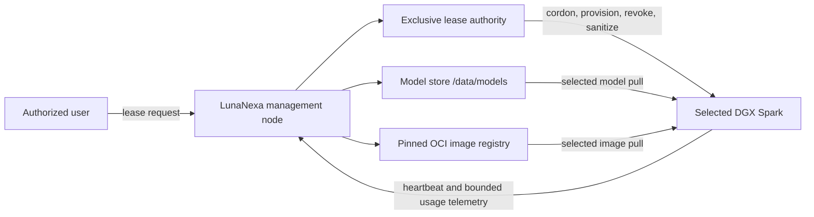

# Exclusive DGX node leases

## Purpose

LunaNexa supports two mutually exclusive operating modes for every managed GPU
node:

- **Managed service** — LunaNexa schedules approved inference containers and
  materializes only the model artifacts assigned to that node.
- **Exclusive lease** — one authorized subject receives time-bounded
  interactive access to the whole node. LunaNexa schedules no managed service
  on that node until access is revoked and sanitization succeeds.

An exclusive node lease is different from a `WorkspaceLease`. A workspace
lease is a provider-plane capacity entitlement and never names hardware. An
exclusive node lease names exactly one node and changes its operating mode.

## Initial topology



The management node is the authority and source of artifacts. It does not push
models to every DGX. Only the node named by a managed assignment or exclusive
lease pulls the requested model. `/data/models` is a management-node storage
root, not a path exposed in public API responses or mounted directly into a
tenant container.

Runtime images remain immutable OCI images pinned by digest. Model artifacts
remain digest- and signature-verified objects. An exclusive user can request
approved artifacts through a scoped management-node distribution endpoint;
the node-local daemon performs the actual pull and verification.

## Lease lifecycle

```text
Requested -> Reserved -> Provisioning -> Active -> Expiring -> Draining
                                                       |          |
                                                       +----------+
                                                                  v
                                               RevokingAccess -> Sanitizing
                                                                  |
                                                                  v
                                                               Completed
```

`Cancelled` is allowed before access is enabled. Any unsafe or unverifiable
condition enters `Quarantined`; a quarantined node is never eligible for
managed placement. Recovery continues through access revocation and
sanitization rather than making the node available automatically.

The control plane applies these invariants:

1. at most one non-terminal exclusive lease may name a node;
2. reserving a node excludes it from managed placement immediately, even
   before the node observes its cordon directive;
3. reservation never provisions access until desired assignments and observed
   managed runtimes on the selected node are empty;
4. activation requires provisioning evidence from the selected node;
5. expiry cannot reactivate managed scheduling directly;
6. access is revoked before sanitization starts;
7. only a successful sanitization receipt permits return to managed service;
8. direct operator lifecycle transitions are rejected; all accepted
   transitions are generation-numbered, durable and audited.

## Identity and credentials

The lease contract stores an opaque subject, a validated Unix username, and an
`access_credential_ref`. It never accepts or persists a raw password, private
key, SSH certificate, model-store credential, or registry token.

The recommended production mechanism is a short-lived SSH certificate issued
for the lease subject and bounded by the lease expiry. If a deployment must use
a password, the password lives in a deployment-owned secret manager and the
contract still carries only its reference. The host provisioner resolves the
reference over its protected node channel and must not echo the secret in
telemetry, audit events, process arguments or API responses.

The provisioned account is non-root by default. Container access is rootless or
mediated through a narrow runtime policy. The lease does not grant access to
the LunaNexa daemon identity, its node credential, other users' caches, or the
management node filesystem.

### Customer self-service projection

An authenticated enterprise member reads only their own records through
`GET /v1/machine-access/self`. Authorization combines the verified ingress
subject, an active portal membership, and an exact exclusive-lease subject
match. A record belonging to another subject returns `404` rather than exposing
whether it exists.

The response includes the lease-scoped machine label, lifecycle generation,
username, bounded start/expiry, coarse reachability (`Online`, `Delayed`, or
`Unknown`), and credential-handoff kind/status/expiry. It deliberately omits the
physical node ID, inventory, address, labels, `access_credential_ref`, passwords,
private keys, and SSH certificate material. When access is active, the response
never carries a broker reference. The subject-authorized credential endpoint
returns the opaque, single-use, generation-bound handoff reference which the
deployment-owned credential authority redeems only after repeating identity
and lease checks. The actual credential issuer remains an external production
prerequisite.

The broker persists the first redemption time and derives a bounded redemption
receipt from the subject, lease and generation. If the browser loses the first
response or reloads, the same subject may recover the identical safe host,
fingerprint, command and approved issuer URL. This recovery never creates a
second handoff or changes the issuer capability; cross-subject, stale-generation,
revoked and expired recovery attempts remain rejected.

The customer list reports credential handoff as `Pending` until a live broker
record exists for the exact lease generation, `Available` before first
redemption, and `Recoverable` afterward while the lease remains valid. An `Active`
lease alone never produces a false “ready to redeem” state. Production
readiness also requires current signed health evidence from the external
issuer; the controller's handoff store and issuer URL do not satisfy that gate.

Customers may end their own access early with
`POST /v1/machine-access/self/{lease_ref}:terminate`. The request must carry the
current generation and exact `TERMINATE {lease_ref}` confirmation. Acceptance
immediately closes the customer handoff, emits immutable subject-attributed
audit evidence and an operator alert, and advances the same revoke-before-
sanitize lifecycle used by operators. A stale generation returns `409`; a
second termination cannot bypass cleanup. Natural expiry is reconciled before
every customer read and remains fenced across controller restart until cleanup
is verified.

## Node daemon responsibilities

The LunaNexa node agent remains installed as a protected system service outside
the leased account. The exclusive-lease guard now:

- observe signed, generation-numbered lease directives;
- create/disable the named account through a narrow host provisioner;
- install and remove the referenced short-lived access material;
- pull only explicitly authorized model artifacts and OCI images;
- report account readiness, observed lease generation and bounded resource
  usage;
- revoke access at expiry even if the management connection is temporarily
  unavailable;
- stops tenant sessions, processes and rootless containers; removes runtime
  volumes, the dedicated account/home, staged access material and lease state;
  and produces a generation-bound sanitization receipt before returning the
  node to managed service.

Arbitrary controller-supplied shell text is not part of this contract. Host
operations are typed actions implemented and allowlisted by the node daemon.
`cmd/lease-helper` is the root-owned reference implementation and
`cmd/lease-helper-client` is its non-root fixed-protocol caller. A helper error,
stale or forged receipt, remaining process/runtime object, or missing ownership
marker quarantines the node.

Helper receipts MAC the complete typed action, including username and, for
provisioning, credential reference and expiry. Receipts cannot be substituted
between otherwise identical lease IDs and generations. The Kubernetes
DaemonSet intentionally disables this workflow because the host sudo client is
not runnable inside its least-privileged pod; use the documented host-systemd
layout or supply and physically verify a separate privileged adapter before
enabling exclusive leases.

The leased account must not have write access outside its dedicated home and
rootless runtime storage. Production hosts must enforce that with filesystem
permissions and a reviewed per-user temporary-directory/mount namespace policy;
the helper will not traverse or delete arbitrary host files. Physical
acceptance must prove those writable boundaries before login access is enabled.

## Storage and failure domains

The 8 TB model disk is a significant management-node failure domain. Production
deployment needs filesystem health monitoring, capacity thresholds, scrub and
backup policy, an artifact manifest with digest/signature evidence, and a
recovery copy of irreplaceable licensed artifacts. Registry metadata, lease
authority, audit state and credential authorities require independent backup;
backing up model blobs alone is insufficient.

If the management node is unavailable, an active user may continue local work
until the locally recorded expiry, but cannot obtain new credentials or
artifacts. The node daemon must fail closed at expiry. If revocation or cleanup
cannot be proven, the node becomes `Quarantined` rather than available.

## Implemented lifecycle slices

1. Typed durable lifecycle, automatic expiry, generation-fenced early
   termination API/CLI and immediate managed-scheduler exclusion.
2. Signed node directives, restart-safe local expiry and observed-state reports.
3. Narrow Linux account/SSH access provisioner using locally staged access
   material; raw credentials never cross the control-plane contract.
4. Revoke-before-sanitize cleanup, generation-bound helper receipts and
   fail-closed quarantine.
5. Operator console confirmation plus deterministic normal, restart, forged
   evidence, traversal, stuck-process and next-lease reuse tests.

The repository test proves the policy and command boundary on a synthetic host.
It does not replace the required destructive test on each physical DGX image.
