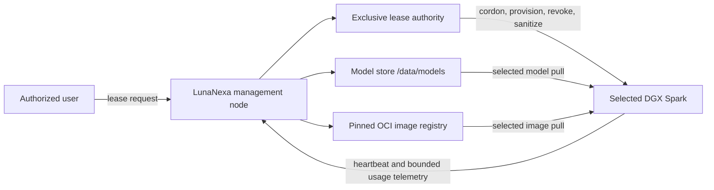

# Exclusive DGX node leases

## Purpose

LunaNexa supports two mutually exclusive operating modes for every managed GPU
node:

- **Managed service** — LunaNexa schedules approved inference containers and
  materializes only the model artifacts assigned to that node.
- **Exclusive lease** — one authorized subject receives time-bounded
  interactive access to the whole node. LunaNexa schedules no managed service
  on that node until access is revoked and sanitization succeeds.

An exclusive node lease is different from a `WorkspaceLease`. A workspace
lease is a provider-plane capacity entitlement and never names hardware. An
exclusive node lease names exactly one node and changes its operating mode.

## Initial topology



The management node is the authority and source of artifacts. It does not push
models to every DGX. Only the node named by a managed assignment or exclusive
lease pulls the requested model. `/data/models` is a management-node storage
root, not a path exposed in public API responses or mounted directly into a
tenant container.

Runtime images remain immutable OCI images pinned by digest. Model artifacts
remain digest- and signature-verified objects. An exclusive user can request
approved artifacts through a scoped management-node distribution endpoint;
the node-local daemon performs the actual pull and verification.

## Lease lifecycle

```text
Requested -> Reserved -> Provisioning -> Active -> Expiring -> Draining
                                                       |          |
                                                       +----------+
                                                                  v
                                               RevokingAccess -> Sanitizing
                                                                  |
                                                                  v
                                                               Completed
```

`Cancelled` is allowed before access is enabled. Any unsafe or unverifiable
condition enters `Quarantined`; a quarantined node is never eligible for
managed placement. Recovery continues through access revocation and
sanitization rather than making the node available automatically.

The control plane applies these invariants:

1. at most one non-terminal exclusive lease may name a node;
2. reserving a node excludes it from managed placement immediately, even
   before the node observes its cordon directive;
3. activation requires provisioning evidence from the selected node;
4. expiry cannot reactivate managed scheduling directly;
5. access is revoked before sanitization starts;
6. only a successful sanitization receipt permits return to managed service;
7. all transitions are generation-numbered, durable and audited.

## Identity and credentials

The lease contract stores an opaque subject, a validated Unix username, and an
`access_credential_ref`. It never accepts or persists a raw password, private
key, SSH certificate, model-store credential, or registry token.

The recommended production mechanism is a short-lived SSH certificate issued
for the lease subject and bounded by the lease expiry. If a deployment must use
a password, the password lives in a deployment-owned secret manager and the
contract still carries only its reference. The host provisioner resolves the
reference over its protected node channel and must not echo the secret in
telemetry, audit events, process arguments or API responses.

The provisioned account is non-root by default. Container access is rootless or
mediated through a narrow runtime policy. The lease does not grant access to
the LunaNexa daemon identity, its node credential, other users' caches, or the
management node filesystem.

## Node daemon responsibilities

The existing LunaNexa node agent remains installed as a protected system
service outside the leased account. The exclusive-lease extension will:

- observe signed, generation-numbered lease directives;
- create/disable the named account through a narrow host provisioner;
- install and remove the referenced short-lived access material;
- pull only explicitly authorized model artifacts and OCI images;
- report account readiness, observed lease generation and bounded resource
  usage;
- revoke access at expiry even if the management connection is temporarily
  unavailable;
- stop tenant containers, remove ephemeral lease data and produce a
  sanitization receipt before returning the node to managed service.

Arbitrary controller-supplied shell text is not part of this contract. Host
operations are typed actions implemented and allowlisted by the node daemon.

## Storage and failure domains

The 8 TB model disk is a significant management-node failure domain. Production
deployment needs filesystem health monitoring, capacity thresholds, scrub and
backup policy, an artifact manifest with digest/signature evidence, and a
recovery copy of irreplaceable licensed artifacts. Registry metadata, lease
authority, audit state and credential authorities require independent backup;
backing up model blobs alone is insufficient.

If the management node is unavailable, an active user may continue local work
until the locally recorded expiry, but cannot obtain new credentials or
artifacts. The node daemon must fail closed at expiry. If revocation or cleanup
cannot be proven, the node becomes `Quarantined` rather than available.

## Implementation slices

1. Typed lease lifecycle, durable authority, management API/CLI and immediate
   managed-scheduler exclusion.
2. Signed node lease directives and observed-state reports.
3. Narrow Linux account/SSH-certificate provisioner and local expiry watchdog.
4. Scoped model and OCI pull grants backed by `/data/models` and the registry.
5. Sanitization policy, quarantine recovery, console workflows and full
   four-node failure tests.
