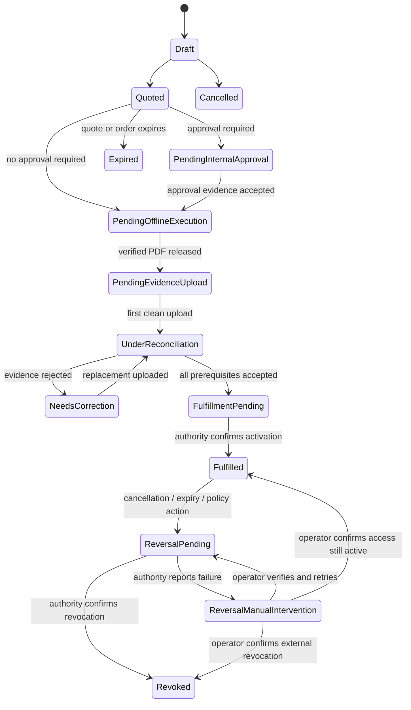

# Hybrid digital-to-offline commerce

Status: repository implementation complete; production adapters gated
Last reviewed: 2026-08-13

This subsystem supports an interim commercial workflow when contract sealing,
treasury collection, and tax invoicing must remain inside the owner's existing
offline controls. LunaNexa automates ordering, quoting, artifact preparation,
evidence collection, review, reconciliation, entitlement gating, and audit
metadata. It does not pretend that an uploaded scan is an e-signature, that a
receipt is bank settlement, or that a generated document is a legal invoice.

## Customer journey

1. The signed-in enterprise user chooses a service, SLA, project, and expiry and
   submits a draft order. Tenant, organization, and purchaser are derived from
   the trusted portal membership, not request fields.
2. An operator applies an immutable, arithmetic-checked quote. The quote pins
   currency, line amounts, tax, total, validity, and terms digest.
3. The controller moves the order into internal approval when policy requires
   it, otherwise directly into offline execution.
4. The management-plane artifact worker customizes versioned templates. DOCX
   and XLSX controlled edits and semantic reopen are verified with MoonLeaf. A
   print-ready PDF must pass its renderer/visual gate before release.
5. The user prints the PDF and follows the organization's existing seal,
   treasury, and invoice process.
6. The user asks for a short-lived, size-bounded upload grant for each required
   evidence artifact. The API creates a durable one-time transfer session,
   sends only its token digest and private object route to the configured
   adapter, and returns the raw capability directly to the browser. The portal
   opens a file picker without persisting that token. The object store
   determines the object reference. Its verified callback—not the
   browser—reports media type, byte count, SHA-256,
   malware/active-content result, and scanner receipt.
7. A different actor reviews the exact uploaded digest. Rejection retains the
   prior revision and returns the order to `NeedsCorrection`.
8. Fulfillment succeeds only after all policy-required evidence is accepted.
   Activation and reversal are durable authority sagas. A failed reversal
   enters `ReversalManualIntervention` instead of retrying without bound. The
   operator UI then requires an explicit, generation-fenced decision to retry,
   confirm already-revoked access, or confirm that access remains active; the
   failed authority receipt is retained in every case.

## Durable authority

The public contract is `commercial/offline`; native persistence is
`commercial/offline/store`. File mode writes a mode-0600 atomic snapshot using
`<path>.next` and rename. Production mode stores the same opaque snapshot under
the PostgreSQL domain `offline_commerce`. Restart restoration revalidates every
template, order, artifact, generation request, grant, callback, review,
activation, reversal, and transfer session and
rebuilds scoped idempotency indexes.

The snapshot stores metadata only:

- object references, SHA-256 digests, media type, byte count, locale, and
  artifact state;
- immutable template ID/version and generation/request receipts;
- upload grant limits and verified callback evidence;
- exact artifact digest, separate reviewer, bounded reason code, and audit
  receipt;
- order state/generation, policy, quote, and opaque entitlement reference.

It never stores DOCX/XLSX/PDF/image bytes, raw transfer tokens, passwords,
private keys, bank credentials, invoice-provider secrets, or raw callback
bodies.

## Artifact worker boundary

`commercial/offline/worker` is a native MoonBit verification and controlled-edit
adapter. It directly consumes `vectie/moonleaf` and provides:

- bounded DOCX placeholder replacement where placeholders are whole `w:t`
  node substrings such as `{{ORDER_ID}}`;
- bounded XLSX cell replacement for non-formula cells and merged-cell anchors;
- MoonLeaf archive-policy parsing, neutral scene rendering, save-as-copy, reopen,
  part preservation, and semantic-scene equality;
- macro/ActiveX/embedded-object part detection;
- XLSX cached formula-error rejection.

MoonLeaf is deliberately not treated as a full Word/Excel/PDF engine. The
deployment-owned artifact worker may use the approved MoonLeaf document
renderer and spreadsheet formula engine, but it must return the typed
`ArtifactGenerationResult`. The controller accepts DOCX/XLSX only when
`moonleaf_verified=true`, accepts XLSX only when `formula_error_count=0`, and
accepts all generated artifacts only when `render_verified=true` and a digest
of the visual QA evidence is present. Generated bytes go directly to object
storage.

The executable `cmd/offline-artifact-worker` implements an explicit two-pass
protocol under a configured staging root. `LUNANEXA_OFFLINE_ARTIFACT_MODE=prepare`
writes mode-0600 prepared DOCX/XLSX bytes for MoonLeaf's renderer. MoonLeaf
inspects every page or sheet and writes an HMAC-SHA256 signed v3 manifest with
a typed `moonleaf.render-evidence.v1` receipt and exactly one indexed visual
record per page/sheet. `mode=finalize`
repeats customization in memory and releases output only when the manifest
binds the exact artifact digest, kind, count, fresh renderer receipt, and every
verified PNG/PDF evidence digest. Its digest is not predeclared in the input
job; MoonLeaf creates and signs it after `prepare`.
`LUNANEXA_RENDER_EVIDENCE_SECRET` is distinct, at least 32 bytes, and never
accepted in job JSON, arguments, or logs.

For DOCX authoring, use a versioned legal template and preserve its typography,
real list numbering, fixed table geometry, and page setup. Render every output
to page images and inspect it before callback. For XLSX authoring, keep inputs
and formulas visible, use typed numeric/date cells, scan formula errors, render
every sheet, and reject clipped or unreadable output. PDF is the sole
print/offline-execution copy; DOCX remains clearly labeled editable source.

The 2026-08-12 local artifact rehearsal exercised a realistic bilingual,
three-page contract and two-sheet quote through `prepare`, external render
evidence, and `finalize`. That rehearsal is historical parser/evidence data,
not MoonLeaf PDF qualification. LunaNexa now rejects non-MoonLeaf PDF evidence.
The PDF path remains fail-closed until the MoonLeaf renderer implements and
qualifies deterministic pagination, approved CJK font shaping, PDF output, and
one retained visual artifact per page.

## HTTP surface

All paths are rooted at `/v1/offline-commerce`. Operator routes require operator
authority. Self-service routes require inference authority plus the trusted
enterprise subject. Object bytes are not returned by these endpoints.

| Method and path | Authority | Purpose |
| --- | --- | --- |
| `GET /operator/snapshot` | operator | restart/audit projection |
| `GET /operator/readiness` | operator | fail-closed adapter/evidence readiness |
| `POST /operator/templates` | operator | register immutable safe template metadata |
| `POST /operator/quotes` | operator | pin an arithmetic-checked quote |
| `POST /operator/begin` | operator | start approval/offline state machine |
| `POST /operator/generation-requests` | operator | enqueue bound artifact work |
| `GET /operator/generation-requests/pending` | artifact dispatcher token | claim bounded retry-fenced work and record heartbeat |
| `POST /operator/generation-results` | artifact-worker callback token | accept verified metadata result |
| `POST /operator/release-packets` | operator | expose offline stage only after PDF gate |
| `POST /operator/upload-callbacks` | trusted object/scanner ingress | reconcile an exact grant |
| `POST /operator/reviews` | separate reviewer | accept/reject exact artifact digest |
| `POST /operator/fulfillments` | operator | bind opaque entitlement after all gates |
| `POST /operator/entitlement-activation-results` | entitlement authority token | complete an exact activation saga |
| `GET /operator/entitlement-work/pending` | entitlement authority token | claim bounded activation/reversal work and record heartbeat |
| `POST /operator/reversals` | operator | request refund/void/expiry/policy revocation |
| `POST /operator/reversal-recoveries` | operator | reconcile a failed reversal with exact generation and authority evidence |
| `POST /operator/entitlement-reversal-results` | entitlement authority token | complete an exact revocation saga |
| `POST /operator/transfer-results` | transfer-adapter token | consume one capability with exact media, byte count, SHA-256 and provider receipt |
| `GET /self/orders` | enterprise subject | list only purchaser-owned orders |
| `POST /self/orders` | enterprise subject | create tenant-derived draft intent |
| `POST /self/orders/{id}:cancel` | purchaser | cancel pre-fulfillment or start a tracked entitlement reversal after fulfillment |
| `POST /self/upload-grants` | purchaser | create evidence grant plus one-time browser upload capability |
| `GET /self/artifacts/{id}` | purchaser | safe metadata projection without object reference |
| `POST /self/artifacts/{id}:download` | purchaser | create one-time digest-bound browser download capability |

Production ingress splits human operator routes from machine callbacks. The
controller fails closed unless distinct callback secrets of at least 32 bytes
are set in `LUNANEXA_ARTIFACT_WORKER_CALLBACK_TOKEN` and
`LUNANEXA_ARTIFACT_SCANNER_CALLBACK_TOKEN`; they may not equal each other or
human/inference tokens.
Entitlement activation and revocation use a third, non-reusable identity in
`LUNANEXA_ENTITLEMENT_AUTHORITY_CALLBACK_TOKEN`. No order becomes fulfilled
until this typed authority confirms the exact pending request; expiry and
post-fulfillment refund/void/revocation become durable compensation sagas.
The transfer adapter endpoint, token, and session secret are all-or-none. The
endpoint is HTTPS outside exact loopback; redirects and oversized/non-JSON
responses are rejected. The raw token is returned only to the browser, while
the durable store retains its SHA-256 digest.

Deployment readiness is supplied only through the signed, bounded JSON file at
`LUNANEXA_OFFLINE_COMMERCE_READINESS_PATH`, verified with
`LUNANEXA_OFFLINE_COMMERCE_READINESS_SECRET`. The path must be absolute and
resolve to a regular file inside its configured mount. This permits Kubernetes
projected-Secret symlinks but rejects targets escaping the mount. The example
uses mode `0400`. The document has schema
`lunanexa.offline-commerce-readiness.v1`, an issue/expiry window of at most 31
days, exactly one entry for every capability, unique retained `evidence_ref`
values, and an HMAC-SHA256 signature over the canonical material. Omitting both
variables is supported and intentionally reports `OfflineCommerceAdaptersPending`;
partial, malformed, expired, ambiguous, or forged configuration stops startup.
Initiating side-effect routes return `503 OfflineCommerceNotReady` with blocker
codes when required capabilities are unavailable. Terminal callbacks remain
authenticated and reachable after readiness expiry so issued work can always
reconcile. Full readiness also requires actual callback identities, the
transfer adapter triple, a recent successful reconciler pass, recent
authenticated artifact and entitlement dispatcher heartbeats, and recent
terminal successes from both worker paths. Signed evidence or a deployment
boolean alone cannot make these adapters ready. Claims retry no sooner than 60
seconds and stop after five attempts until an operator resolves the failed
work.

## State and security rules

- Scoped idempotency is `organization_id + idempotency_key`; replay with changed
  content fails.
- Every mutation is generation-fenced where a stale UI could overwrite a newer
  state.
- Generation requests must match the current immutable quote terms digest. The
  store captures the order generation when work is created and rejects a result
  arriving after cancellation, review, another artifact, or any other order
  mutation.
- Quotes reconcile `quantity × unit price = line total`, line totals to
  subtotal, and subtotal plus tax to total with overflow checks.
- Templates are immutable by ID/version and reject macros/active content.
- Upload object references are controller-derived. Callback object reference,
  media type, byte count, expiry, digest, scan receipt, and provider
  verification are checked against the grant.
- A rejected scan never reaches review. A submitter cannot review the same
  digest. Review is bound to artifact ID and SHA-256.
- Self-service clients cannot choose fulfillment policy. Until an
  operator-owned service/SLA policy registry exists, the server requires signed
  agreement, payment, invoice-before-fulfillment, identity verification, and
  internal approval. Self order expiry is bounded to five minutes through 366
  days.
- Tenant and purchaser filters are applied server-side. Public artifact views
  omit object references and worker receipts. Browser projections also omit
  subject and idempotency authority. Transfer URLs stay under the configured
  adapter namespace; tokens are one-time, expire within 15 minutes, and are not
  written to portal state or local storage. Downloads are checked against the
  authorized byte bound and SHA-256 before being saved.
- Quote, generation, and review actors are derived from verified ingress mTLS;
  token-only profiles use `platform-operator`. Body-supplied identities are
  ignored. Per-person legal approval still requires real IdP/RBAC integration.
- Customer stage notifications are reconstructed from durable order state and
  deduplicated. They contain only order reference and state, never object refs
  or digests.

## Tested evidence

Native tests cover restart at evidence/transfer stages; idempotent order/grant and
callback replay; verified happy-path fulfillment; missing evidence; forged
object reference and digest; oversize callback; active content; scan rejection;
reviewer conflict; review digest mismatch; cross-tenant order/artifact denial;
quote arithmetic drift and overflow; malformed OOXML; DOCX/XLSX semantic reopen;
controlled DOCX/XLSX edits; cached XLSX formula errors; pending-saga
cancellation rejection; backdated callbacks; one-time transfer replay; adapter
authentication, redirect, timeout and response bounds; projected-Secret
symlinks; and per-page visual evidence cardinality.

These tests do not certify a legal template, physical seal, bank settlement,
tax invoice, production object store, production malware scanner, renderer,
office-suite fidelity, or jurisdiction-specific retention policy.

## Production readiness gates

The production controller always installs the exact approval scope from
`LUNANEXA_OFFLINE_APPROVED_TEMPLATES_JSON`: an array of `template_id`, `version`,
`locale`, `sha256` (the registered source bytes), and attributable `approval_ref`.
An absent or empty scope denies new commercial begin/generation operations.
Generation and dispatcher plans recheck all four bindings; approving the Chinese
OFL v2 template does not approve the old private-font template. Existing records
remain readable and cancellable. A quotation is neither an executed agreement
nor a declaration that any other template has been approved. Private-cloud
workspace access is outside this gate.

Document-generation work may contain several artifacts for one immutable order.
Publishing one verified artifact atomically advances only still-current sibling
artifact claims to the new order revision; it does not reset attempt limits,
retry clocks or completed receipts. Cancellation, expiry, commercial transitions
and already-stale claims remain fenced. A document plan resolves an explicit
agreement reference first; an unbound order requires exactly one matching
generation-requested packet with full tenant, organization, purchaser, order,
template-version and source/fillable digest bindings. It never picks the newest
unrelated packet or silently replaces an explicit binding.

MoonEdit's purchaser `:generate` action now bridges directly into the durable
offline queue. It freezes the complete confirmed packet (revision, value digest,
source digest and scoped identities) before issuing deterministic DOCX/PDF work
IDs. Retried clicks recover that same pair. If a cross-store write fails after
the packet becomes `GenerationRequested`, controller reconciliation resumes the
enqueue; it does not invent a second revision or require manual operator jobs.
Frozen field values and callback proofs stay in the private durable generation
plan and are removed from the operator snapshot projection.

Each real worker result persists its actual rasterized `page_count` and visual
evidence digest alongside the stored artifact. Both objects must pass verification,
refer to the same frozen packet and agree on page count/render evidence before
the document packet becomes `Generated`. Legacy callbacks without page counts
cannot complete this bridge. If the final packet write fails, both object proofs
remain durable and reconciliation completes the packet after restart. None of
these transitions records signature, payment, legal execution or entitlement.
Existing generated legacy packets remain readable; attempting to re-render an
unapproved old template reports its missing deployment scope explicitly.

Before enabling this workflow on the real management node, configure and prove:

- approved legal DOCX templates for the deployment's explicitly supported
  locale(s), with immutable source/fillable hashes, preserved terms/fields,
  versioned scope and an attributable approval source;
- S3-compatible object storage with tenant-isolated prefixes, retention,
  versioning, encryption, and short-lived multipart upload grants;
- malware/active-content scanning with signed callbacks and ZIP-bomb limits;
- a management-plane document worker with pinned image digest and a read-only
  template mount;
- deterministic MoonLeaf DOCX→PDF rendering with page-image visual regression;
- XLSX formula recalculation, error scan, and rendered-sheet inspection;
- mTLS or signed callback identities separate from human operator authority.

The platform owner explicitly withdrew the bilingual-template prerequisite on
2026-09-22. A Chinese-only template is not blocked for lacking an English copy.
This removes an erroneous language requirement, not approval, font licensing,
content integrity or visual-render acceptance. An approval recorded from the
authenticated platform owner's current deployment instruction is platform
approval, not a fabricated named lawyer or third-party legal certification.

`deploy/offline-pdf-pipeline-job.yaml` defines the required sequential
MoonLeaf-prepare → MoonLeaf-render/attest → LunaNexa-finalize boundary. The
finalizer accepts binary PDFs without UTF-8 decoding, checks the PDF header,
cross-reference/startxref and EOF structure, verifies the exact PDF digest,
requires a signed `moonleaf.render-evidence.v1` receipt and page-image evidence,
and binds both to the exact prepared DOCX digest. An external dispatcher must poll the protected
work route, provision one PVC per job, stage inputs, upload verified outputs,
post the terminal callback, and delete the PVC after acknowledgement; Job TTL
does not delete PVCs. Native MoonLeaf rendering and the new OFL-v2 undertaking's
four-page visual baseline now exist, with a real isolated Linux worker/render/
scanned-S3/callback-recovery run. See `docs/evidence/offline-ofl-v2-20260922/README.md`.
That technical proof is scoped to exact template/font hashes; it is not an
attestation for an unbuilt image, an unexecuted production Job, legacy private
fonts or unapproved legal/locale variants. Production capability evidence must
bind the deployed image and read-only assets to the corresponding actual
rehearsal. Another office engine is not accepted as equivalent renderer evidence.

Both artifact Job templates are selected by a dedicated default-deny
NetworkPolicy with empty ingress and egress. They consume only their per-job
PVC. The external dispatcher—not the document worker or renderer—owns API and
object-store traffic, callback acknowledgement, and PVC deletion.

Also prove:

- backup/restore of the `offline_commerce` snapshot and immutable audit chain;
- approved fulfillment policy for invoice-before/after-service, refund, void,
  cancellation, expiry, and entitlement revocation;
- UI-to-UI rehearsal with legal, finance, purchaser, reviewer, and operator
  roles, followed by a physical offline execution rehearsal.

Until these gates pass, readiness must show `OfflineCommerceAdaptersPending`;
the platform may demonstrate state transitions locally but must not represent
the generated packet or uploaded evidence as legally executed or financially
settled.
