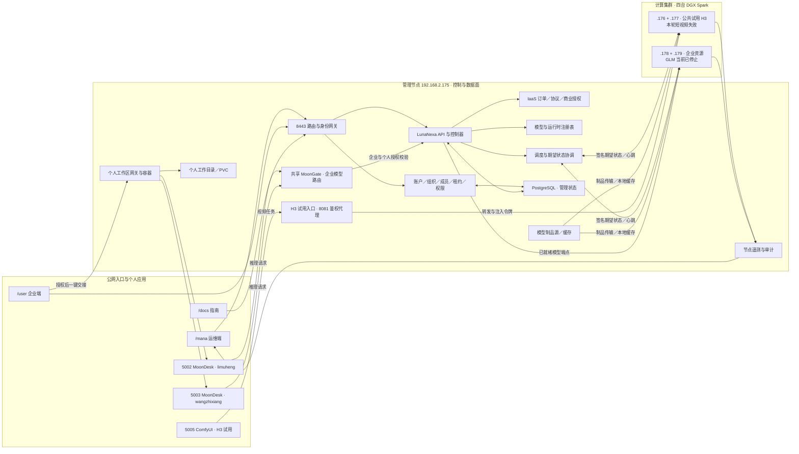

# 平台模块全景与现场证据（2026-09-25，北京时间）

这张图描述**模块责任与当前四台 Spark 部署**，不是所有链路都已验收的声明。实线表示设计或部署中的调用关系；具体已验证范围见图下表。`/mana`、`/user`、`/docs` 是同一平台的不同入口；MoonDesk/ComfyUI 是用户应用，不是 LunaNexa 节点代理。

## 权限与数据归属

- **企业共有**：组织成员关系、机器订单/预留、已授权模型服务和用量。两位成员可调用同一个企业模型，但须各有自己的有效身份、成员关系与租约。
- **个人独有**：MoonDesk 容器、会话记录和工作目录；5002 与 5003 是按 subject 绑定的两个入口，不应共享 PVC 或聊天历史。MoonGate 是共享路由层，不需要为每个人部署一套。
- **计算节点**：运行受管模型和节点代理。模型源负责制品，节点上的缓存负责加载；把模型登记进注册表不等于它已部署、就绪或可调用。
- **三种交付**：IaaS 分配独占机器；PaaS 打开个人 WebIDE/ComfyUI；MaaS 通过 MoonGate 和 LunaNexa 调用企业模型 API。订单和协议只属于需要它们的商业路径，不应阻断私有云管理员授予的工作区。

## 本轮现场核对

| 证据 | 现场结果 | 能证明什么／不能证明什么 |
| --- | --- | --- |
| 公网 8443 | `/mana`、`/user`、`/docs` 均由浏览器打开，中文页面可读；`/user` 旧标签页随后在操作时返回会话无效，刷新才显示登录页 | 证明入口和站点服务可达；旧页面内容不证明会话仍有效，更不证明所有业务链路可用 |
| 管理端节点页，约 16:34 北京时间 | 四台 Spark 均为“正常”；`.178/.179` 的统一内存分别约 117.7/117.8 GiB 可用；存储监控 `management-storage` 已采集，约 2388.3/7309.4 GiB 已用 | 证明页面收到近期节点和存储读数；不等于模型已启动或生成成功 |
| 5005 ComfyUI | 短诊断模板从公网 UI 点击“运行”，任务入队并显示 0→80%；约 40 秒后报 `Video generation failed or its access ended`，未生成新 MP4 | **本轮端到端失败**；不能因为页面、模板或已有旧视频可见就宣称试用可用 |
| 企业端 WebIDE | CeShi 的旧组织视图显示“没有有效的工作区权限”，打开按钮禁用；贯通进度 0；随后发现浏览器会话也已过期 | 只能证明当时按钮不可操作；不能单独证明租约到期保护，需重新登录复核 |
| 5002/5003 MoonDesk | 5002 旧会话显示 `Code runtime is unavailable`；5003 可见旧聊天和输入框，但没有新模型答复 | 历史答复不能充当当前 Code 推理证据；模型服务已经停止，测试权限也已过期 |
| MaaS 模型控制 | 上一轮在 `/user` 点击停止 GLM，页面为“已停止”，管理端 `.178/.179` 内存回升 | 停止与资源释放已通过 UI 实测；重新启动和两人共享调用待验 |
| IaaS 自助 | 上一轮显示两个 Spark 售卖配置与报价入口；未提交订单 | 选型可用；付款、协议、分配、登录与释放的完整闭环未通过 |
| 会话过期反馈修复 | 企业端遇到 401 现在清除本地会话并展示重新登录提示；针对性 37/37、全量 JS 634/634 通过；新 bundle 摘要 `af5f0009…` 已在公网浏览器加载，Deployment 1/1 Ready | 证明源码分支、自动测试和静态资源发布；本轮没有等待真实会话再次到期来验证现场 401 画面 |

本轮没有续签用户授权、启动 GLM、创建订单或修改 `.176/.177` 的运行部署。H3 视频失败后**没有再次排队**：只读核查显示 FL2VA Pod 为 Running，运行时日志在北京时间 16:47:21（08:47:21 UTC）报 `asyncio.TimeoutError`，调用点是 vLLM-Omni `diffusion_engine.py` 的 `_ASYNC_OUTPUT_TIMEOUT`；运行容器中的常量实值为 **30 秒**。这解释了任务为何在该时刻失败，但还需区分扩散阶段只是超过 30 秒，还是底层线程已卡住；确认任务取消/清理后才能调整等待时限并重试。此前配置的 `VLLM_OMNI_VIDEO_SYNC_TIMEOUT=7200` 不是这条 30 秒限制。没有修改正在试用的 GPU Pod 或悄悄换模型。

要继续做企业 PaaS/MaaS 的正向验收，需要为目标用户重新授权、由本人建立新浏览器会话，再逐项验证“启动→发送→停止→重开”和跨账号隔离；IaaS 另需明确不收费测试订单路径或完成真实商业流程。企业端旧标签页的“已登录”与 API 会话状态不一致已经由上述 401 修复覆盖；旧镜像 `lunanexa-web-enterprise:20260925-lifecycle-final` 保留作回滚点，新镜像为 `lunanexa-web-enterprise:20260925-session-expiry`。本轮专用临时构建目录（约 668 MiB）在确认发布成功后已清理；没有删除用户文件或模型。之前更细的按钮记录见 [公网 IaaS/PaaS/MaaS 生命周期复测](ui-lifecycle-live-check-20260925-r2.md)。
