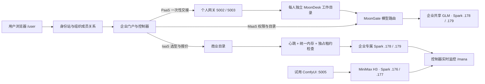

# 公网 IaaS / PaaS / MaaS 复测记录（2026-09-26，北京时间）

状态：**PaaS 的 wangzhixiang 个人工作台及共享 GLM 推理已通过停止、重开、续聊；IaaS 已验证实时库存、选型及签名报价，但创建订单被尚未发布的已审核机器条款阻止，未创建新订单、未付款、未独占机器。** 不把页面可达或容器 `Running` 视为模型就绪。

## 公网按钮与反馈

| 路径 | 实际操作与页面反馈 | 结果 |
| --- | --- | --- |
| wang 登录与组织 | `/user` 登录 `wangzhixiang@wlkxcgs.com`，组织选择器显示“能源谷青创街区” | 通过；身份站记录 9 月 24 日由 `temp-admin` 重置过测试密码，不是用户自行修改。密码不写入本报告。 |
| PaaS 停止 | `/user`「WebIDE」→「管理／停止我的 WebIDE」→ 一次性交接至 `:5003/workspace-control` →「停止工作台」；页面从“正在停止”变为“工作台已停止”，Kubernetes 副本数由 1 降为 0 | 通过。 |
| PaaS 重开与持久性 | `/user`「WebIDE」→「打开 MoonDesk / MoonCode」→ `:5003`「代码」；此前历史对话仍在；选择 `moongate/glm-5.3.flash`，输入“请只回答：重启后仍可聊天。”→「Prompt」→ 返回“重启后仍可聊天。” | 通过。个人工作台数据未因停止丢失。 |
| PaaS 独立入口 | `:5002` 的旧直链提示从企业门户重新打开；它不会继承 wang 的 `:5003` 会话 | 隔离反馈符合预期；limuheng 缺少本轮可用的正常登录，不能据此宣称其完整交接已通过。 |
| MaaS 状态与恢复 | `/user`「模型目录」显示企业共享 `glm-5.3.flash`。停止测试后重启容器期间显示“两台 Spark 启动中 · 推理尚未就绪”，权重加载完成后「刷新状态」显示“运行中 · 占用两台 Spark”；随后 `:5003` Code 输入“请只回答：GLM 已恢复。”→「Prompt」，返回“GLM 已恢复。” | 状态反馈和真实推理恢复通过；本轮没有向 wang 授予企业模型停止权限。 |
| IaaS 无库存 | `/user`「自助开通」→「租用独占 GPU 算力」显示“当前无可用算力，尚未创建订单”；当 .178/.179 GLM 卸载后刷新，出现 `offer-dgx-spark-02`、`offer-dgx-spark-03` 两款可用 Spark 配置 | 通过。商业目录按实测统一内存拒绝把正在承载 GLM 的整机出售。 |
| IaaS 报价权限 | 原 Developer-only 身份报价被正确拒绝；临时授予 `LeaseRequester` 后，再次选择配置 → 填 Linux 用户名 `wangtest26` → 区域 `cn-north-1` → 24 小时 →「查看报价」 | 签名报价成功；下单因没有已审核机器条款而禁用。临时权限已撤销。没有新订单、付款或机器租约。 |
| 其他入口 | `/mana` 显示 4/4 节点心跳、存储节点容量；`/docs` 打开中文架构页；`:5005` ComfyUI 工作流、运行按钮和已生成 MP4 仍在 | 可达性通过；本轮未重复执行视频生成。 |

## 服务边界全景

`.176/.177` 是独立试用池，未因企业 IaaS 测试停机。`.178/.179` 是企业专属池；本轮为了验证实时库存曾通过受限的 GLM 控制服务临时停止并随后启动精确识别的两个 GLM 容器。**该基础设施准备动作不是 UI 完成的商业停机流程**，因此不能写成 IaaS 全链路 UI 已通过。恢复后的新 Code 推理答复已核验。

## 修复与剩余门槛

- 发现 IaaS 页面顺带请求 MaaS 外部模型控制状态，偶发 `ModelControlUnavailable` 会遮住机器库存。现仅在模型目录查询该外部状态；IaaS/PaaS 独立显示自身状态。源码 `38b56e3`，公网镜像 `sha256:3afa3abfa9e28a249bab6647ecdae7d574e0ac0a8f89e8cf8d49fbe01e84d7b1` 已滚动部署，公网 IaaS 页面回归通过。
- 报价拒绝提示原本只显示笼统的“无权限”；已将 `MachineOrderAccessDenied` 明确映射为企业“租用申请人”角色要求，并增加中英文回归断言。本轮专项测试 `58/58` 通过。源码 `89e2e8b` 已推送 GitHub/GitLab；企业端新镜像 `moon/lunanexa-web@sha256:64a7cfad690faacbd82c64e233847beea3d137c94b07c791c2371d7a21c98223` 经私有仓库 TLS HEAD 回读并滚动成功，公网 `/user` 已加载 `enterprise.js?v=42fe4ff73d915fd97ab1f44886572600a6b54f32785eacbfd65924b8252bcc5f`。新拒绝文案尚未在公网再次触发，不写成已通过 UI 验收。
- 两个个人网关已统一到验证过的 `sha256:9675622a391bec128e02c6a4659dbffe680dee3ef63180bd8f1b3801835e4d01`，源码清单 `6d1b033`；5002 尚待 limuheng 正常登录后的端到端验证。
- IaaS 的临时 `LeaseRequester` 已完成签名报价验证并撤销。创建订单仍需经审核的机器条款；合同、支付或明确限定的新测试豁免须单独处理，不能用 wang 的 Developer 权限绕过。
- 本轮 JS 全量测试 `638/638` 通过。原生全量测试在四个链接单元长时间高 CPU 编译时主动中止以释放构建锁，不能记录为通过；专项 JS 测试 `58/58` 通过。

## 追加复测：临时授权与签名报价

1. 在公网 `/mana` 通过类型化操作撤销 wangzhixiang 原有的 Developer 企业成员关系，临时创建仅对“能源谷青创街区”有效的 `Developer + LeaseRequester` 成员关系。该角色变更仅用于本次报价测试；原工作区授权未改动。
2. 通过受限 GLM 控制服务停止 `.178/.179` 两个精确识别的容器后，公网 `/user` 的 IaaS 目录由“无可用算力”切换为两款 DGX Spark 资源。`.176/.177` 试用池和 `:5005` ComfyUI 未参与停机。
3. wangzhixiang 在公网 `/user` 点击“选择此服务”→ 选择组织“能源谷青创街区”→ 选择 `offer-dgx-spark-02` → 填写 Linux 用户名 `wangtest26` → 保持 `cn-north-1` 与 24 小时 → 点击“查看报价”。页面返回签名报价 `machine-quote-0931d0c8-d7b5-4ff7-b60b-f9864d6056ab`，总价 ¥1,728，报价在北京时间 13:45:46 到期。该报价不是订单，也不是付款。
4. 页面显示“平台尚未发布经审核的机器条款，下单暂不可用。请联系平台管理员.”，“创建订单”按钮禁用。这是当前 IaaS 自助链路的真实阻塞。代码要求恰好一份已生效、已审核的 `machine-self-service` `ReadyTemplate`；不得将演示文案冒充法律条款。现有“订单与材料”中另有一张旧线下草稿单，本轮未修改。
5. 已在公网 `/mana` 撤销临时 `Developer + LeaseRequester` 成员关系，重新创建 Developer-only 成员关系。PostgreSQL 回读显示临时成员关系 `active=false`，恢复后的 Developer-only 成员关系 `active=true`；wang 未保留租用申请人权限。
6. 恢复 GLM 时，受限控制服务的 `:start` 返回 HTTP 503、状态保持 `Stopped`。事后检查两台 GPU 均无其他计算进程，但未在 503 发生瞬间保存判定证据，不能断言是资源检查、容器启动还是停止后的清理窗口导致。通过原服务账户逐台执行 `docker start`（先 worker、后 head）成功，受限控制服务随后报告 `Running`。模型权重加载期间，公网企业端正确显示“两台 Spark 启动中 · 推理尚未就绪”；随后模型 `/health` 返回 HTTP 200，公网 `/user` 点击“刷新状态”变为“运行中 · 占用两台 Spark”。控制服务应返回可诊断的拒绝原因和安全重试指引。
7. 直接复用先前打开的 `:5003` MoonCode 标签发消息，页面显示 `Invalid character 'L' at line 1, column 0`，同时会话列表提示“Showing earlier chats”。该旧标签不能作为当前授权有效的证据。返回公网 `/user` →「WebIDE」→「刷新模型与权限状态」（可用模型 `glm-5.3.flash`，进度 25%）→「打开 MoonDesk / MoonCode」→ `:5003/connect` →「代码」，旧会话与历史消息重新加载；发送“请只回答：本轮恢复验收通过。”后页面先显示“运行中”，最终显示“DONE”及模型回答“本轮恢复验收通过。”。因此重新交接后的真实推理链通过；过期直链的原始解析错误仍是待修复的交互缺陷，应提示用户返回门户重新授权。

页面摩擦点：IaaS 配置名与价格单位仍混用英文 `DGX Spark (GB10) exclusive node`、`CNY 0.02 / second`；项目字段自动填入不透明 ID。应以中文资源名称、可理解的计费单位与项目选择器取代，不影响本次报价正确性。
