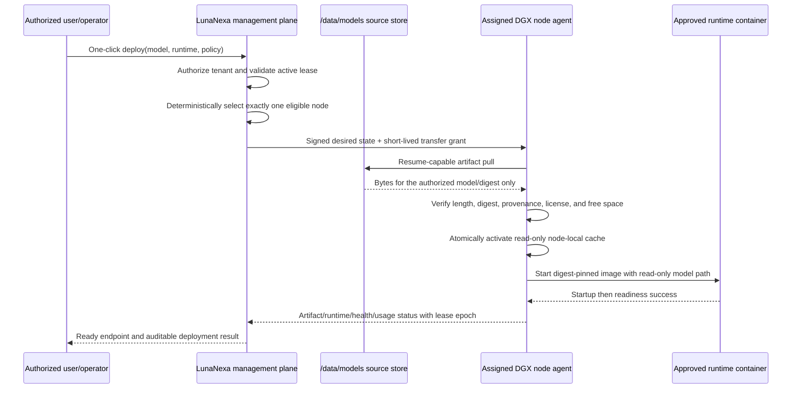

# Suanli applicability to LunaNexa

This assessment maps the [Suanli documentation catalog](CATALOG.md) to
LunaNexa's management-node plus four-DGX architecture. The labels mean:

- **Adopt**: directly useful and consistent with LunaNexa's product boundary.
- **Adapt**: useful idea, but LunaNexa needs a different trust, placement, or
  implementation model.
- **Reject**: conflicts with LunaNexa's security boundary or intended product.
- **Defer**: plausible later capability without a current four-node need.

## Decision matrix

| Suanli capability | Decision | LunaNexa interpretation |
| --- | --- | --- |
| Separate container image and model data | **Adopt** | Runtime adapters stay digest-pinned OCI images. Models stay in the management-node catalog under `/data/models` and are materialized to an assignment-scoped node cache. |
| Image and model prewarming | **Adopt** | Prewarm only the node selected by the scheduler. Verify size, digest, signature/provenance, license policy, and free-space reservation before declaring it ready. |
| Read-only model mount | **Adopt** | A runtime receives a read-only path for the exact verified artifact. It never receives management-store credentials or a writable mount of `/data/models`. |
| Startup, readiness, and liveness probes | **Adopt** | Use three independent probe policies. Startup protects slow model loading, readiness gates traffic, and liveness may restart a stuck runtime only after startup succeeds. |
| GPU/CPU/memory/power/temperature telemetry | **Adopt** | The node daemon reports these measurements with node identity, lease epoch, deployment identity, timestamps, and freshness. Prompt or response bodies never enter telemetry. |
| Queue concurrency and backpressure | **Adopt** | Make queue length, maximum in-flight requests, admission deadlines, and overload responses explicit. A fixed fleet must fail predictably instead of accepting unbounded work. |
| Retry and failure circuit breakers | **Adopt** | Cap retries and failed replicas/jobs. Surface a terminal reason instead of consuming the entire lease or repeatedly re-pulling a bad artifact. |
| Drain before shutdown or replacement | **Adopt** | Stop new routing, allow bounded in-flight completion, then terminate. Force termination only after an auditable deadline. |
| Provider-neutral deployment/status API | **Adopt** | Keep LunaNexa's typed, versioned, idempotent API. Preserve structured error codes and operation/status resources rather than provider-specific UI automation. |
| OpenAI-compatible inference endpoint | **Adapt** | Useful at the serving edge where an approved adapter supports it. The LunaNexa management contract remains provider-neutral and must not become coupled to one consumer SDK. |
| Object-storage acceleration and cache preheat | **Adapt** | Suanli mounts S3-compatible data through a cache filesystem. LunaNexa instead performs a signed, assignment-scoped HTTPS pull from the management node into node-local storage, then verifies and atomically activates it. Future S3 support belongs behind the artifact-source interface. |
| Shared writable storage | **Adapt** | Appropriate for explicitly declared job outputs or operator-managed scratch data. It is not the model source of truth, a substitute for the node cache, or an implicit cross-tenant filesystem. |
| Manual and automatic replica scaling | **Reject for this profile** | The four-node production profile uses explicit operator placement and one lease per machine. There is no autoscaler. |
| Load-balancing policies | **Adapt** | Round-robin and least-in-flight are initially useful. Hashing policies require a declared affinity key and privacy review. Capacity limits and readiness always override the selected policy. |
| Multi-container pods | **Adapt** | Permit only reviewed profiles such as runtime plus telemetry/log sidecar. Do not expose arbitrary Compose/Kubernetes objects, unrestricted commands, or user-selected privileged helpers. |
| Container registry credentials | **Adapt** | Use short-lived, pull-only credentials scoped to a repository/digest and node identity. Never reuse a user's LunaNexa password or persist broad registry credentials in a deployment. |
| Team roles and API-key budgets | **Adapt** | Map to LunaNexa operator, tenant administrator, deployer, observer, and auditor roles. Keys need expiry, scope, revocation, last-used metadata, and optional quota—not Suanli's billing-specific roles. |
| Cost-center views and bill exports | **Adopt** | Attribute immutable usage to organization, cost center, project, lease/deployment/job, model, runtime, and node. Use fixed-point rating, daily/monthly views, budgets, finalized periods, and tenant-isolated CSV exports. |
| Framework digital agreements | **Adapt** | LunaNexa owns agreement requirements, version hashes, authority checks, state, and evidence references. A qualified external electronic-signature provider owns identity, certificates, seals, timestamping, and executed-document validation. |
| Organization verification | **Adapt** | Gate commercial operations on an externally verified organization and authorized signer. Retain normalized status and opaque evidence references, not raw identity documents or biometrics. |
| Digital invoices and payment collection | **Defer/integrate** | Produce reconciled finalized bills and invoice requests. External tax, accounting, and payment systems issue legal artifacts and handle funds; do not build a payment processor or tax engine into LunaNexa. |
| Reserved resource packages | **Adapt** | Represent them as capacity commitments/entitlements bound to organization, cluster/GPU class, quantity, mode, and interval. They cannot override health, security, placement, or exclusive-lease fencing. |
| SLA credits and disputes | **Adapt** | Define measured availability, exclusions, evidence windows, claim state, and append-only credit adjustments. Contract language and remedies require legal approval. |
| Privacy and data-subject controls | **Adopt as requirements** | Maintain data inventory, purpose, retention, access, deletion/legal-hold, breach, subprocessor, and agreement-version evidence. Keep prompts and responses out of cost and audit logs. |
| RSA-signed OpenAPI requests | **Adapt** | The production-authentication principle is sound, but LunaNexa should retain its enrolled node identities, mTLS/rotatable control credentials, timestamps, replay protection, and idempotency rules. Do not copy provider headers or RSA/PKCS#1 details by imitation. |
| Batch jobs and task groups | **Reject for this profile** | LunaNexa exposes bounded interactive inference and exclusive machine leases, not a batch or spot queue system. |
| Cross-region failover | **Defer** | Four local DGX nodes are one administrative cluster. Add regions only with locality constraints, data-residency policy, cache behavior, measured transfer costs, and explicit user consent. |
| Scale-to-zero | **Defer** | It saves resources but creates large model cold starts. Implement only after prewarm latency, queue deadlines, and minimum-ready policy are measurable. |
| General cloud host, JupyterLab, VS Code, and SSH | **Reject for managed mode** | They violate the managed-node boundary. Equivalent access is allowed only during a governed exclusive-node lease, with separate credentials, fencing, audit, revocation, and sanitization before return. |
| Arbitrary Kubernetes YAML import | **Reject** | User-controlled scheduling, security context, volumes, images, and lifecycle hooks can bypass LunaNexa invariants. Operators may use reviewed deployment templates or overlays outside the public API. |
| Arbitrary startup commands and daemons | **Reject** | Runtime behavior comes from an approved adapter profile and immutable image. User-provided shell commands are not a managed inference feature. |
| Direct public port exposure | **Reject** | Traffic enters through the LunaNexa gateway after authorization and lease checks. Node runtime ports remain on the management network. |
| Models embedded in giant images | **Reject** | It multiplies transfer and storage, weakens artifact identity, and prevents independent model/runtime rollout. |
| Copying a model to every DGX node | **Reject** | The required behavior is copy-on-assignment to the selected node, with optional explicit prewarm for a future placement. Cache presence never grants placement authority. |
| Runtime access to `/data/models` | **Reject** | `/data/models` is management-node source storage. The node agent receives a scoped transfer grant; the runtime sees only the verified node-local artifact. |
| Suanli endpoints, credentials, prices, invoice rules, and legal wording | **Reject as implementation input** | The underlying commercial capabilities can be adapted, but Suanli-specific rates, tax rules, agreements, provider identities, and remedies are not LunaNexa requirements. |
| Prebuilt application recipes | **Reject as first-party code** | Recipes for Jupyter, Open WebUI, ComfyUI, and similar applications may inform compatibility testing, but LunaNexa must not vendor them or become an application hosting platform. |

## Recommended transfer and deployment flow

The transfer grant should bind the tenant, deployment, assigned node, model
version/digest, byte range if resuming, expiration, and a nonce. A cache hit may
skip copying bytes, but must repeat authorization, lease-epoch, digest, and
activation checks. Lease expiry or reassignment fences stale desired state and
credentials before another tenant can use the node.

## Current LunaNexa fit

The repository already documents or implements a substantial portion of this
shape:

- deterministic placement and one-click deployment intents;
- assignment-scoped artifact materialization with digest/signature checks;
- OCI runtime confinement and approved adapters;
- exclusive-node lease epochs, transitions, revocation, and sanitization;
- health and telemetry reporting;
- queues, failover, reconciliation, and restart recovery;
- a management console plus deployment and lease APIs.

That means Suanli is most useful as a product-feature comparison and operational
checklist, not as code or a provider contract to copy.

## Missing or incomplete production features

The review identifies the following priority gaps. These require implementation
and real-cluster validation; this research snapshot does not claim they are
production-complete.

1. **Explicit prewarm operations.** Add a separately auditable image/model
   prewarm intent, node target, progress, reservation, cancellation, and expiry.
   Prewarming must never silently broaden placement.
2. **Three-phase probe policy.** Confirm startup/readiness/liveness are distinct
   in the public deployment contract and node supervisor, including thresholds,
   timeouts, backoff, failure reasons, and rollback behavior.
3. **Cache lifecycle telemetry.** Report desired/received/verified bytes,
   transfer rate, cache hit, last access, reservations, high-water mark,
   eviction candidates, and cleanup outcome without leaking paths or tokens.
4. **Fixed-fleet backpressure.** Standardize bounded queue behavior,
   retry-after, cancellation, overload and deadline semantics without an
   autoscaler or partial-batch state machine.
5. **Credential lifecycle.** Complete short-lived registry
   pull credentials, management API key scopes, expiry, rotation, replay
   protection, and emergency revocation evidence.
6. **Controlled sidecar profiles.** If multi-container deployment is needed,
   expose named reviewed profiles rather than raw Kubernetes YAML.
7. **Commercial controls if multi-tenant billing is introduced.** Add quotas,
   budget limits, metering reconciliation, evidence retention, and dispute-safe
   audit records. Do not inherit Suanli pricing or account roles.

## Production acceptance implications

For this architecture, a successful UI click is not sufficient evidence. The
release gate should prove on real DGX hardware that:

- only the assigned node receives or activates the model;
- an interrupted transfer resumes without accepting corrupt partial content;
- digest, signature, license, path traversal, archive bomb, and disk exhaustion
  failures remain closed;
- a stale lease epoch cannot start or keep a runtime;
- readiness does not pass before model loading and warmup complete;
- node loss, management restart, credential revocation, and cache eviction
  reconcile deterministically;
- GPU telemetry is fresh, correctly attributed, and contains no prompts,
  responses, secrets, or user passwords;
- lease end revokes access, drains workloads, sanitizes tenant material, and
  produces operator-verifiable evidence before the node becomes assignable.
