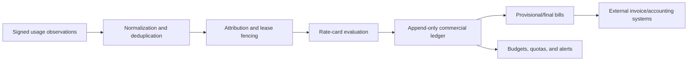

# Cost center, digital agreements, and commercial controls

This document extends the Suanli review into the commercial and governance
functions required by a production LunaNexa management plane. It covers cost
allocation, usage metering, budgets, orders, reservations, digital agreements,
organization verification, invoices, service-level credits, privacy, and audit
evidence.

It is a product and engineering assessment, not legal, tax, or accounting
advice. LunaNexa's final agreements, privacy notices, invoice processes, and
retention rules require review by qualified counsel and finance professionals in
every jurisdiction where the service operates.

## What Suanli demonstrates

Suanli's [cost bill](https://suanli.cn/docs/expense-center/bill-management/tlzqwytynil7qbktxl6crn7antd/)
provides daily/monthly views, separates product categories and charging modes,
shows gross charges, discounts and paid amounts, and supports detailed CSV or
Excel exports for internal showback and chargeback.

Its [framework-contract flow](https://suanli.cn/docs/expense-center/contract-management/h8knwrsfrihmqokjyopcx84endg/)
collects the contracting party, renders contract text for review, confirms the
signer, sends the transaction to an external electronic-signature provider,
waits for customer and platform signatures, and makes the completed agreement
downloadable.

Related capabilities include:

- [team roles](https://suanli.cn/docs/platform/team-account/bpcxwi8vviqxylk677tcpfwqnkf/)
  that separate owners, administrators, finance staff, and developers;
- [organization and individual verification](https://suanli.cn/docs/platform/team-account/eyobwhae3iwld4kbsvcczqtqndh/)
  that gates paid resource operations at the tenant-owner level;
- [digital invoice management](https://suanli.cn/docs/expense-center/apy4woyrsipziokpec2cmio7nhf/oguowbfw3ibocrk8i5ccbzrfn8d/)
  with invoiceable amounts, tax profiles, request states, electronic artifacts,
  and correction handling;
- [reserved resource packages](https://suanli.cn/docs/expense-center/resource-pack-management/qqn3wbknpio3kfkpk1gcgxjmnef/)
  that bind a prepaid entitlement to a cluster, GPU type, quantity, and validity
  interval;
- versioned [service](https://suanli.cn/docs/platform/service-agreement/mlhtwuyvlixjfykpr6fcfrexnth/),
  [identity-verification](https://suanli.cn/docs/platform/service-agreement/nvahwv6wai1fvtkg4c1ckgvwn8e/),
  [resource-provider](https://suanli.cn/docs/platform/service-agreement/vbinw7mepifp7dk0vyfcd0bgn2d/),
  [privacy](https://suanli.cn/docs/platform/privacy-policy/twpmwbmy2iiarbksnvccd35ontd/),
  and [SLA](https://suanli.cn/docs/platform/service-agreement/m3jrwjh28izlqik59xucdjf4nhf/)
  material.

The reusable idea is a connected chain from identity and authority through
agreement, entitlement, resource usage, cost allocation, settlement, invoice,
and audit. LunaNexa should not copy Suanli's legal wording, provider endpoints,
prices, tax practices, or signature implementation.

## Product boundary

LunaNexa should own the technical facts and policy decisions that only the
cluster management plane can authoritatively produce:

- immutable usage observations and their node/deployment/lease attribution;
- cost-center, project, tenant, user, model, runtime, and workload dimensions;
- pricing-plan and rate-card snapshots used for each calculation;
- estimates, provisional charges, finalized line items, adjustments, credits,
  quotas, budgets, and commercial entitlements;
- agreement requirements and the evidence that a required agreement version was
  accepted or externally signed;
- authorization gates derived from organization status, role, agreement,
  budget, quota, lease, and entitlement state;
- reconciliation and audit trails connecting a bill back to measured workload
  events.

LunaNexa should integrate rather than reimplement:

- payment processing and custody of payment-card or bank credentials;
- qualified electronic-signature identity, certificates, seals, timestamping,
  and evidence validation;
- government or third-party personal and organization identity verification;
- tax calculation and official electronic-invoice issuance;
- accounting/general-ledger and enterprise procurement systems;
- email, SMS, and legally required delivery channels.

The integration stores opaque provider references, normalized state, verified
callback evidence, and document hashes. It must not store raw identity documents,
biometrics, private signing keys, complete payment credentials, or external
provider secrets in normal application records.

## Cost-center model

Cost centers should be hierarchical and stable. A useful initial hierarchy is:

```text
organization
└── cost center
    └── project
        ├── exclusive node lease
        ├── managed deployment
        ├── batch job or evaluation
        └── model transfer and retained artifact cache
```

Each workload carries immutable attribution identifiers at admission time.
Renaming a project or moving it later must not rewrite historical bills. The
ledger stores both immutable IDs and display-name snapshots.

Minimum allocation dimensions:

| Dimension | Purpose |
| --- | --- |
| Organization/tenant | Legal and security boundary |
| Cost center/project | Showback, chargeback, budget, and approval routing |
| User/service principal | Initiator and accountability |
| Lease/deployment/job | Direct resource consumer |
| Model/runtime version | Model economics and optimization |
| Node/GPU identity | Hardware attribution and capacity reconciliation |
| Region/cluster | Locality, capacity pool, and future rate differences |
| Start/end and meter interval | Proration and evidence window |
| Pricing plan/rate snapshot | Reproducible monetary calculation |

The management UI should support daily and monthly summaries, filtering by all
allocation dimensions, gross/discount/credit/net totals, finalized state, and
CSV export. Exports need authorization, tenant isolation, stable schemas, a
generation timestamp, filter echo, and a content hash.

## Metering and ledger

Do not calculate invoices directly from mutable deployment rows. Use an
append-only pipeline:



Recommended billable meters depend on the operating mode:

| Mode | Primary meter | Important secondary evidence |
| --- | --- | --- |
| Exclusive DGX lease | Reserved node-second or agreed lease period | Node availability, lease epoch, activation/end times, SLA exclusions |
| Managed inference | GPU-second or deployment-replica-second | Requests, tokens/images/audio duration, queue time, runtime readiness |
| Batch/evaluation | GPU-second per completed/attempted job | Retry reason, exit status, deadline, preemption |
| Model storage | Retained byte-hour on management/node cache if commercially charged | Artifact digest, tier, retention policy, replica count |
| Transfer | Verified bytes transferred if policy charges for it | Source/target node, cache hit, resume, digest result |

For the initial four-node private deployment, lease duration is the clearest
primary commercial meter. GPU utilization should remain operational evidence,
not change the price of an exclusive lease unless a contract explicitly says
otherwise. Internal transfer from `/data/models` to the assigned node should
normally be included in the lease/deployment price and shown as zero-cost usage;
charging for every retry or cached replica would create perverse incentives.

Monetary values use fixed-point integers in a declared currency and scale, never
binary floating point. Timestamps are UTC instants with an explicit billing
timezone for calendar periods. Every line item records quantity, unit, unit
price, currency, tax treatment reference, gross amount, discount/credit,
net amount, rate-card version, and source-event range.

Ledger states should be explicit:

```text
observed -> normalized -> rated -> provisional -> finalized
                                              \-> disputed
finalized -> adjustment/credit/debit note (never destructive mutation)
```

Duplicate observations, late telemetry, node clock skew, reconciliation gaps,
and disputed events must produce visible exceptions. Finalized periods are
immutable; corrections use linked reversal and replacement entries.

## Budgets, quotas, and reservations

A budget is not a security boundary and not a guaranteed real-time cutoff.
Telemetry and rating lag mean the system needs both:

- admission-time quota and entitlement checks before starting work;
- observed/spent/forecast budget thresholds with notifications;
- an optional hard-stop policy with a clearly documented grace and overshoot
  bound;
- emergency operator override with reason, scope, expiry, and audit record.

Suggested threshold actions are 50%, 80%, 90%, 100%, and forecast exhaustion.
Actions may notify, require approval, block new deployments, prevent scale-out,
or drain work. Never abruptly terminate an exclusive lease or destructive job
merely because a delayed usage event crosses a budget unless the signed contract
and selected policy explicitly authorize that behavior.

Suanli's prepaid resource package is best adapted into a LunaNexa **capacity
reservation/commitment**:

- binds organization, cluster or eligible node pool, GPU class/count, effective
  interval, service mode, and optional time window;
- creates an entitlement and scheduler reservation, not a hidden placement
  override;
- cannot bypass node health, lease fencing, model policy, or security admission;
- has deterministic consumption order when multiple commitments match;
- exposes used, remaining, expired, and unfulfilled capacity;
- separates capacity guarantees from discounts and payment terms.

## Digital agreement model

LunaNexa needs two related but distinct mechanisms:

1. **Terms acceptance/clickwrap** for versioned service terms, privacy notice,
   acceptable-use policy, model-license terms, or feature-specific conditions.
2. **Electronic signature workflow** for negotiated or organization-level
   framework agreements, data-processing agreements, SLA schedules, order
   forms, and capacity commitments.

Never reduce the evidence to a Boolean `accepted`. Store:

| Evidence | Required content |
| --- | --- |
| Template/version | Stable agreement type, semantic version, locale, effective date, rendered-document hash |
| Party | Organization/legal name and opaque verification reference |
| Signer | User ID, asserted role, authority basis, and authority check result |
| Intent | Explicit action, presentation context, transaction/order/deployment being authorized |
| Time and network | Server timestamp, client timestamp if supplied, IP/security context under privacy policy |
| Provider evidence | External envelope/transaction ID, verified callback IDs, signature/timestamp status |
| Artifact | Executed PDF or provider reference, content hash, retention and legal-hold state |
| Audit | Actor, state transition, previous/new state, reason, correlation and idempotency keys |

Recommended agreement state machine:

```text
draft -> internal_review -> ready_for_signature -> awaiting_signer
      -> partially_signed -> awaiting_countersignature -> executed
      -> declined | expired | voided | superseded
```

Editing a template after signature starts creates a new version and envelope; it
must never alter the bytes under review. Revoking a signer's organization role
before execution pauses or voids the workflow according to policy. A verified
external callback may advance state only once and only when its envelope,
tenant, template hash, signer, and expected previous state all match.

Execution gates should be policy-driven. Examples:

- creating an organization requires verified organization status and current
  service/privacy acceptance;
- starting an exclusive lease may require a framework agreement, acceptable-use
  terms, sanitization acknowledgement, price/order acceptance, and capacity
  entitlement;
- deploying a restricted model may require a specific model-license agreement;
- enabling retention of prompts or outputs requires a data-processing basis and
  explicit tenant policy;
- a new materially changed agreement version may block new work but should not
  silently terminate an existing contracted lease.

## Roles and separation of duties

Suanli's team roles are directionally useful but too coarse for LunaNexa. Use
separate permissions for:

| Role | Typical authority |
| --- | --- |
| Organization owner | Membership, role delegation, organization policy |
| Billing administrator | Cost centers, budgets, billing profiles, exports |
| Finance viewer | Bills, invoices, credits, reconciliation; no deployments |
| Procurement/order approver | Capacity commitments and paid orders within limit |
| Legal signer | Sign only agreements for which authority is recorded |
| Deployer | Models, deployments and jobs within entitlement; no payment/signature |
| Lease administrator | Exclusive-lease assignment and lifecycle, not billing mutation |
| Auditor | Read-only evidence and exports |
| Platform operator | Cluster operation without tenant financial or signature authority |

High-risk actions need step-up authentication and, where policy requires,
four-eyes approval. A user must not approve their own elevated role, modify a
finalized bill, attest their own organizational authority, or both create and
approve a high-value commitment without an explicit small-organization policy.

## Invoices, payments, and reconciliation

Invoices are downstream legal/tax artifacts, not the source of usage truth.
LunaNexa should prepare a reconciled invoice request containing the organization
billing profile reference, finalized bill IDs, currency, tax category references,
line-item totals, and content hash. An external tax/invoice system issues the
official artifact and returns status and a document reference.

Support states such as `draft`, `requested`, `under_review`, `issued`,
`delivery_failed`, `credited`, `voided`, and `reissued`. Incorrect invoices are
corrected through the jurisdiction-appropriate credit/void/reissue flow, never
by overwriting an issued document.

Payment webhooks require signature verification, timestamp/replay checks,
idempotency, exact amount/currency matching, and reconciliation against an
expected order. A successful provider callback does not authorize resource use
unless the corresponding entitlement transaction commits. Failed entitlement
creation must enter a visible reconciliation queue rather than losing money or
granting capacity twice.

For an internal/private deployment, LunaNexa can stop at showback: immutable
usage, cost-center allocation, budgets, and exports. Payment collection and tax
invoices should remain disabled until the organization intentionally operates
LunaNexa as a commercial service.

## SLA and service credits

Suanli's SLA material is useful as a reminder that technical availability and
commercial remedy need the same evidence. LunaNexa should define:

- service indicators and the exact measurement point;
- when a lease/deployment becomes billable and available;
- minimum outage duration, maintenance and tenant-caused exclusions;
- management-plane, artifact-transfer, node, runtime and inference-gateway
  failure domains;
- incident correlation and evidence retention;
- claim window, reviewer, dispute path, credit calculation, and maximum remedy;
- whether credits affect invoiceable amounts and how they appear in the ledger.

Readiness is especially important: a container process existing is not the same
as a loaded model ready to serve. Exclusive-lease availability should separately
record credential delivery, node reachability, hardware health, and tenant-caused
configuration failures.

## Privacy and identity

Organization verification should be an external service boundary. LunaNexa
normally needs only verification status, subject type, verified legal-name
reference, jurisdiction, provider transaction ID, completion/expiry times, and a
reason code. Raw identity documents and biometric data should not enter LunaNexa.

The privacy design must cover data inventory, purpose and legal basis, tenant
configuration, retention, deletion and legal hold, subject requests, subprocessors,
cross-border transfer, breach response, and agreement-version evidence. Prompts,
responses, model-license tokens, user passwords, agreement documents, billing
exports, and node telemetry have different classifications and retention rules.

Cost and audit logs must not accidentally become a second prompt store. Record
token/image/audio counts and resource identifiers, not content. Mask taxpayer
identifiers, bank information, addresses, phone numbers, email addresses,
signature links, and external provider tokens in UI, exports, and logs according
to role.

## Adversarial and fuzz-test requirements

Before commercial release, test at least:

- duplicate, reordered, delayed, truncated, forged, and replayed meter events;
- integer overflow, negative quantities, zero-length periods, fractional units,
  currency/scale mismatch, daylight-saving transitions, leap days, and month-end
  proration;
- telemetry gaps, clock rollback, node identity swap, stale lease epochs, and
  usage attributed across tenants;
- duplicate or out-of-order payment, signature, invoice, and identity callbacks;
- amount/currency mismatch and paid-order/failed-entitlement race conditions;
- budget-check races during concurrent one-click deployments or scale-out;
- signer removed, authority expired, organization renamed, or agreement template
  superseded while signing;
- callback signatures valid for a different tenant, envelope, document hash, or
  environment;
- CSV/formula injection, spreadsheet limits, export denial-of-service, and
  unauthorized cross-cost-center aggregation;
- malicious names, addresses, Unicode confusables, overlong legal names, and
  markup/script injection in generated agreement and invoice fields;
- privacy deletion requests colliding with legal hold, financial retention, or
  active disputes;
- operator attempts to mutate finalized ledger, agreement, invoice, or audit
  records.

Property tests should prove conservation rules: normalized usage is rated at
most once, line-item arithmetic balances exactly, adjustments preserve an audit
trail, an entitlement is consumed no more than its capacity, and no tenant can
observe another tenant's commercial data.

## Recommended delivery phases

### Phase 1: internal showback

- cost-center/project attribution on every lease, deployment and job;
- append-only usage normalization and fixed-point rating;
- daily/monthly cost views, budgets, alerts, and CSV export;
- versioned agreement registry and clickwrap acceptance evidence;
- organization roles and read-only audit views;
- no payments, tax invoices, or home-grown electronic signatures.

### Phase 2: organization commerce

- organization verification provider integration;
- external electronic-signature envelopes and evidence bundles;
- order approval and capacity commitments;
- external accounting/invoice integration;
- payment provider integration only if LunaNexa becomes merchant-facing;
- reconciliation queues and operator runbooks.

### Phase 3: mature commercial operations

- forecasts, anomaly detection and hard budget policies;
- negotiated rate cards, commitments and credits;
- SLA claim workflow and automated evidence assembly;
- procurement/ERP exports and general-ledger reconciliation;
- jurisdiction-specific retention, privacy, tax, and signature controls.

## LunaNexa implementation recommendation

For the current management node and four DGX Spark nodes, implement Phase 1
first. It adds operational value even if no external money changes hands and
creates trustworthy input for future contracts and invoices. Treat the
commercial subsystem as a separate LunaNexa component backed by published
LunaNexa contracts—not as a new product, not as part of the node daemon, and not
as provider-specific logic in the scheduler.

The node agent reports signed usage facts only. The controller owns lease and
deployment attribution. The commercial component rates and records those facts.
Finance/legal integrations consume finalized outputs. None of these systems may
place workloads, bypass lease fencing, or copy a model to an unassigned node.
